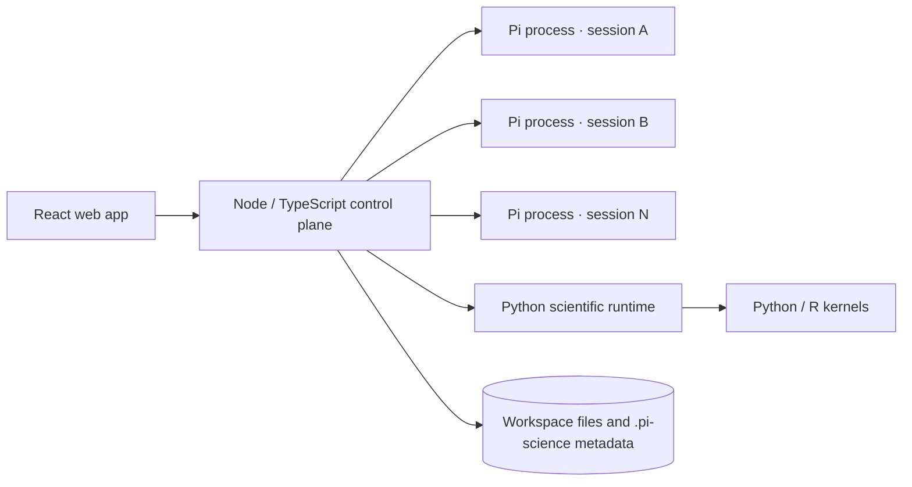

<div align="center">
  
  <h1>Pi-Science</h1>
  <p><strong>An open scientific AI workbench for research, computation, and reproducible discovery.</strong></p>
  <p>
    Chat with AI agents, run scientific code, inspect data, manage project knowledge,
    and trace every generated artifact back to its source.
  </p>
  <p>
    <a href="README.zh-CN.md">简体中文</a>
    · <a href="#quick-start">Quick Start</a>
    · <a href="#architecture">Architecture</a>
    · <a href="#development">Development</a>
  </p>
  <p>
    
    
    
    
  </p>
</div>

---

Pi-Science brings the core research workflow into one browser-based workspace. Each project keeps its own conversations, files, runs, provenance, and reviewed knowledge. Each conversation runs in an independent Pi process, so multiple sessions can continue concurrently without blocking one another.

## Quick Start

### Requirements

- Node.js 22 or newer
- Python 3.11 or newer
- pnpm
- An LLM provider API key, or a trusted OpenAI/Anthropic-compatible local endpoint

### One-command setup

```bash
git clone https://github.com/Garhorne0813/pi-science.git
cd pi-science
bash scripts/dev.sh
```

`dev.sh` installs missing dependencies and starts the complete local stack.

### Separate installation and startup

For repeatable deployments, install once and start independently:

```bash
bash scripts/install.sh
bash scripts/start.sh
```

After the first installation, use only `bash scripts/start.sh`. To keep using `dev.sh` without reinstalling, run:

```bash
PI_SCIENCE_SKIP_INSTALL=1 bash scripts/dev.sh
```

### Local services

| Service | Address | Purpose |
|---|---|---|
| Web app | `http://127.0.0.1:5173` | Main research workspace |
| Node control plane | `http://127.0.0.1:8787` | Sessions, SSE, files, jobs, settings, and project APIs |
| Python runtime | `http://127.0.0.1:8788` | Internal scientific services and kernels |
| API documentation | `http://127.0.0.1:8787/docs` | Interactive API reference |

Open **Settings → LLM** after startup and configure a provider and default model.

## Highlights

| Area | What Pi-Science provides |
|---|---|
| Agent workspace | Streaming conversations, tool cards, Markdown, LaTeX, slash commands, and interactive extension prompts |
| Concurrent sessions | One independent Pi process per session, including restored and forked conversations |
| Scientific files | Native previews for molecular structures, FITS, genomics, phase data, 3D models, tables, office documents, media, and code |
| Reproducibility | Artifact hashes, generating code and diffs, environment snapshots, provenance history, and reproduce actions |
| Project memory | Reviewer proposals, human approval, evidence links, project versions, research loops, and Pareto-frontier tracking |
| Computation | Python/R kernels, notebooks, experiment runs, job control, large-file probing, and optional Jupyter Lab |
| Extensibility | Pi skills, extensions, MCP servers, subagents, custom model providers, and managed endpoints |
| Workspace safety | Project-scoped metadata, validated paths, isolated session state, and controlled outbound provider discovery |

## Scientific Viewers

Pi-Science renders common research formats directly in the browser.

| Domain | Formats | Viewer |
|---|---|---|
| Chemistry | CIF, PDB, SDF, MOL, SMILES, XYZ | Interactive 3Dmol.js viewer |
| Astronomy | FITS | Canvas rendering with scientific color maps |
| 3D / CAD | STL, OBJ, PLY, glTF, GLB | Three.js scene viewer |
| Solid-state physics | EIGENVAL, DOSCAR | Band-structure and density-of-states charts |
| Genomics | BED, GFF, GTF, VCF | Track-based genome viewer |
| Tabular data | CSV, TSV | Sortable tables and line, bar, and scatter charts |
| Office | DOCX, XLSX, PPTX | Browser-native document previews |
| General | Markdown, JSON, code, images, PDF, video | Syntax-aware or native previews |

## Architecture



- The **React frontend** provides chat, project memory, file inspection, notebooks, runs, skills, and settings.
- The **Node control plane** owns conversation processes, session APIs, live SSE events, files, jobs, provenance, and application settings.
- The **Python runtime** provides scientific services and computational kernels.
- Each session is keyed by both workspace and session ID. Idle Pi processes are reclaimed after 30 minutes by default; set `PI_SCIENCE_IDLE_RUNTIME_MS=0` to disable cleanup.

See [Node control-plane architecture](docs/node-control-plane.md) and the [scientific platform runtime](docs/science-platform-runtime.md) for deeper implementation details.

## Project Model

Every initialized project is a workspace. Project-local runtime state is kept under `.pi-science/`, while agent instructions and skills remain in standard Pi locations.

```text
project/
├── AGENTS.md
├── .pi/
│   ├── skills/
│   └── agents/
├── .pi-science/
│   ├── sessions/
│   ├── artifacts.jsonl
│   ├── provenance.jsonl
│   └── research-records.jsonl
└── your research files
```

Reviewed project memory is created lazily. Findings do not enter the formal project record until the user accepts them.

## Slash Commands

Type `/` in the conversation composer to open the command menu.

| Command | Action |
|---|---|
| `/new` | Create a conversation |
| `/model <provider/model>` | Switch the active model |
| `/compact` | Compact conversation context |
| `/name <name>` | Rename the current conversation |
| `/copy` | Copy the latest agent response |
| `/export <html\|jsonl>` | Export conversation history |
| `/session` | Show session information |
| `/skill:<name>` | Invoke a workspace skill through the agent |

## Model Configuration

Providers can be configured from **Settings → LLM**. Pi-Science supports built-in vendors, OpenAI-compatible endpoints, Anthropic-compatible endpoints, and trusted keyless local services such as Ollama or LM Studio.

API keys may also be provided through environment variables:

```bash
export OPENAI_API_KEY=sk-...
# or ANTHROPIC_API_KEY, DEEPSEEK_API_KEY, and other supported vendors
```

## Development

```bash
# JavaScript and TypeScript tests
pnpm test

# Static checks
pnpm typecheck

# Production build
pnpm build

# Python tests
uv run pytest backend/tests -q
```

Additional end-to-end checks:

```bash
pnpm smoke
pnpm uat:conversation
PI_CLI_PATH=/absolute/path/to/pi pnpm smoke:real-pi
```

Focused frontend UAT commands are available under `frontend`:

```bash
cd frontend
npm run test:uat:knowledge
npm run test:uat:notebook
npm run test:uat:office
```

## Documentation

- [Skill schema](docs/skill-schema.md)
- [Scientific platform runtime](docs/science-platform-runtime.md)
- [Node control-plane architecture](docs/node-control-plane.md)
- [TypeScript backend migration plan](docs/node-typescript-backend-atomic-plan.md)

## Contributing

Issues and pull requests are welcome. Before submitting a change, run the relevant tests plus `pnpm typecheck` and `pnpm build`. Changes to runtime behavior should include regression coverage.

## License

MIT
