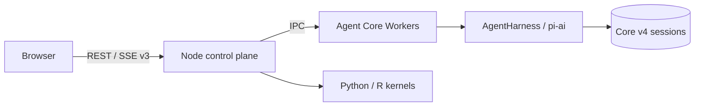

<div align="center">
  
  <h1>Pi-Science</h1>
  <p><strong>An open scientific AI workbench for research, computation, and reproducible discovery.</strong></p>
  <p>
    Chat with AI agents, run scientific code, inspect data, manage project knowledge,
    and trace every generated artifact back to its source.
  </p>
  <p>
    <a href="README.zh-CN.md">简体中文</a>
    · <a href="#quick-start">Quick Start</a>
    · <a href="#architecture">Architecture</a>
    · <a href="#development">Development</a>
  </p>
  <p>
    
    
    
  </p>
</div>

---

Pi-Science brings AI conversations, scientific computation, data previews and project knowledge into one local workbench.

- **Run analyses in context.** Execute Python/R code on session kernels and inspect the resulting tables, plots and files alongside the conversation.
- **Keep execution evidence.** Runs record code, environment revisions, artifact hashes and provenance so results can be inspected and reproduced.
- **Explore with research loops.** Agents propose and analyze candidates; the control plane applies deterministic evaluation, budgets and pause/resume controls.
- **Find scientific sources.** Built-in connectors retrieve papers and scientific data, with linked citation metadata you can verify.
- **Use ordinary project folders.** Research files stay in your workspace. Model requests and external connector calls use the services you configure.

Conversations run concurrently in isolated Agent Core Worker processes. AgentHarness owns execution and durable sessions; Pi-Science adds the scientific workspace and product interface.

## Quick Start

### Requirements

- Node.js **24.16+**, Python **3.11+**, and pnpm **11.7.0** (the pinned package manager)
- An LLM API key, or a configured local endpoint such as Ollama or LM Studio
- On Windows, PowerShell **5.1+**

Clone the repository:

```bash
git clone https://github.com/Garhorne0813/pi-science.git
cd pi-science
```

On macOS/Linux, install and start in one step:

```bash
bash scripts/dev.sh
```

Or install once and start separately:

```bash
bash scripts/install.sh
bash scripts/start.sh
```

On native Windows, use PowerShell:

```powershell
powershell -File scripts/install.ps1
powershell -File scripts/start.ps1
```

Open **http://127.0.0.1:5173**. In **Settings → LLM**, configure a provider and default model, then open a workspace and start a conversation. Use **Settings → Skills** to manage skills and **Settings → MCP** to enable scientific connectors; only Paper Search is enabled initially. The control-plane API runs on `127.0.0.1:8787`.

These launchers run the Vite and `tsx watch` **development servers**. Bash supports macOS/Linux and WSL; native Windows does not require Git Bash. Installation includes the Agent Core SDK through workspace dependencies.

### Start, stop and update

The installer provides a `pi-science` command. On macOS/Linux, add `~/.local/bin` to `PATH` if needed (`PI_SCIENCE_BIN_DIR` overrides that directory). On Windows, open a new terminal after installation updates `PATH`.

```text
pi-science                 Start the services
pi-science status          Show service status
pi-science stop            Stop this checkout's services
pi-science help            Show command help
```

Foreground startup keeps the terminal open; **Ctrl+C** stops the services. Bash also supports `pi-science start --detach`; the Windows launcher is foreground-only.

Re-run the platform installer after moving the checkout or updating Node/Python dependency metadata, the lockfile or SDK dependencies. Source-only edits do not require reinstallation. To skip installation with the combined Bash launcher:

```bash
PI_SCIENCE_SKIP_INSTALL=1 bash scripts/dev.sh
```

<details>
<summary>Launcher behavior and persistent state</summary>

Installed launchers use package-local executables, so npm/pnpm wrappers are not needed for startup; pnpm is required for installation, builds and dependency updates. Startup has a 90-second readiness deadline, configurable with `PI_SCIENCE_STARTUP_TIMEOUT_SECONDS`. Launchers track owned services for shutdown and refuse to overwrite an unrelated launcher path.

Application state uses `PI_SCIENCE_HOME` or `~/.pi-science`, with a checkout-local fallback when necessary. Project metadata may be workspace-local or application-managed; see [data ownership](docs/architecture.md#persistence-and-data-ownership) before moving or backing up state. Existing v3 sessions can be converted automatically or with the [offline conversion command](docs/agent-core-session-conversion.md).

</details>

## Highlights

| Area | What Pi-Science provides |
|---|---|
| Agent workspace | Streaming conversations, tool cards, Markdown, LaTeX, slash commands, and browser questionnaires and approvals |
| Concurrent sessions | Independent Agent Core Worker processes for active, restored, and forked conversations |
| Scientific files | Native previews for molecular structures, FITS, genomics, phase data, 3D models, tables, office documents, media, and code |
| Reproducibility | Live session-scoped execution records, artifact hashes, generating code and diffs, environment snapshots, provenance history, and reproduce actions |
| Project memory | Reviewer proposals, human approval, evidence links, project versions, research loops, and Pareto-frontier tracking |
| Computation | Shared versioned Micromamba environments, isolated Python/R Session kernels, executable `.ipynb` files, agent notebook cell read/edit/run tools, conversation-linked runs, and an optional app-managed Jupyter Lab |
| Extensibility | Pi skills, prompt templates, MCP servers, subagents, custom model providers, and managed endpoints |
| Workspace safety | Project-scoped metadata, validated paths, isolated session state, and controlled outbound provider discovery |

## Scientific MCP Connectors

Pi-Science includes 18 managed MCP connectors backed by public scientific data
services. They run as local MCP processes and expose compact, typed, read-only
tools to the agent; the upstream searches still make outbound network requests.

| Connector | Upstream services | Default |
|---|---|---|
| Paper Search | PubMed, arXiv, Crossref, bioRxiv, medRxiv, Europe PMC | Enabled |
| Literature Graph | OpenAlex | Disabled |
| Clinical Trials | ClinicalTrials.gov | Disabled |
| Structures & Interactions | RCSB PDB, AlphaFold DB, EMDB, IntAct, Complex Portal | Disabled |
| Genes & Ontologies | MyGene.info, EBI OLS, QuickGO, Reactome | Disabled |
| Genomes | Ensembl REST, UCSC Genome Browser | Disabled |
| CellGuide | CELLxGENE CellGuide | Disabled |
| Protein Annotation | InterPro, STRING v12, Human Protein Atlas | Disabled |
| Omics Archives | NCBI GEO, PRIDE, MGnify, ArrayExpress, MetaboLights | Disabled |
| Chemistry | PubChem, ChEBI, BindingDB, Rhea | Disabled |
| Regulation | ENCODE, JASPAR, UniBind | Disabled |
| BioMart | Ensembl BioMart | Disabled |
| Drug Regulatory | openFDA, Drugs@FDA | Disabled |
| Human Genetics | NHGRI-EBI GWAS Catalog, FinnGen PheWAS | Disabled |
| Protein Records | UniProtKB | Disabled |
| Nucleotide Archives | NCBI GenBank, ENA | Disabled |
| Target Discovery | Open Targets Platform | Disabled |
| ChEMBL | ChEMBL | Disabled |

Together they expose 85 tools. Enable only the domains you need from
**Settings → MCP**, where you can inspect discovered tools, test a connection,
filter exposed tools, and choose `Ask`, `Allow`, or `Deny` decisions. Built-in
definitions are read-only, while custom `stdio`, Streamable HTTP, SSE, and
socket connectors can also be registered. Settings apply globally; individual
projects may override tool decisions. Connector changes are projected into
active agent runtimes without manually editing Pi configuration files.

Connector authentication can reference a managed key/token or a named environment variable, delivered as a process variable, HTTP header or Bearer token. Policy snapshots contain only credential references; permitted credentials are resolved in Worker memory. OAuth login/refresh is not currently supported.

## Scientific Viewers

Pi-Science renders common research formats directly in the browser.

| Domain | Formats | Viewer |
|---|---|---|
| Chemistry | CIF, PDB, PQR, SDF, MOL, MOL2, SMILES, XYZ, CUBE | Interactive Mol* viewer with structure-linked sequences |
| Astronomy | FITS | Canvas rendering with scientific color maps |
| 3D / CAD | STL, OBJ, PLY, glTF, GLB | Three.js scene viewer |
| Solid-state physics | EIGENVAL, DOSCAR | Band-structure and density-of-states charts |
| Genomics | BED, GFF, GTF, VCF | Track-based genome viewer |
| Tabular data | CSV, TSV | Sortable tables and line, bar, and scatter charts |
| Office | DOCX, XLSX, PPTX | Browser-native document previews |
| General | Markdown, JSON, code, images, PDF, video | Syntax-aware or native previews |

## Architecture


```mermaid
flowchart LR
    UI[Browser] -->|REST / SSE v3| CP[Node control plane]
    CP -->|IPC| W[Agent Core Workers]
    W --> H[AgentHarness / pi-ai]
    H --> S[(Core v4 sessions)]
    CP --> K[Python / R kernels]
```

AgentHarness owns agent execution and durable operation state. The Node control plane supervises isolated Workers, projects Core facts into the versioned browser protocol, and coordinates scientific services. Conversations, titles, research, reviews and subagents share this execution stack.

Core session format **v4** and product SSE protocol **v3** are independent versions. History is a projection of Core sessions; earlier formats are handled only at data-read/conversion boundaries. SQLite coordinates workspaces, environments, jobs and MCP policy. Research files and product metadata have separate storage ownership.

See the [architecture reference](docs/architecture.md) for process boundaries, event delivery, state locations, recovery and capability isolation.

## Slash Commands

Type `/` in the conversation composer to open the command menu.

| Command | Action |
|---|---|
| `/compact` | Compact conversation context |
| `/export <html\|jsonl>` | Export conversation history |
| `/skill:<name>` | Invoke a dynamically discovered workspace skill |

Pi-Science-managed workspaces trust `.pi/skills/` by default; these
project-built-in skills participate in Pi command discovery. Use **Settings →
Skills** to review and control discovered skills.

## Execution Evidence

Kernel, notebook, and agent-tool executions are recorded in the context of the
conversation session that produced them. Execution status streams live, and
the Runs view can locate an execution in its source conversation or open files
and artifacts produced by that execution.

Conversation Workers provide `notebook_read`, `notebook_edit`, and
`notebook_run` for file-backed `.ipynb` notebooks. Cell edits are revision-safe;
`notebook_read` exposes per-cell revisions so `notebook_edit` can protect only
the cells it changes when unrelated concurrent edits should be allowed. Selected
cells run through the same persistent Python/R kernels used by the workbench.
`notebook_run` writes bounded execution counts and outputs back to the notebook
with the next revision, while execution and artifact provenance remain available
through the control plane.

## Model Configuration

Providers can be configured from **Settings → LLM**. Pi-Science supports built-in vendors, OpenAI-compatible endpoints, Anthropic-compatible endpoints, and trusted keyless local services such as Ollama or LM Studio. Managed endpoints can be registered, enabled or disabled, and health-checked from the same page. Health checks are bounded outbound requests; private-network endpoints are allowed by default for local model servers and can be disabled with `PI_SCIENCE_ALLOW_PRIVATE_PROVIDERS=0`.

API keys are managed through **Settings → LLM**. Environment-backed credentials require an explicit variable reference in model-resource configuration; exporting a vendor variable alone does not establish a binding.

## AI Session Titles

After a successfully completed turn, Pi-Science may generate an AI title (**enabled by default**) using the configured **default model**, which can differ from the conversation's model. A disposable Worker with tools and skills disabled sends up to 6 recent messages, each trimmed to 200 characters, and requests a title of at most 8 words.

This is an additional model request containing a conversation excerpt. Titles are stored in `session-titles.jsonl` under the resolved project metadata root; browser storage is an immediate fallback.

To disable it, set the environment variable before starting the services and
restart:

```bash
export PI_SCIENCE_AI_TITLES=0
```

Title generation never blocks the conversation and failures leave the derived
sidebar name in place. Its temporary session remains hidden and is removed
when the Worker is disposed.

## Development

```bash
# JavaScript and TypeScript tests
pnpm test

# Static checks
pnpm typecheck

# Production build
pnpm build
```

Additional end-to-end checks:

```bash
pnpm smoke
pnpm uat:conversation
pnpm smoke:agent-core
```

Focused frontend UAT commands:

```bash
pnpm --filter frontend test:uat:knowledge
pnpm --filter frontend test:uat:notebook
pnpm --filter frontend test:uat:office
```

## Documentation

| Read about | Reference |
| --- | --- |
| Process boundaries, state ownership, events and recovery | [Architecture](docs/architecture.md) |
| Supported tools and known limits | [Agent Core capability inventory](docs/agent-core-capability-inventory.md) |
| Existing sessions and offline conversion | [Session conversion](docs/agent-core-session-conversion.md) |
| Scientific connectors, credentials and tool policy | [MCP management](docs/mcp-management-implementation.md) |
| Research orchestration and deterministic evaluation | [Research-loop ADR](docs/adr-research-loop-subagents.md) |
| Writing project skills | [Skill authoring](docs/skill-authoring.md) |

Implementation notes are linked from the architecture reference. Documents without an English counterpart are available in their original language.

## Contributing

Issues and pull requests are welcome. Before submitting a change, run the relevant tests plus `pnpm typecheck` and `pnpm build`. Changes to runtime behavior should include regression coverage.

## License

MIT
