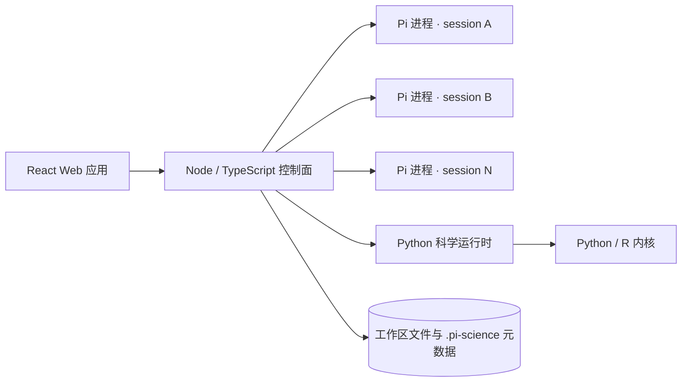

<div align="center">
  
  <h1>Pi-Science</h1>
  <p><strong>面向科研、计算与可复现发现的开源科学 AI 工作台。</strong></p>
  <p>
    在一个工作区中与 AI 智能体协作、运行科学代码、查看数据、管理项目知识，
    并追踪每个产物的完整来源。
  </p>
  <p>
    <a href="README.md">English</a>
    · <a href="#快速开始">快速开始</a>
    · <a href="#系统架构">系统架构</a>
    · <a href="#开发与测试">开发与测试</a>
  </p>
  <p>
    
    
    
    
  </p>
</div>

---

Pi-Science 将科研工作的核心流程整合到浏览器中。每个项目独立保存对话、文件、实验运行、产物谱系和审核后的项目知识；每个对话使用独立 Pi 进程，因此多个 session 可以并行执行，互不阻塞。

## 快速开始

### 环境要求

- Node.js 22 或更高版本
- Python 3.11 或更高版本
- pnpm
- 一个 LLM 提供商 API Key，或可信的 OpenAI / Anthropic 兼容本地端点

### 一键安装并启动

```bash
git clone https://github.com/Garhorne0813/pi-science.git
cd pi-science
bash scripts/dev.sh
```

`dev.sh` 会安装缺失依赖并启动完整的本地服务。

### 分开安装和启动

首次部署或依赖变化后执行安装：

```bash
bash scripts/install.sh
bash scripts/start.sh
```

后续只需运行 `bash scripts/start.sh`。如果继续使用 `dev.sh`，但希望跳过安装：

```bash
PI_SCIENCE_SKIP_INSTALL=1 bash scripts/dev.sh
```

### 本地服务

| 服务 | 地址 | 用途 |
|---|---|---|
| Web 应用 | `http://127.0.0.1:5173` | 主科研工作区 |
| Node 控制面 | `http://127.0.0.1:8787` | 会话、SSE、文件、任务、设置和项目 API |
| Python 运行时 | `http://127.0.0.1:8788` | 内部科学服务与计算内核 |
| API 文档 | `http://127.0.0.1:8787/docs` | 交互式 API 参考 |

启动后进入 **Settings → LLM**，配置提供商和默认模型即可开始使用。

## 核心能力

| 领域 | Pi-Science 提供的能力 |
|---|---|
| 智能体工作区 | 流式对话、工具卡片、Markdown、LaTeX、斜杠命令和交互式扩展请求 |
| 并行会话 | 每个 session 使用独立 Pi 进程，包括恢复和分叉的旧会话 |
| 科学文件 | 原生预览分子结构、FITS、基因组、相图、3D 模型、表格、办公文档、媒体和代码 |
| 可复现性 | 产物哈希、生成代码与差异、环境快照、谱系历史和一键复现 |
| 项目记忆 | Reviewer 提案、人工审核、证据链接、项目版本、研究循环和 Pareto 前沿 |
| 科学计算 | Python/R 内核、Notebook、实验运行、任务控制、大文件探测和可选 Jupyter Lab |
| 扩展能力 | Pi skills、扩展、MCP、subagents、自定义模型提供商和托管端点 |
| 工作区安全 | 项目级元数据、路径校验、会话状态隔离和受控的模型端点发现 |

## 科学文件查看器

Pi-Science 可以直接在浏览器中渲染常见科研格式。

| 领域 | 格式 | 查看器 |
|---|---|---|
| 化学 | CIF、PDB、SDF、MOL、SMILES、XYZ | 3Dmol.js 交互式三维查看器 |
| 天文 | FITS | Canvas 渲染和科学色图 |
| 3D / CAD | STL、OBJ、PLY、glTF、GLB | Three.js 场景查看器 |
| 固体物理 | EIGENVAL、DOSCAR | 能带和态密度图 |
| 基因组 | BED、GFF、GTF、VCF | 轨道式基因组查看器 |
| 表格数据 | CSV、TSV | 可排序表格及折线、柱状、散点图 |
| 办公文档 | DOCX、XLSX、PPTX | 浏览器原生文档预览 |
| 通用格式 | Markdown、JSON、代码、图片、PDF、视频 | 语法感知或浏览器原生预览 |

## 系统架构



- **React 前端**负责对话、项目记忆、文件检查器、Notebook、实验运行、技能和设置界面。
- **Node 控制面**负责对话进程、session API、实时 SSE、文件、任务、谱系和应用设置。
- **Python 运行时**提供科学服务和计算内核。
- session 同时按 workspace 和 session ID 隔离。空闲 Pi 进程默认在 30 分钟后回收；设置 `PI_SCIENCE_IDLE_RUNTIME_MS=0` 可关闭回收。

深入设计说明见 [Node 控制面架构](docs/node-control-plane.md) 和 [科学平台运行时](docs/science-platform-runtime.md)。

## 项目与工作区

每个初始化后的项目都是一个 workspace。项目运行状态保存在 `.pi-science/`，智能体指令和技能使用 Pi 的标准目录。

```text
project/
├── AGENTS.md
├── .pi/
│   ├── skills/
│   └── agents/
├── .pi-science/
│   ├── sessions/
│   ├── artifacts.jsonl
│   ├── provenance.jsonl
│   └── research-records.jsonl
└── 你的科研文件
```

项目记忆按需创建。发现、结论和任务只有在用户确认后，才会进入正式项目记录。

## 斜杠命令

在对话输入框中输入 `/` 即可打开命令菜单。

| 命令 | 作用 |
|---|---|
| `/new` | 创建新对话 |
| `/model <provider/model>` | 切换当前模型 |
| `/compact` | 压缩对话上下文 |
| `/name <name>` | 重命名当前对话 |
| `/copy` | 复制最近一条智能体回复 |
| `/export <html\|jsonl>` | 导出对话历史 |
| `/session` | 显示 session 信息 |
| `/skill:<name>` | 通过智能体调用工作区技能 |

## 模型配置

可以在 **Settings → LLM** 中配置提供商。Pi-Science 支持内置厂商、OpenAI-compatible、Anthropic-compatible，以及 Ollama、LM Studio 等可信的无 Key 本地服务。

也可以通过环境变量提供 API Key：

```bash
export OPENAI_API_KEY=sk-...
# 也可以使用 ANTHROPIC_API_KEY、DEEPSEEK_API_KEY 等受支持的厂商变量
```

## 开发与测试

```bash
# JavaScript / TypeScript 测试
pnpm test

# 静态类型检查
pnpm typecheck

# 生产构建
pnpm build

# Python 测试
uv run pytest backend/tests -q
```

补充端到端检查：

```bash
pnpm smoke
pnpm uat:conversation
PI_CLI_PATH=/absolute/path/to/pi pnpm smoke:real-pi
```

前端专项 UAT：

```bash
cd frontend
npm run test:uat:knowledge
npm run test:uat:notebook
npm run test:uat:office
```

## 文档

- [Skill 规范](docs/skill-schema.md)
- [科学平台运行时](docs/science-platform-runtime.md)
- [Node 控制面架构](docs/node-control-plane.md)
- [TypeScript 后端迁移计划](docs/node-typescript-backend-atomic-plan.md)

## 参与贡献

欢迎提交 Issue 和 Pull Request。提交前请运行相关测试，以及 `pnpm typecheck` 和 `pnpm build`。修改运行时行为时，应同时补充回归测试。

## 许可证

MIT
