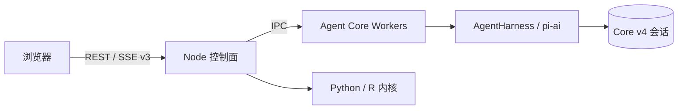

<div align="center">
  
  <h1>Pi-Science</h1>
  <p><strong>面向科研、计算与可复现发现的开源科学 AI 工作台。</strong></p>
  <p>
    在一个工作区中与 AI 智能体协作、运行科学代码、查看数据、管理项目知识，
    并追踪每个产物的完整来源。
  </p>
  <p>
    <a href="README.md">English</a>
    · <a href="#快速开始">快速开始</a>
    · <a href="#系统架构">系统架构</a>
    · <a href="#开发与测试">开发与测试</a>
  </p>
  <p>
    
    
    
  </p>
</div>

---

Pi-Science 将 AI 对话、科学计算、数据预览和项目知识整合到一个本地工作台。

- **在上下文中运行分析。** 在会话内核执行 Python/R 代码，与对话一起查看表格、图像和生成文件。
- **保留执行证据。** 运行记录保存代码、环境版本、产物哈希和谱系，便于检查与复现结果。
- **通过研究循环探索。** 智能体提出并分析候选方案，控制面负责确定性评估、预算和暂停恢复。
- **检索科学来源。** 内置连接器获取论文和科学数据，提供可以核对的引用元数据。
- **使用普通项目目录。** 科研文件保存在工作区，模型请求和外部检索使用你配置的服务。

多个对话通过独立 Agent Core Worker 进程并发执行。AgentHarness 管理执行和持久会话，Pi-Science 提供科学工作区与产品界面。

## 快速开始

### 环境要求

- Node.js **24.16+**、Python **3.11+**、pnpm **11.7.0**（仓库锁定的包管理器版本）
- 一个 LLM API Key，或已配置的 Ollama、LM Studio 等本地端点
- Windows 需要 PowerShell **5.1+**

先克隆仓库：

```bash
git clone https://github.com/Garhorne0813/pi-science.git
cd pi-science
```

macOS/Linux 可一键安装并启动：

```bash
bash scripts/dev.sh
```

也可以安装一次，再独立启动：

```bash
bash scripts/install.sh
bash scripts/start.sh
```

原生 Windows 使用 PowerShell：

```powershell
powershell -File scripts/install.ps1
powershell -File scripts/start.ps1
```

打开 **http://127.0.0.1:5173**，在 **设置 → LLM** 配置提供商和默认模型，再打开工作区开始对话。**设置 → Skills** 管理技能，**设置 → MCP** 启用科学连接器；初始仅启用 Paper Search。控制面 API 位于 `127.0.0.1:8787`。

启动器运行 Vite 和 `tsx watch` **开发服务**。Bash 支持 macOS/Linux 与 WSL，原生 Windows 不需要 Git Bash；Agent Core SDK 随项目依赖安装。

### 启动、停止与更新

安装器提供 `pi-science` 命令。macOS/Linux 需要将 `~/.local/bin` 加入 `PATH`（可用 `PI_SCIENCE_BIN_DIR` 修改安装目录）；Windows 安装更新 `PATH` 后请打开新终端。

```text
pi-science                 启动服务
pi-science status          查看服务状态
pi-science stop            停止当前 checkout 的服务
pi-science help            查看命令帮助
```

前台启动占用当前终端，按 **Ctrl+C** 停止服务。Bash 还支持 `pi-science start --detach`；Windows 启动器仅支持前台运行。

移动仓库或更新 Node/Python 依赖元数据、锁文件、SDK 依赖后，应重新运行对应平台安装器。仅修改源代码不需要重装。组合 Bash 启动器可跳过安装：

```bash
PI_SCIENCE_SKIP_INSTALL=1 bash scripts/dev.sh
```

<details>
<summary>启动器行为与持久状态</summary>

安装后的启动器直接调用包内可执行文件，启动不依赖 npm/pnpm 包装器；安装、构建和依赖更新仍需要 pnpm。默认就绪期限为 90 秒，可用 `PI_SCIENCE_STARTUP_TIMEOUT_SECONDS` 调整。启动器记录自己启动的服务以准确停止，并拒绝覆盖无关的启动器路径。

应用状态使用 `PI_SCIENCE_HOME` 或 `~/.pi-science`，必要时回退到 checkout 内。项目元数据可位于工作区或应用托管目录，移动或备份前请参阅[数据归属](docs/architecture.zh-CN.md#持久化与数据归属)。旧 v3 会话支持自动转换或[离线转换](docs/agent-core-session-conversion.md)。

</details>

## 核心能力

| 领域 | Pi-Science 提供的能力 |
|---|---|
| 智能体工作区 | 流式对话、工具卡片、Markdown、LaTeX、斜杠命令和浏览器问卷与审批 |
| 并行会话 | 活跃、恢复和分叉的对话使用独立的 Agent Core Worker 进程 |
| 科学文件 | 原生预览分子结构、FITS、基因组、相图、3D 模型、表格、办公文档、媒体和代码 |
| 可复现性 | 实时的会话级执行记录、产物哈希、生成代码与差异、环境快照、谱系历史和一键复现 |
| 项目记忆 | Reviewer 提案、人工审核、证据链接、项目版本、研究循环和 Pareto 前沿 |
| 科学计算 | 可复用的 Micromamba 环境、隔离的 Python/R Session 内核、可执行 `.ipynb` 文件、与对话关联的运行记录和应用级 Jupyter Lab |
| 扩展能力 | Pi skills、提示模板、MCP、subagents、自定义模型提供商和托管端点 |
| 工作区安全 | 项目级元数据、路径校验、会话状态隔离和受控的模型端点发现 |

## 科学 MCP 连接器

Pi-Science 内置 18 个由公共科学数据服务驱动的 MCP 连接器。它们以本地 MCP
进程运行，向 Agent 提供紧凑、带类型、只读的工具；实际检索仍会向上游服务发送网络请求。

| 连接器 | 上游服务 | 默认状态 |
|---|---|---|
| Paper Search | PubMed、arXiv、Crossref、bioRxiv、medRxiv、Europe PMC | 启用 |
| Literature Graph | OpenAlex | 关闭 |
| Clinical Trials | ClinicalTrials.gov | 关闭 |
| Structures & Interactions | RCSB PDB、AlphaFold DB、EMDB、IntAct、Complex Portal | 关闭 |
| Genes & Ontologies | MyGene.info、EBI OLS、QuickGO、Reactome | 关闭 |
| Genomes | Ensembl REST、UCSC Genome Browser | 关闭 |
| CellGuide | CELLxGENE CellGuide | 关闭 |
| Protein Annotation | InterPro、STRING v12、Human Protein Atlas | 关闭 |
| Omics Archives | NCBI GEO、PRIDE、MGnify、ArrayExpress、MetaboLights | 关闭 |
| Chemistry | PubChem、ChEBI、BindingDB、Rhea | 关闭 |
| Regulation | ENCODE、JASPAR、UniBind | 关闭 |
| BioMart | Ensembl BioMart | 关闭 |
| Drug Regulatory | openFDA、Drugs@FDA | 关闭 |
| Human Genetics | NHGRI-EBI GWAS Catalog、FinnGen PheWAS | 关闭 |
| Protein Records | UniProtKB | 关闭 |
| Nucleotide Archives | NCBI GenBank、ENA | 关闭 |
| Target Discovery | Open Targets Platform | 关闭 |
| ChEMBL | ChEMBL | 关闭 |

这些连接器共提供 85 个工具。可在 **设置 → MCP** 中仅启用需要的科研领域，查看已发现
工具、测试连接、筛选暴露的工具，并为工具选择 `询问`、`允许` 或 `拒绝`。内置连接器
定义只读；也可以注册自定义 `stdio`、Streamable HTTP、SSE 和 socket 连接器。连接器
设置全局生效，单个项目可以覆盖工具决策。配置变更会自动投影到活跃 Agent runtime，
无需手工编辑 Pi 配置文件。

连接器认证可引用托管密钥/令牌或具名环境变量，作为进程变量、HTTP Header 或 Bearer Token 传递。策略快照只含凭据引用，获准使用的凭据在 Worker 内存中解析。目前不支持 OAuth 登录与刷新。

## 科学文件查看器

Pi-Science 可以直接在浏览器中渲染常见科研格式。

| 领域 | 格式 | 查看器 |
|---|---|---|
| 化学 | CIF、PDB、PQR、SDF、MOL、MOL2、SMILES、XYZ、CUBE | 支持结构关联序列的 Mol* 交互式查看器 |
| 天文 | FITS | Canvas 渲染和科学色图 |
| 3D / CAD | STL、OBJ、PLY、glTF、GLB | Three.js 场景查看器 |
| 固体物理 | EIGENVAL、DOSCAR | 能带和态密度图 |
| 基因组 | BED、GFF、GTF、VCF | 轨道式基因组查看器 |
| 表格数据 | CSV、TSV | 可排序表格及折线、柱状、散点图 |
| 办公文档 | DOCX、XLSX、PPTX | 浏览器原生文档预览 |
| 通用格式 | Markdown、JSON、代码、图片、PDF、视频 | 语法感知或浏览器原生预览 |

## 系统架构


```mermaid
flowchart LR
    UI[浏览器] -->|REST / SSE v3| CP[Node 控制面]
    CP -->|IPC| W[Agent Core Workers]
    W --> H[AgentHarness / pi-ai]
    H --> S[(Core v4 会话)]
    CP --> K[Python / R 内核]
```

AgentHarness 管理智能体执行和持久操作状态。Node 控制面监督独立 Worker，将 Core 事实投影为有版本的浏览器协议，并协调科学计算服务。对话、标题、研究、复查和子代理共用这套执行链路。

Core 会话格式 **v4** 与产品 SSE 协议 **v3** 是独立版本。历史是 Core 会话的投影；旧格式只在数据读取/转换边界处理。SQLite 协调工作区、环境、任务和 MCP 策略，科研文件与产品元数据分别管理存储位置。

进程边界、事件交付、状态目录、恢复机制与能力隔离详见[架构文档](docs/architecture.zh-CN.md)。

## 斜杠命令

在对话输入框中输入 `/` 即可打开命令菜单。

| 命令 | 作用 |
|---|---|
| `/compact` | 压缩对话上下文 |
| `/export <html\|jsonl>` | 导出对话历史 |
| `/skill:<name>` | 调用动态发现的工作区技能 |

Pi-Science 托管的工作区默认信任 `.pi/skills/`；其中的项目内置 skills 会参与 Pi 的命令发现。可在 **设置 → Skills** 中查看和控制已发现的 skills。

## 执行证据

内核、Notebook 和智能体工具的执行都会记录在产生它们的对话会话中。执行状态会实时更新；在 Runs 视图中，可将执行定位到来源对话，也可打开该次执行生成的文件和产物。

对话 Worker 为文件型 `.ipynb` 提供 `notebook_read`、`notebook_edit` 和
`notebook_run`。`notebook_read` 会返回每个 cell 的 revision；默认编辑使用
Notebook 文件 SHA-256 做严格并发保护，也可用 `expected_cell_revisions`
只保护本次修改的 cell，使无关 cell 的并发修改不会阻塞操作。运行选定的
Python/R 代码块后，会把受限的执行次数、标准输出/错误、MIME 结果和错误输出
原子写回 Notebook，并返回新的 revision。产物发布失败会作为执行告警保留，
不会被静默忽略。

## 模型配置

可以在 **设置 → LLM** 中配置提供商。Pi-Science 支持内置厂商、OpenAI-compatible、Anthropic-compatible，以及 Ollama、LM Studio 等可信的无 Key 本地服务。还可以在同一页面注册、启停并检查托管模型端点。健康检查是带超时和响应大小限制的出站请求；为支持本地模型服务，默认允许私网端点，可通过 `PI_SCIENCE_ALLOW_PRIVATE_PROVIDERS=0` 禁用。

API Key 通过 **设置 → LLM** 管理。环境凭据需要在模型资源配置中明确引用变量名，仅导出厂商环境变量不会建立凭据绑定。

## AI 会话标题

成功完成一轮对话后，Pi-Science 可以生成 AI 标题（**默认启用**）。标题使用配置的**默认模型**，可能与当前对话模型不同。禁用工具与技能的临时 Worker 发送最近不超过 6 条消息，每条截断到 200 字符，并请求不超过 8 个词的标题。

这是一次额外的模型请求，会包含最近的对话片段。标题保存到项目实际元数据目录中的 `session-titles.jsonl`，浏览器存储作为即时回退。

如需禁用，请在启动前设置并重启服务：

```bash
export PI_SCIENCE_AI_TITLES=0
```

标题生成不阻塞对话，失败时保留侧边栏的派生名称。临时会话保持隐藏，在 Worker 释放时删除。

## 开发与测试

```bash
# JavaScript / TypeScript 测试
pnpm test

# 静态类型检查
pnpm typecheck

# 生产构建
pnpm build
```

补充端到端检查：

```bash
pnpm smoke
pnpm uat:conversation
pnpm smoke:agent-core
```

前端专项 UAT：

```bash
pnpm --filter frontend test:uat:knowledge
pnpm --filter frontend test:uat:notebook
pnpm --filter frontend test:uat:office
```

## 文档

| 内容 | 参考 |
| --- | --- |
| 进程边界、状态归属、事件与恢复 | [架构文档](docs/architecture.zh-CN.md) |
| 支持的工具与已知限制 | [Agent Core 能力清单](docs/agent-core-capability-inventory.md) |
| 旧会话与离线转换 | [会话转换](docs/agent-core-session-conversion.md) |
| 科学连接器、凭据与工具策略 | [MCP 管理](docs/mcp-management-implementation.md) |
| 研究编排与确定性评估 | [研究循环 ADR](docs/adr-research-loop-subagents.md) |
| 编写项目技能 | [技能编写](docs/skill-authoring.md) |

架构文档提供对应的实现记录链接，未提供双语版本的文档保留原语言。

## 参与贡献

欢迎提交 Issue 和 Pull Request。提交前请运行相关测试，以及 `pnpm typecheck` 和 `pnpm build`。修改运行时行为时，应同时补充回归测试。

## 许可证

MIT
