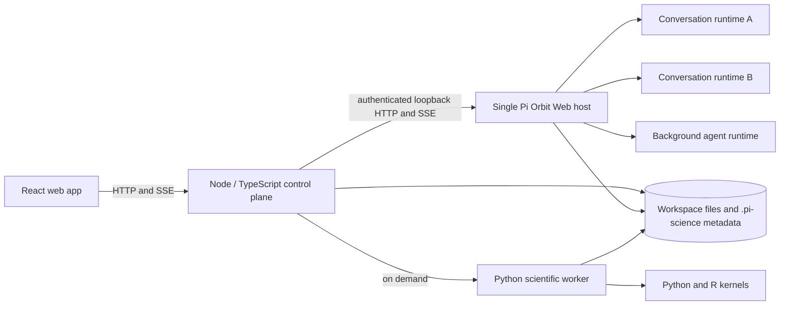
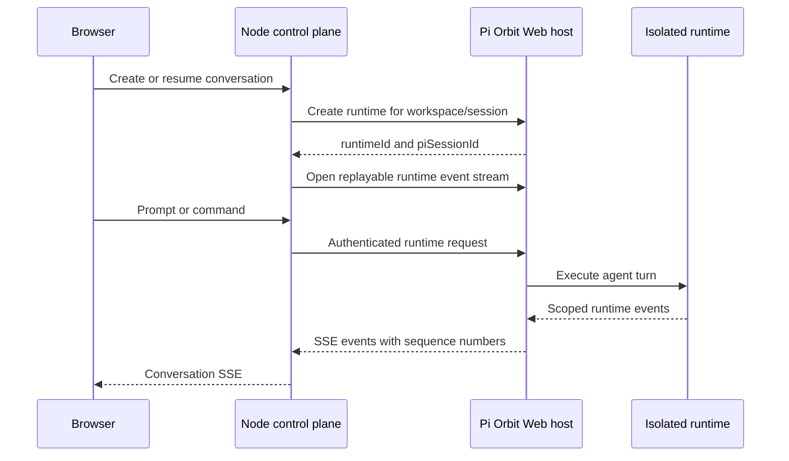

# Pi-Science Architecture

This document describes the current Pi-Science runtime architecture. It is the
canonical reference for process ownership, runtime isolation, service
boundaries, workspace state, and lifecycle behavior.

## System overview



The React application is a client of the Node control plane. The control plane
owns application APIs, coordinates the other runtimes, and is the only backend
service the browser calls directly.

| Component | Responsibility |
|---|---|
| React web app | Conversations, project knowledge, files, notebooks, runs, skills, settings, and scientific viewers |
| Node control plane | Sessions, event streaming, files, jobs, provenance, project state, settings, runtime lifecycle, and route authorization |
| Pi Orbit Web host | Agent sessions and isolated runtimes for conversations and bounded background agents |
| Python scientific worker | Scientific services, notebooks, PDF processing, and Python/R kernels |
| Workspace | User files plus project-local instructions, skills, environments, sessions, artifacts, and provenance |

## Pi Orbit runtime model

Pi-Science starts **one Pi Orbit Web host per Node control-plane process**, not
one operating-system process per conversation. The first agent runtime starts
the host; later conversations and background agents reuse it.

Isolation happens inside the host:

- Each active conversation is represented by its own Pi Orbit runtime identity.
- A runtime is bound to a canonical workspace and a Pi session file.
- Restoring, switching, forking, and cloning a conversation update or create the
  corresponding runtime/session binding without starting another host process.
- Project review and research-loop subagents use bounded runtimes managed by the
  same control-plane-owned host.
- Stopping one conversation disposes only its runtime. Shutting down the Node
  control plane disposes all runtimes and then stops the shared host.

`PiManager` owns this lifecycle. Concurrent requests for the same runtime are
deduplicated, and concurrent attempts to start the shared host await the same
startup operation.

### Host startup and compatibility checks

The installer normally downloads the platform-specific Pi Orbit release and
verifies it against the published `SHA256SUMS`. At runtime, `PI_CLI_PATH` points
to either that native executable or a compatible JavaScript/TypeScript CLI.
`PI_ORBIT_REPO` opts installation into a local Pi Orbit source checkout instead
of a release artifact.

The control plane starts Pi Orbit in Web mode on a random loopback port with:

- an application-managed lifecycle;
- no implicit initial session;
- a generated bearer token;
- a capability handshake before any runtime is created.

The handshake requires protocol version 1, the
`single-user-shared-process` isolation model, runtime and event-replay APIs,
browser-session authentication, workspace binding, project trust, and legacy
session compatibility. Startup fails closed when these capabilities are absent.

`PI_SCIENCE_PI_MODE=rpc` retains the previous per-process RPC adapter as a
temporary rollback path. Web mode is the supported default architecture.

## Commands and event flow



The browser never receives the Pi Orbit bearer token and does not call the host
directly. `PiProcess` is an adapter over the Web API: it translates the existing
session command interface into runtime and legacy-session endpoints, and it
replays scoped events after reconnecting by sequence number.

## Node and Python service boundary

The Node control plane owns the public application API. Most routes—including
sessions, workspaces, files, settings, jobs, project knowledge, artifacts,
provenance, citations, environments, and research loops—are implemented there.

Scientific routes for kernels, notebooks, and PDF processing are compatibility
proxies to the Python worker. The worker may be externally managed or started on
demand by the control plane. A managed worker is reclaimed after five minutes
without active scientific requests by default.

The default local topology is:

| Service | Address | Exposure |
|---|---|---|
| React development app | `http://127.0.0.1:5173` | Browser-facing |
| Node control plane | `http://127.0.0.1:8787` | Browser-facing application API |
| Interactive API reference | `http://127.0.0.1:8787/docs` | Served by the control plane |
| Python scientific worker | `http://127.0.0.1:8788` | Internal, reached through the control plane |
| Pi Orbit Web host | Random loopback port | Internal and bearer-authenticated |

## Workspace and persistent state

Pi-Science is local-first: the workspace remains a normal directory and
project-specific state is stored beside it.

```text
project/
├── AGENTS.md                 # project instructions
├── .venv/                    # workspace-local Python environment
├── node_modules/             # workspace-local JavaScript packages
├── .pi/
│   ├── skills/
│   └── agents/
├── .pi-science/
│   ├── sessions/             # persisted Pi session JSONL files
│   ├── agent/                # project-local fallback runtime config
│   ├── runs/                 # execution workspaces and outputs
│   ├── solutions/            # immutable research candidates
│   ├── artifacts.jsonl
│   ├── provenance.jsonl
│   └── research-records-v2.jsonl
└── research files
```

Reviewed project memory is created lazily. Agent findings do not become formal
project knowledge until the user accepts them.

### Package isolation

The first Agent, Job, or Python Kernel use initializes `.venv/`. Agent
processes, local jobs, and notebook kernels receive that environment at the
front of `PATH`, and `pip` is configured to refuse installation outside a
virtual environment. JavaScript packages remain workspace-local; attempted
global npm/pnpm installs are redirected below `.pi-science/` rather than
modifying the host installation. Existing malformed `.venv` directories are not
overwritten automatically. The environment can be inspected or initialized from
the Notebooks page or through `GET/POST /api/environments/workspace`.

## Trust and security boundaries

- The Pi Orbit host listens only on loopback and requires a generated bearer
  token for every control-plane request.
- The token remains in the backend; browser origins are not granted direct CORS
  access to the host.
- Workspace paths are canonicalized and validated before runtime creation.
- A registered workspace is inside the application trust boundary. The control
  plane records Pi Orbit project trust before creating a runtime, so users should
  register only workspaces whose instructions and skills they trust.
- Runtime identity includes both workspace and session identity to prevent one
  workspace from being resumed through another runtime.
- Project metadata uses validated paths, atomic writes, and advisory locks where
  multiple writers may update the same record.

## Lifecycle and recovery

- Conversation runtimes are reclaimed after 30 minutes of inactivity by
  default. `PI_SCIENCE_IDLE_RUNTIME_MS=0` disables that control-plane cleanup.
- The shared Pi Orbit host remains alive while the Node control plane is alive,
  even when it currently contains no conversation runtimes.
- A managed Python worker starts on the first scientific request and is stopped
  after its idle period. `PI_SCIENCE_SCIENTIFIC_IDLE_MS` controls that period.
- Runtime commands use bounded request timeouts. Operations that time out are
  reconciled against runtime state so an accepted prompt is not silently treated
  as a failed turn.
- Event streams reconnect with the last observed sequence number so transient
  transport interruptions do not require a new agent runtime.

## Research loops

Research loops are coordinated by the Node control plane. A loop uses bounded
Pi Orbit subagent runtimes for candidate generation and analysis, the job system
for execution and deterministic evaluation, immutable candidate snapshots, and
append-only records for recovery and provenance.

For the research-loop state machine and persistence contract, see the
[research-loop ADR](adr-research-loop-subagents.md).
