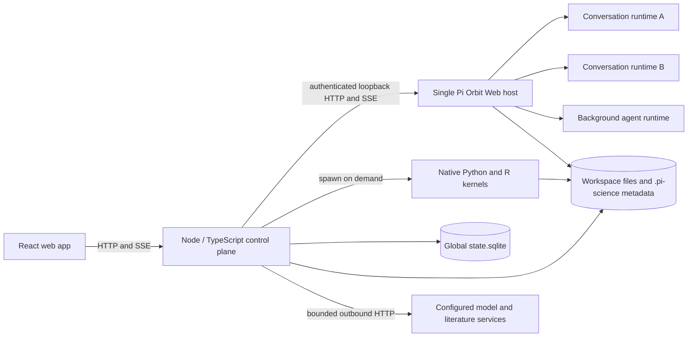
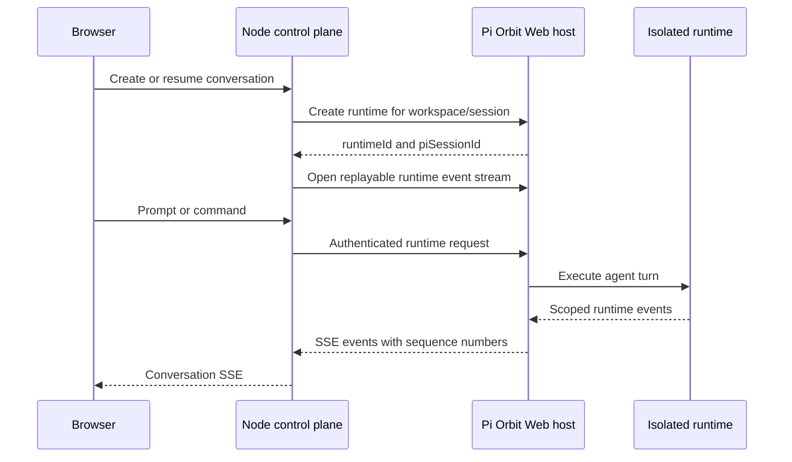

# Pi-Science Architecture

[简体中文](architecture.zh-CN.md)

This document describes the current Pi-Science runtime architecture. It is the
canonical reference for process ownership, runtime isolation, service
boundaries, workspace state, and lifecycle behavior.

## System overview



The React application is a client of the Node control plane. The control plane
owns application APIs, coordinates the other runtimes, and is the only backend
service the browser calls directly.

| Component | Responsibility |
|---|---|
| React web app | Conversations, project knowledge, files, notebooks, runs, skills, settings, and scientific viewers |
| Node control plane | Sessions, event streaming, files, jobs, provenance, project state, settings, SQLite coordination, runtime lifecycle, and route authorization |
| Pi Orbit Web host | Agent sessions and isolated runtimes for conversations and bounded background agents |
| Node-native scientific runtime | Workspace-bound Python/R kernels and optional JupyterLab tooling |
| Global SQLite state | Workspace locations, environment revisions, durable jobs, leases, and legacy-import markers |
| Workspace | User files plus project-local instructions, skills, environments, sessions, artifacts, and provenance |

## Pi Orbit runtime model

Pi-Science starts **one Pi Orbit Web host per Node control-plane process**, not
one operating-system process per conversation. The first agent runtime starts
the host; later conversations and background agents reuse it.

Isolation happens inside the host:

- Each active conversation is represented by its own Pi Orbit runtime identity.
- A runtime is bound to a canonical workspace and a Pi session file.
- Restoring, switching, forking, and cloning a conversation update or create the
  corresponding runtime/session binding without starting another host process.
- Project review and research-loop subagents use bounded runtimes managed by the
  same control-plane-owned host.
- Stopping one conversation disposes only its runtime. Shutting down the Node
  control plane disposes all runtimes and then stops the shared host.

`PiManager` owns this lifecycle. Concurrent requests for the same runtime are
deduplicated, and concurrent attempts to start the shared host await the same
startup operation.

### Host startup and compatibility checks

The installer normally downloads the platform-specific Pi Orbit release and
verifies it against the published `SHA256SUMS`. At runtime, `PI_CLI_PATH` points
to either that native executable or a compatible JavaScript/TypeScript CLI.
`PI_ORBIT_REPO` opts installation into a local Pi Orbit source checkout instead
of a release artifact.

The control plane starts Pi Orbit in Web mode on a random loopback port with:

- an application-managed lifecycle;
- no implicit initial session;
- a generated bearer token;
- a capability handshake before any runtime is created.

The handshake requires protocol version 1, the
`single-user-shared-process` isolation model, runtime and event-replay APIs,
browser-session authentication, workspace binding, project trust, and legacy
session compatibility. Startup fails closed when these capabilities are absent.

`PI_SCIENCE_PI_MODE=rpc` retains the previous per-process RPC adapter as a
temporary rollback path. Web mode is the supported default architecture.

## Commands and event flow



The browser never receives the Pi Orbit bearer token and does not call the host
directly. `PiProcess` is an adapter over the Web API: it translates the existing
session command interface into runtime and legacy-session endpoints, and it
replays scoped events after reconnecting by sequence number.

## Node-native scientific runtime boundary

The Node control plane owns the public application API. Most routes—including
sessions, workspaces, files, settings, jobs, project knowledge, artifacts,
provenance, citations, environments, and research loops—are implemented there.

Scientific routes for kernels and notebooks are implemented directly by the Node
control plane. Kernel sessions are child processes started from the selected
Micromamba revision, with JSONL communication and bounded lifecycle control.
JupyterLab remains optional and uses a separate application-managed tooling
environment; project kernelspecs point at the selected project revision.

Managed Pi sessions also load the built-in `pi-science-notebook` extension. Its
`notebook_read`, `notebook_edit`, and `notebook_run` tools call the Node notebook
and kernel routes rather than reading files or spawning kernels themselves.
Notebook edits use the file SHA-256 returned by `notebook_read` as an optimistic
revision check; source edits clear stale outputs, and executions retain the
existing execution/artifact provenance chain.

The default local topology is:

| Service | Address | Exposure |
|---|---|---|
| React development app | `http://127.0.0.1:5173` | Browser-facing |
| Node control plane | `http://127.0.0.1:8787` | Browser-facing application API |
| Pi Orbit Web host | Random loopback port | Internal and bearer-authenticated |

The control plane exposes `/internal/live`, `/internal/ready`, and
`/internal/diagnostics` for launcher health checks and local diagnostics.

## Workspace and persistent state

Pi-Science is local-first: a workspace remains a normal directory, and portable
project state is stored beside it. Application-wide coordination state is kept
separately in the control-plane configuration root.

```text
project/
├── AGENTS.md                 # project instructions
├── node_modules/             # workspace-local JavaScript packages
├── .pi/
│   ├── skills/
│   └── agents/
├── .pi-science/
│   ├── project.json           # stable project identity and display metadata
│   ├── environment.json       # binding to a shared Micromamba revision
│   ├── memory/
│   │   └── ledger.json       # canonical memory ledger (records, proposals, decisions)
│   ├── sessions/             # persisted Pi session JSONL files
│   ├── agent/                # project-local fallback runtime config
│   ├── runs/                 # execution workspaces and outputs
│   ├── solutions/            # immutable research candidates
│   ├── session-titles.jsonl
│   ├── turn-artifacts.jsonl
│   ├── artifacts.jsonl
│   ├── provenance.jsonl
│   └── research-records-v2.jsonl
└── research files
```

The global configuration root is `PI_SCIENCE_HOME` when set, otherwise
`~/.pi-science`; a checkout-local `.runtime/pi-science` directory is used as a
fallback when the preferred location is not writable. Production starts a
dedicated worker thread for `state.sqlite` and enables SQLite by default. The
database uses WAL journaling and stores:

- stable project identities and canonical workspace locations, including
  managed, pinned, recently opened, and missing-location state;
- immutable Micromamba environment revisions and their lifecycle status;
- durable job records, output, ownership generations, and recovery leases; and
- migration history and fingerprints for legacy imports.

SQLite schema migrations run before the server reports ready. A failed store or
migration keeps `/internal/ready` at HTTP 503, while `/internal/diagnostics`
reports the store status, schema version, journal mode, and pending requests.
The worker checkpoints the database during graceful shutdown. Setting
`PI_SCIENCE_SQLITE_STATE=0` disables this state layer for diagnostics or
rollback; file-backed compatibility paths then remain available where
implemented.

Reviewed project memory is created lazily. Agent findings do not become formal
project knowledge until the user accepts them.

The memory ledger is the canonical project-memory store. It keeps the existing
project knowledge records and review proposals together with evidence references,
approval state, and decision audit events. Existing `.pi-science/project-state.json`
files are migrated on first read and retained as a compatibility projection for
older clients and local tooling.

External workspaces are explicitly registered through the workspace-open API.
Their canonical paths and pin state are persisted in SQLite so they can be
rediscovered after a restart. On startup, legacy `registered-workspaces.json`,
`pinned.json`, environment-registry files, and workspace job records are
imported idempotently; they are compatibility inputs rather than the canonical
production stores.

### Package isolation

The Node control plane owns a SQLite-backed global registry of versioned
Micromamba environments. Projects store only an `environment.json` binding and can reuse
the same ready revision without downloading packages again. Changing a managed
environment creates a new revision instead of mutating one used by other
projects. Environment selection lives under Settings → Environments.

Each conversation Session and language receives an independent kernel process
started from the bound Micromamba revision. Ready revisions are immutable;
package changes create and bind a new revision, so one Session cannot mutate a
revision used by another project. Existing workspace `.venv` directories remain
a legacy migration fallback and malformed ones are never overwritten
automatically.
JavaScript packages remain workspace-local; attempted global npm/pnpm installs
are redirected below `.pi-science/`.

Session Notebook is opened from the active conversation and renders the shared
execution history for Agent and user cells. Disk `.ipynb` files are opened from
Files and persist only when saved. JupyterLab uses one app-managed tooling
environment and registers the project's bound revision as a kernelspec.

## Trust and security boundaries

- The Pi Orbit host listens only on loopback and requires a generated bearer
  token for every control-plane request.
- The token remains in the backend; browser origins are not granted direct CORS
  access to the host.
- Workspace paths are canonicalized and validated before runtime creation.
- Each registered workspace owns a stable project identity in
  `.pi-science/project.json`; session listings resolve their `project_id` from
  that manifest.
- A registered workspace is inside the application trust boundary. The control
  plane records Pi Orbit project trust before creating a runtime, so users should
  register only workspaces whose instructions and skills they trust.
- Runtime identity includes both workspace and session identity to prevent one
  workspace from being resumed through another runtime.
- Project-local metadata uses validated paths, atomic writes, and advisory locks
  where multiple writers may update the same record. Global state mutations are
  serialized through repository operations in the SQLite worker.
- Model providers and explicit literature/connector actions may send requests
  outside the machine. Endpoint URLs reject embedded credentials; health probes
  have redirect, response-size, and timeout limits, and cross-origin redirects
  cannot retain sensitive headers. Private endpoints are allowed by default for
  local model servers and can be rejected with
  `PI_SCIENCE_ALLOW_PRIVATE_PROVIDERS=0`.
- Outbound connector destinations are recorded locally in
  `egress-audit.jsonl` by default. Set `egress_audit: false` in `config.json` to
  disable that audit. The audit records the connector identity, target domain,
  timestamp, and approval state—not request bodies or credentials.

## Lifecycle and recovery

- Conversation runtimes are reclaimed after 30 minutes of inactivity by
  default. `PI_SCIENCE_IDLE_RUNTIME_MS=0` disables that control-plane cleanup;
  the Pi Orbit host evicts idle runtimes after `PI_ORBIT_IDLE_TIMEOUT_MS` (default 24h).
- Deleting a busy runtime waits up to `PI_SCIENCE_DISPOSE_TIMEOUT_MS` (default 60s) for
  it to settle before giving up; control-plane shutdown skips this and kills the host directly.
- The shared Pi Orbit host remains alive while the Node control plane is alive,
  even when it currently contains no conversation runtimes.
- Kernel child processes are started lazily for the first cell in a Session and
  are stopped on Session shutdown, workspace shutdown, crash recovery, or
  timeout cleanup.
- Runtime commands use bounded request timeouts. Operations that time out are
  reconciled against runtime state so an accepted prompt is not silently treated
  as a failed turn.
- Event streams reconnect with the last observed sequence number so transient
  transport interruptions do not require a new agent runtime.
- Durable jobs use owner generations and expiring leases in SQLite. Startup
  recovery reconciles interrupted work without allowing an older process to
  overwrite a newer terminal result.

## Research loops

Research loops are coordinated by the Node control plane. A loop uses bounded
Pi Orbit subagent runtimes for candidate generation and analysis, the job system
for execution and deterministic evaluation, immutable candidate snapshots, and
append-only records for recovery and provenance.

For the research-loop state machine and persistence contract, see the
[research-loop ADR](adr-research-loop-subagents.md).
