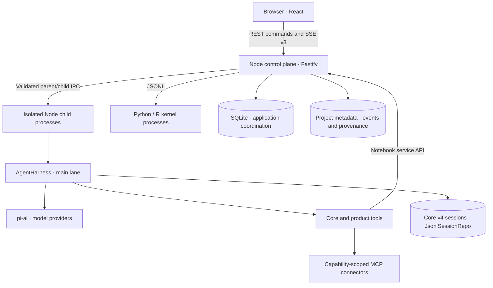
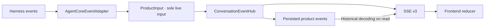

# Pi-Science Architecture

[简体中文](architecture.zh-CN.md) · [README](../README.md)

This is the reference for the current production architecture. It describes who
owns execution and persistent state, how events reach the browser, and how the
system recovers. Implementation notes and capability limits are linked below.

## System boundaries


```mermaid
flowchart TB
    UI["Browser · React"] -->|REST commands and SSE v3| CP["Node control plane · Fastify"]
    CP -->|Validated parent/child IPC| W["Isolated Node child processes"]
    W --> H["AgentHarness · main lane"]
    H --> AI["pi-ai · model providers"]
    H --> T["Core and product tools"]
    T --> MCP["Capability-scoped MCP connectors"]
    T -->|Notebook service API| CP
    H --> S[("Core v4 sessions · JsonlSessionRepo")]
    CP -->|JSONL| K["Python / R kernel processes"]
    CP --> DB[("SQLite · application coordination")]
    CP --> P[("Project metadata · events and provenance")]
```

Agent Core is the only agent execution backend. Conversations, subagents,
research, reviews and AI titles all use `AgentRuntimeManager` and AgentHarness.
“Worker” here means a Node **child process**, not a browser Worker or a shared
agent host. The SQLite service uses a separate **worker thread**.

| Component | Owns | Does not own |
| --- | --- | --- |
| Browser | Presentation, composer, local interaction state and applied SSE cursor | Model credentials or the agent loop |
| `AgentRuntimeManager` | Child-process capacity, exclusive session ownership, startup, idle cleanup and shutdown | Durable agent state |
| `AgentCoreSessionService` | Prompt admission reconciliation, configuration synchronization and runtime supervision | A second agent loop or session format |
| `SessionRuntime` / AgentHarness | Lane execution, tools, model configuration, compaction and durable operation results | Browser presentation |
| `AgentSessionRepository` | Read-only projection of Core sessions into product history | A parallel transcript authority |
| `ConversationEventHub` | Product event identity, persistence, delivery and product side effects | Invented Core completion results |
| Scientific services | Kernel, notebook, execution, artifact and research orchestration state | Model reasoning |

The default development endpoints are `http://127.0.0.1:5173` for the frontend
and `http://127.0.0.1:8787` for the control plane. Workers have no public HTTP
endpoint. The repository launchers run development servers; building packages
does not turn those launchers into production deployment servers.

## Agent execution and configuration

`SessionRuntime` creates a `NodeExecutionEnv`, opens `JsonlSessionRepo`, creates
AgentHarness, obtains the `main` lane and watches its events. Prompt execution
uses `lane.accept()` and `lane.drive()`; steering, follow-ups and cancellation
use `lane.steer()`, `lane.followUp()` and `lane.abort()`.

Harness session data, `laneState` and `operationResult` are authoritative.
Configuration changes are serialized and synchronized with the durable lane
configuration. Compaction settings use the Harness APIs. Skills and prompt
templates use Core loaders for configured skill paths, `.pi/skills/` and
`.pi/prompts/`; product policy determines which resources can be invoked.

The tool set combines Core `read`, `bash`, `edit` and `write` with product tools
for notebooks, todo, subagents and browser questionnaires. Notebook tools call
the Node notebook/kernel services. There is no general-purpose extension runtime
implied by this integration; supported tools and limits are listed in the
[capability inventory](agent-core-capability-inventory.md).

Hidden tasks share the same manager capacity and session repository:

| Task | Capabilities / lifecycle |
| --- | --- |
| Conversation | Configured tools and skills; durable visible session |
| Conversation subagent | Parent-scoped tools and model policy; hidden child session |
| Research supervisor | `read` and `subagent`; hidden session |
| Project review | No tools; hidden session |
| AI title | No tools or skills, thinking off; disposable hidden session, using the configured default model |

Hidden ownership is registered before activation. Task links allow resumed work
to reopen the same child session. Title disposal removes its temporary
transcript and task link. Hidden sessions are excluded from conversation lists.

## Prompt admission, lifecycle and recovery

Startup and restart use the same ordering:

1. Open a Worker with activation deferred.
2. Bind the control-plane event consumer.
3. Read and apply the durable snapshot.
4. Activate the Worker and drive or resume the operation.

Prompts have stable operation IDs and browser `client_message_id` values. An IPC
request timeout is an uncertain admission result: the service reconciles durable
state before declaring failure or admitting the prompt again. Configuration
mutations are serialized; aborts and interaction responses remain available
while normal mutations are pending.

The supervisor distinguishes process liveness from operation progress. A healthy
IPC response alone does not reset the progress deadline. IPC failure, runtime
faults, missing event delivery or a busy operation without real progress can
trigger Worker replacement and durable operation resume. Waiting for a browser
questionnaire or approval is excluded from the no-progress deadline.

| Setting | Default | Meaning |
| --- | --- | --- |
| `PI_SCIENCE_AGENT_MAX_WORKERS` | 16 | Process-wide capacity shared by app-owned managers, including pending starts and hidden tasks |
| `PI_SCIENCE_IDLE_RUNTIME_MS` | 1,800,000 ms | Idle Worker cleanup; non-positive values disable idle cleanup |
| `PI_SCIENCE_EVENT_WATCHDOG_MS` | 60,000 ms | Probe interval; non-positive values disable the watchdog |
| `PI_SCIENCE_OPERATION_NO_PROGRESS_MS` | 900,000 ms | Busy-operation progress deadline; increase for legitimately silent long-running tools |

After three consecutive automatic recoveries, another stall stops automatic
recovery and preserves the checkpoint for explicit reopening. `runtime.paused`
reports a supervision stop; it does **not** settle the durable operation.
`operation.settled` comes from a Core lifecycle fact or an authoritative durable
operation result. Busy session deletion is rejected. Shutdown drains owned work
and disposes Workers and their tools.

## Product events and browser state


```mermaid
flowchart LR
    H["Harness events"] --> A["AgentCoreEventAdapter"]
    A --> I["ProductInput · sole live input"]
    I --> C["ConversationEventHub"]
    C --> E["Persisted product events"]
    C --> S["SSE v3"]
    E -->|Historical decoding on read| S
    S --> R["Frontend reducer"]
```

The browser consumes a versioned product protocol and does not import Agent Core.
The server projects execution facts into product events rather than forwarding
SDK objects or translating live events through an earlier protocol.

| Event family | Meaning |
| --- | --- |
| `operation.started`, `operation.settled` | Durable operation lifecycle; settlement status is `completed`, `declined`, `aborted` or `failed` |
| `message.started`, `message.delta`, `message.reasoning.delta`, `message.completed` | Message lifecycle and content progress |
| `tool.started`, `tool.updated`, `tool.completed` | Tool call lifecycle |
| `compaction.started`, `compaction.progress`, `compaction.completed`, `compaction.failed` | Context compaction lifecycle |
| `interaction.requested`, `interaction.resolved` | Browser interaction with an explicit interaction kind |
| `runtime.paused` | Supervision paused while durable work may remain resumable |

The complete event names are shared in
[`packages/contracts/src/conversation-events.ts`](../packages/contracts/src/conversation-events.ts).
Envelopes carry `schemaVersion: 3`, workspace/session identity, stream epoch,
event ID, sequence and timestamp, plus operation/item identity when applicable.
Text revisions and ordered chunks protect content from duplication and stale
updates. Reconnection uses SSE cursors; epoch and gap checks protect replay and
history recovery. The frontend retains the distinction between working,
waiting, recovering and terminal states.

Earlier persisted presentation events are decoded only in the event-store read
path. Their original bytes, timestamps, cursors and sequence numbers remain
unchanged. This is separate from **Core session v3 → v4 conversion**: session
format versions and SSE protocol versions are independent.

## Persistence and data ownership

Research files remain ordinary workspace files. Product metadata is resolved
through `metadataRoot(workspace)`: an existing application-managed
`<config-root>/workspaces/<canonical-path-hash>/` takes precedence; otherwise the
workspace's `.pi-science/` is used. Code must use the resolver rather than assume
all project state lives beside research files.

The metadata root contains these stores, created as needed:

```text
<metadata-root>/
├── project.json                 # project identity
├── environment.json             # selected environment revision
├── agent-sessions/              # authoritative Core v4 JSONL
├── agent-session-registry.json   # ownership, conversion mappings, deletion tombstones
├── agent-task-links/             # hidden-task session ownership
├── agent-task-results/           # child-task results
├── sessions/                    # earlier v3 transcripts: conversion input only
├── events/                      # bounded product-event replay logs
├── memory/ledger.json            # reviewed knowledge, proposals and decisions
├── mcp-runtime.json              # generated connector policy, credential references only
├── runs/                        # execution workspaces and outputs
├── solutions/                   # immutable research candidates
├── session-titles.jsonl
├── turn-artifacts.jsonl
├── artifacts.jsonl
├── provenance.jsonl
└── research-records-v2.jsonl
```

The global config root is `PI_SCIENCE_HOME`, or `~/.pi-science` by default, with a
checkout-local `.runtime/pi-science` fallback when the preferred root is not
writable. SQLite `state.sqlite` owns workspace registration, environment
revisions, durable jobs/leases, MCP resources and import/schema migration state.
It uses WAL and a dedicated worker thread. Startup migrations complete before
readiness; store failure keeps `/internal/ready` at HTTP 503. File-backed
projections and historical imports are not additional canonical stores.

Core sessions use `JsonlSessionRepo`. Earlier v3 transcripts are validated,
copied and upgraded by the official SDK; originals remain intact. The registry
records ownership and entry-ID mappings; tombstones prevent deleted sessions
from being reimported. Conversion can run offline without a Worker, model key
or network. See [session conversion](agent-core-session-conversion.md).

The memory ledger owns formal project knowledge and review decisions. Agent
findings become accepted knowledge only after user approval. Earlier
`project-state.json` data is imported and retained as a compatibility projection.

## Models, credentials and MCP

Model resources separate `Provider`, `Model`, `Endpoint` and
`ProviderEndpointBinding`, with credentials stored separately. The canonical
model reference is `<provider_id>/<model_id>`. `RuntimeModelResolver` selects
available routes according to enablement, capabilities, endpoint policy,
priority and authentication.

The Worker [`agentModels()` adapter](../apps/server/src/runtime/agent/worker/agent-models.ts)
combines pi-ai's official providers with managed routes and resolves credentials
in backend memory. It constructs model/provider objects directly; it does not
generate a `models.json` runtime catalog. Browser APIs return credential metadata,
not keys. Environment-backed credentials require an explicit variable reference.

MCP definitions, enablement, discovered metadata and global/project tool policy
are managed by the control plane. `McpRuntimeProjection` writes an atomic,
mode-0600 `mcp-runtime.json` containing effective policy and credential references.
`AgentMcpTools` uses the Core MCP APIs to load permitted connectors in the Worker.

Capability checks precede discovery and credential materialization. An empty or
non-MCP `allowedTools` list skips MCP entirely. Exact MCP capabilities restrict
which connectors are initialized; discovered tools are then intersected with
capabilities and managed include/exclude policy. `Deny` takes precedence over
project decisions, global decisions and connector approval defaults. Browser
approval is handled through the Worker interaction bridge.

There are 18 built-in scientific connector definitions and 85 tools; only Paper
Search is enabled initially. Built-ins are read-only, and custom connectors can
use stdio, Streamable HTTP, SSE or socket transports. Probes perform handshake
and tool discovery with revision-based caching. Connector credentials use the
separate `CredentialStore` and are not copied into policy snapshots. See
[MCP management](mcp-management-implementation.md) for its resource/API design.

## Scientific execution and research

Each conversation and language receives a separate Python/R kernel process from
the project's selected immutable Micromamba revision. Kernels start lazily and
communicate with Node through JSONL. Package changes create a new revision;
existing workspace `.venv` directories remain a migration fallback. JavaScript
packages remain workspace-local. JupyterLab is optional, with its own app-managed
tooling environment and project kernelspecs.

Session Notebook displays agent/user execution history. File-backed `.ipynb`
notebooks use `notebook_read`, `notebook_edit` and `notebook_run`. Edits validate
file SHA-256 or selected cell revisions; source changes clear stale outputs.
Execution writes bounded outputs atomically and records execution/artifact
provenance. Artifact-publication failures remain visible as execution evidence.

Node owns research-loop state, revisions, budgets, deterministic evaluation and
stop decisions. Hidden Core Workers generate candidates and analyze results;
`JobCoordinator` executes candidate/evaluator commands. Immutable snapshots and
append-only records support recovery. See the
[research-loop ADR](adr-research-loop-subagents.md).

## Trust, diagnostics and implementation references

Worker processes provide fault isolation, **not an OS sandbox**. Workspace
paths and runtime identity are validated, and ordinary bash/MCP subprocesses
receive an allowlisted tool environment rather than the Worker's credential
environment. Registered project instructions and skills remain trusted inputs.
Browser commands authenticate at the control plane; only internal IPC reaches
Workers. Metadata updates use atomic writes and locks; SQLite mutations run
through serialized repositories.

Configured model requests and external connector tools can transmit data outside
the machine. Provider/connector network paths validate destinations and apply
request bounds; MCP remote fetch also guards redirects and DNS rebinding.
Private model endpoints are allowed by default for local services and can be
restricted with `PI_SCIENCE_ALLOW_PRIVATE_PROVIDERS=0`. Connector destinations
are logged in `egress-audit.jsonl` unless disabled in `config.json`.

| Endpoint / document | Purpose |
| --- | --- |
| `/api/health` | Public health, including `active_agent_workers` |
| `/internal/live`, `/internal/ready` | Launcher liveness and readiness |
| `/internal/diagnostics` | Store, migration and local runtime diagnostics |
| [Runtime implementation](agent-core-runtime-implementation.md) | Runtime entry points and supervision |
| [Communication implementation](agent-core-communication-implementation.md) | IPC, event projection and recovery boundaries |
| [Capability inventory](agent-core-capability-inventory.md) | Supported tools, explicit limits and acceptance scope |
| [Session conversion](agent-core-session-conversion.md) | Offline command, automatic conversion and tombstones |

CI results establish the checks run on that commit. They do not imply all
external providers, complex user transcripts or every platform UI path were
manually tested.
