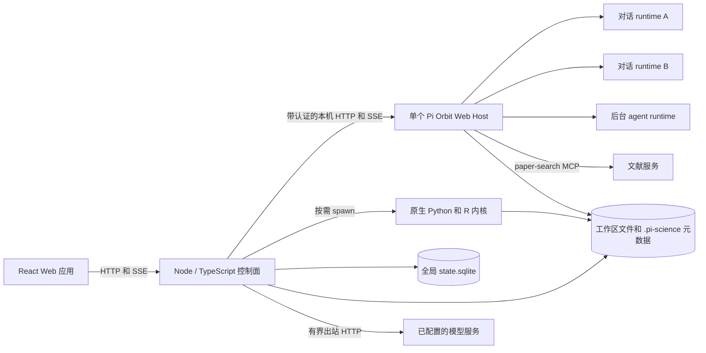
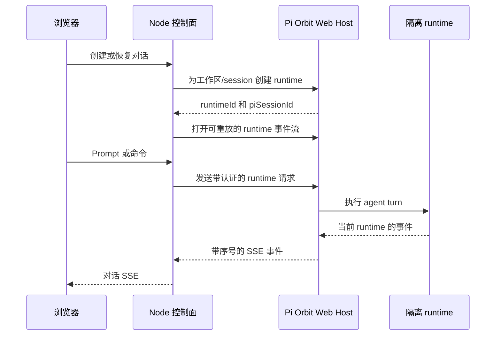
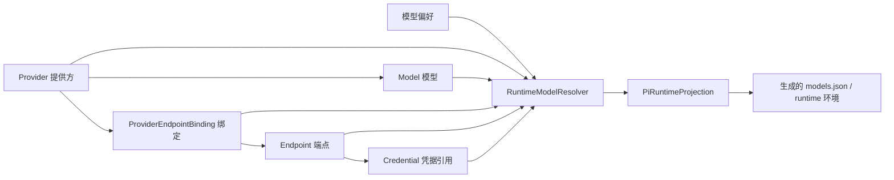

# Pi-Science 架构

[English](architecture.md)

本文描述 Pi-Science 当前的运行时架构，是进程归属、runtime 隔离、服务边界、
工作区状态和生命周期行为的规范参考。

## 系统概览



React 应用是 Node 控制面的客户端。控制面拥有应用 API、协调其他 runtime，
也是浏览器直接调用的唯一后端服务。

| 组件 | 职责 |
|---|---|
| React Web 应用 | 对话、项目知识、文件、Notebook、实验运行、技能、设置和科学文件查看器 |
| Node 控制面 | Session、事件流、文件、任务、谱系、项目状态、设置、SQLite 协调、runtime 生命周期和路由鉴权 |
| Pi Orbit Web Host | Agent session，以及面向对话和有界后台 agent 的隔离 runtime |
| Node 原生科学运行时 | 绑定 Workspace 的 Python/R 内核，以及可选 JupyterLab 工具环境 |
| 全局 SQLite 状态 | Workspace 位置、环境 revision、持久任务、租约和旧状态导入标记 |
| 工作区 | 用户文件，以及项目级指令、技能、环境、session、产物和谱系 |

## Pi Orbit 运行时模型

Pi-Science 为每个 Node 控制面进程启动**一个 Pi Orbit Web Host**，而不是为每个
对话启动一个操作系统进程。第一个 agent runtime 会触发 Host 启动，之后的对话和
后台 agent 复用该 Host。

隔离发生在 Host 内部：

- 每个活跃对话都有独立的 Pi Orbit runtime identity。
- 每个 runtime 绑定到一个规范化工作区和一个 Pi session 文件。
- 恢复、切换、分叉和克隆对话时，会更新或创建对应的 runtime/session 绑定，
  不会再启动一个 Host 进程。
- 项目审查与 research loop subagent 使用由同一控制面 Host 管理的有界 runtime。
- 停止一个对话只会释放对应 runtime；关闭 Node 控制面时会先释放全部 runtime，
  再停止共享 Host。

`PiManager` 负责该生命周期。针对同一 runtime 的并发启动请求会去重；共享 Host 的
并发启动请求也会等待同一个启动操作。

### Host 启动与兼容性检查

安装器默认下载当前平台对应的 Pi Orbit release，并使用发布的 `SHA256SUMS` 校验。
运行时，`PI_CLI_PATH` 指向该原生可执行文件，或兼容的 JavaScript/TypeScript CLI。
设置 `PI_ORBIT_REPO` 可以在安装阶段改用本地 Pi Orbit 源码 checkout，而不是 release
产物。

控制面在随机本机端口上以 Web mode 启动 Pi Orbit，并启用：

- 由应用管理的生命周期；
- 不隐式创建初始 session；
- 随机生成的 bearer token；
- 创建任何 runtime 前的 capability handshake。

Handshake 要求协议版本 1、`single-user-shared-process` 隔离模型、runtime API、
事件重放 API、浏览器 session 认证、workspace binding、项目 trust，以及旧 session
兼容 API。缺少任何必需能力时，启动会以安全失败方式终止。

`PI_SCIENCE_PI_MODE=rpc` 保留旧的逐进程 RPC adapter，作为临时回退路径；Web mode
是受支持的默认架构。

## 命令与事件流



浏览器不会获得 Pi Orbit bearer token，也不会直接调用 Host。`PiProcess` 是 Web API
上的 adapter：它把现有 session command interface 转换为 runtime 与旧 session API，
并在重连后从最后一个事件序号继续重放当前 runtime 的事件。

## Node 原生科学运行时边界

Node 控制面拥有公开的应用 API。Session、workspace、文件、设置、任务、项目知识、
产物、谱系、引用、环境和 research loop 等大部分路由都在 Node 中实现。

Kernel 和 Notebook 等科学计算路由由 Node 控制面直接实现。Kernel Session 是从所选
Micromamba revision 启动的子进程，通过 JSONL 通信并由 Node 统一控制生命周期。
JupyterLab 仍是可选能力，使用独立的应用级工具环境；项目 kernelspec 指向当前项目 revision。

默认本地拓扑如下：

| 服务 | 地址 | 暴露方式 |
|---|---|---|
| React 开发应用 | `http://127.0.0.1:5173` | 面向浏览器 |
| Node 控制面 | `http://127.0.0.1:8787` | 面向浏览器的应用 API |
| Pi Orbit Web Host | 随机本机端口 | 内部服务，使用 bearer token 认证 |

控制面通过 `/internal/live`、`/internal/ready` 和 `/internal/diagnostics`
提供启动器健康检查与本地诊断信息。

## 工作区与持久化状态

Pi-Science 采用 local-first 设计：workspace 始终是普通目录，可移植的项目级状态保存在
其内部；跨项目的协调状态则单独保存在控制面配置目录中。

```text
project/
├── AGENTS.md                 # 项目指令
├── node_modules/             # 工作区级 JavaScript 包
├── .pi/
│   ├── skills/
│   └── agents/
├── .pi-science/
│   ├── project.json           # 稳定项目身份与显示元数据
│   ├── environment.json       # 指向共享 Micromamba revision 的绑定
│   ├── memory/
│   │   └── ledger.json       # 项目记忆规范存储（记录、提案、决策）
│   ├── sessions/             # 持久化的 Pi session JSONL 文件
│   ├── agent/                # 项目级 runtime 配置回退目录
│   ├── runs/                 # 执行工作区与输出
│   ├── solutions/            # 不可变 research candidate
│   ├── session-titles.jsonl
│   ├── turn-artifacts.jsonl
│   ├── artifacts.jsonl
│   ├── provenance.jsonl
│   └── research-records-v2.jsonl
└── 科研文件
```

如果设置了 `PI_SCIENCE_HOME`，它就是全局配置目录；否则默认使用
`~/.pi-science`。首选位置不可写时，会回退到当前 checkout 下的
`.runtime/pi-science`。生产环境默认启用 SQLite，并由专用 worker thread 管理
`state.sqlite`。数据库使用 WAL journal，并保存：

- 稳定项目身份和规范化 workspace 位置，包括托管、收藏、最近打开与位置缺失状态；
- 不可变 Micromamba environment revision 及其生命周期状态；
- 持久任务记录、输出、owner generation 与恢复租约；
- schema migration 历史和旧状态导入指纹。

服务报告 ready 之前会完成 SQLite schema migration。数据库或迁移失败时，
`/internal/ready` 持续返回 HTTP 503；`/internal/diagnostics` 会报告状态、schema
版本、journal mode 和等待中的请求。正常关闭时 worker 会 checkpoint 数据库。
设置 `PI_SCIENCE_SQLITE_STATE=0` 可在诊断或回退时禁用该状态层；已实现的文件存储
兼容路径会继续生效。

审核后的项目记忆按需创建。Agent 发现只有在用户接受后，才会成为正式项目知识。

Memory Ledger 是项目记忆的规范存储：它把现有项目知识、审核提案、证据引用、审批状态
和决策审计事件统一放在一起。已有的 `.pi-science/project-state.json` 会在第一次读取时
迁移，并继续作为旧客户端和本地工具的兼容投影保留。

外部 workspace 通过打开 workspace 的 API 显式注册，其规范化路径和收藏状态写入
SQLite，因此重启后仍可重新发现。启动时会幂等导入旧的
`registered-workspaces.json`、`pinned.json`、环境 registry 文件和 workspace 任务
记录；这些文件是兼容输入，不再是生产环境的规范存储。

### 包隔离

Node 控制面在 SQLite 中维护全局的、带版本的 Micromamba 环境注册表。项目只保存
`environment.json` 绑定，可以复用已经就绪的 revision，不再重复下载依赖。修改受管
环境会创建新 revision，不会原地改变其他项目使用的环境。环境选择位于“设置 → 环境”。

每个对话 Session 和语言使用独立 Kernel 进程，直接从绑定的 Micromamba revision 启动。
Ready revision 不可变；安装包会创建并绑定新的 revision，因此一个 Session 不会修改
其他项目正在使用的 revision。已有 workspace `.venv` 暂时作为迁移回退；格式异常的
`.venv` 不会被自动覆盖。JavaScript 包仍保留在 workspace 内，全局 npm/pnpm 安装
重定向到 `.pi-science/`。

Session Notebook 从当前对话内部打开，统一展示 Agent 与用户单元的执行历史；磁盘
`.ipynb` 文件从“文件”打开，只有保存后才持久化。JupyterLab 使用一个应用级工具环境，
并把项目绑定的 revision 注册为 kernelspec。

## 模型资源域和运行时投影

模型配置拆分为五类资源：



- `Provider` 描述模型由谁提供。系统提供方只读；用户提供方保存到
  `model-resources.json`。
- `Model` 保存标准 `<provider_id>/<model_id>` 和能力来源。运行时验证优先级最高，
  其次是手工设置、发现结果、提供方元数据和保守回退。
- `Endpoint` 只负责 URL、协议、健康状态、出站策略和 `credential_ref`。它不保存模型
  能力，也不保存原始密钥。
- `ProviderEndpointBinding` 把提供方连接到端点，并管理优先级、模型过滤、别名和非敏感
  header。
- `CredentialStore` 在单独的 0600 文件中保存托管密钥。普通 API 只返回元数据。环境凭据
  只有在 Credential 明确写出变量名时才会读取。
- `RuntimeModelResolver` 会排除禁用、blocked、不健康、被过滤和没有认证的路由，并按
  优先级稳定排序。
- `PiRuntimeProjection` 是唯一写入 Pi `models.json` 的适配器。托管密钥只用不可预测的
  临时 runtime 变量注入，不会写入 runtime descriptor 或浏览器 API。

旧的 `custom_providers`、提供方 API key 字段和 `model-endpoints.json` 只作为迁移输入或
兼容投影。新写入统一使用模型资源服务。

## 信任与安全边界

- Pi Orbit Host 只监听本机地址，控制面的每个请求都需要随机生成的 bearer token。
- Token 只保留在后端；不会向浏览器 origin 开放 Host 的直接 CORS 访问。
- 创建 runtime 前会规范化并校验 workspace 路径。
- 每个已注册 workspace 在 `.pi-science/project.json` 中拥有稳定的项目身份；
  session 列表通过该清单解析 `project_id`。
- 注册后的 workspace 位于应用信任边界内。控制面会在创建 runtime 前记录 Pi Orbit
  项目 trust，因此只应注册你信任其中项目指令与技能的 workspace。
- Runtime identity 同时包含 workspace 和 session identity，防止通过另一个 workspace
  的 runtime 恢复 session。
- 多个 writer 可能更新同一记录时，项目本地元数据使用经过校验的路径、原子写入和
  advisory lock；全局状态变更通过 SQLite worker 中的 repository 操作串行化。
- 模型提供商以及用户显式触发的 MCP/连接器操作可能向本机外发送请求。端点 URL 不允许
  嵌入凭据；健康检查限制重定向次数、响应大小和超时时间，跨 origin 跳转不会携带敏感
  header。为支持本地模型服务，默认允许私网端点；设置
  `PI_SCIENCE_ALLOW_PRIVATE_PROVIDERS=0` 可以拒绝私网地址。
- 默认将出站连接器的目标记录到本地 `egress-audit.jsonl`。在 `config.json` 中设置
  `egress_audit: false` 可以关闭审计。记录只包含连接器身份、目标域名、时间戳和审批
  状态，不保存请求正文或凭据。

## 生命周期与恢复

- 对话 runtime 默认在空闲 30 分钟后回收。设置 `PI_SCIENCE_IDLE_RUNTIME_MS=0`
  可以关闭控制面清理；Pi Orbit Host 自身会按 `PI_ORBIT_IDLE_TIMEOUT_MS` 回收空闲
  runtime，默认期限为 24 小时。
- 删除繁忙 runtime 时，最多等待 `PI_SCIENCE_DISPOSE_TIMEOUT_MS`（默认 60 秒）让其
  稳定；控制面关闭时会跳过等待并直接停止 Host。
- 只要 Node 控制面仍在运行，共享 Pi Orbit Host 就保持存活，即使当前没有对话 runtime。
- Kernel 子进程在 Session 首次执行 cell 时按需启动，并在 Session 关闭、workspace
  关闭、崩溃恢复或超时清理时停止。
- Runtime 命令使用有界请求超时。超时操作会与 runtime 状态进行 reconciliation，
  避免已接受的 prompt 被静默当成失败 turn。
- 事件流重连时会携带最后一个已观察到的序号，因此短暂传输中断不需要新建 agent runtime。
- 持久任务在 SQLite 中使用 owner generation 和带期限的 lease。启动恢复会协调被中断的
  工作，同时防止旧进程覆盖新 owner 已写入的终态结果。

## 研究循环

Research loop 由 Node 控制面协调。它使用有界 Pi Orbit subagent runtime 生成与分析
candidate，使用任务系统执行和确定性评估，使用不可变 candidate snapshot，并通过
append-only 记录支持恢复与谱系追踪。

Research loop 状态机和持久化约定详见
[research loop ADR](adr-research-loop-subagents.md)。
