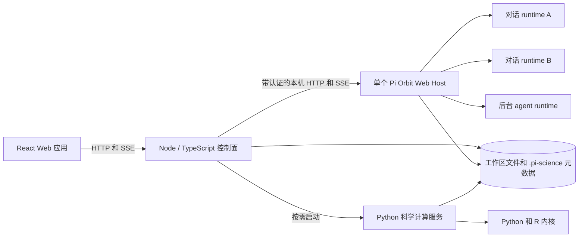
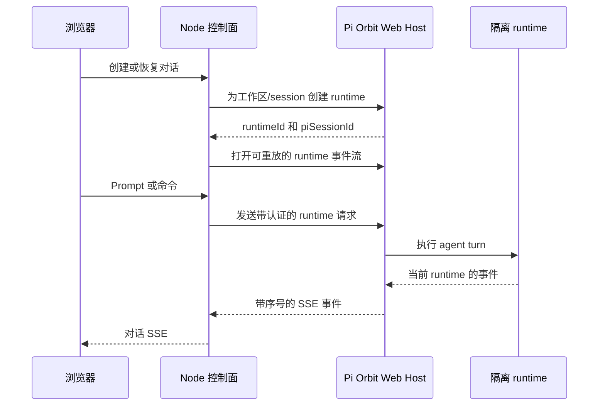

# Pi-Science 架构

[English](architecture.md)

本文描述 Pi-Science 当前的运行时架构，是进程归属、runtime 隔离、服务边界、
工作区状态和生命周期行为的规范参考。

## 系统概览



React 应用是 Node 控制面的客户端。控制面拥有应用 API、协调其他 runtime，
也是浏览器直接调用的唯一后端服务。

| 组件 | 职责 |
|---|---|
| React Web 应用 | 对话、项目知识、文件、Notebook、实验运行、技能、设置和科学文件查看器 |
| Node 控制面 | Session、事件流、文件、任务、谱系、项目状态、设置、runtime 生命周期和路由鉴权 |
| Pi Orbit Web Host | Agent session，以及面向对话和有界后台 agent 的隔离 runtime |
| Python 科学计算服务 | 科学服务、Notebook、PDF 处理和 Python/R 内核 |
| 工作区 | 用户文件，以及项目级指令、技能、环境、session、产物和谱系 |

## Pi Orbit 运行时模型

Pi-Science 为每个 Node 控制面进程启动**一个 Pi Orbit Web Host**，而不是为每个
对话启动一个操作系统进程。第一个 agent runtime 会触发 Host 启动，之后的对话和
后台 agent 复用该 Host。

隔离发生在 Host 内部：

- 每个活跃对话都有独立的 Pi Orbit runtime identity。
- 每个 runtime 绑定到一个规范化工作区和一个 Pi session 文件。
- 恢复、切换、分叉和克隆对话时，会更新或创建对应的 runtime/session 绑定，
  不会再启动一个 Host 进程。
- 项目审查与 research loop subagent 使用由同一控制面 Host 管理的有界 runtime。
- 停止一个对话只会释放对应 runtime；关闭 Node 控制面时会先释放全部 runtime，
  再停止共享 Host。

`PiManager` 负责该生命周期。针对同一 runtime 的并发启动请求会去重；共享 Host 的
并发启动请求也会等待同一个启动操作。

### Host 启动与兼容性检查

安装器默认下载当前平台对应的 Pi Orbit release，并使用发布的 `SHA256SUMS` 校验。
运行时，`PI_CLI_PATH` 指向该原生可执行文件，或兼容的 JavaScript/TypeScript CLI。
设置 `PI_ORBIT_REPO` 可以在安装阶段改用本地 Pi Orbit 源码 checkout，而不是 release
产物。

控制面在随机本机端口上以 Web mode 启动 Pi Orbit，并启用：

- 由应用管理的生命周期；
- 不隐式创建初始 session；
- 随机生成的 bearer token；
- 创建任何 runtime 前的 capability handshake。

Handshake 要求协议版本 1、`single-user-shared-process` 隔离模型、runtime API、
事件重放 API、浏览器 session 认证、workspace binding、项目 trust，以及旧 session
兼容 API。缺少任何必需能力时，启动会以安全失败方式终止。

`PI_SCIENCE_PI_MODE=rpc` 保留旧的逐进程 RPC adapter，作为临时回退路径；Web mode
是受支持的默认架构。

## 命令与事件流



浏览器不会获得 Pi Orbit bearer token，也不会直接调用 Host。`PiProcess` 是 Web API
上的 adapter：它把现有 session command interface 转换为 runtime 与旧 session API，
并在重连后从最后一个事件序号继续重放当前 runtime 的事件。

## Node 与 Python 服务边界

Node 控制面拥有公开的应用 API。Session、workspace、文件、设置、任务、项目知识、
产物、谱系、引用、环境和 research loop 等大部分路由都在 Node 中实现。

Kernel、Notebook 和 PDF 处理等科学计算路由通过兼容代理转发到 Python 服务。
Python 服务可以由外部管理，也可以由控制面按需启动。默认情况下，受管服务在没有
活跃科学计算请求五分钟后回收。

默认本地拓扑如下：

| 服务 | 地址 | 暴露方式 |
|---|---|---|
| React 开发应用 | `http://127.0.0.1:5173` | 面向浏览器 |
| Node 控制面 | `http://127.0.0.1:8787` | 面向浏览器的应用 API |
| 交互式 API 参考 | `http://127.0.0.1:8787/docs` | 由控制面提供 |
| Python 科学计算服务 | `http://127.0.0.1:8788` | 内部服务，通过控制面访问 |
| Pi Orbit Web Host | 随机本机端口 | 内部服务，使用 bearer token 认证 |

## 工作区与持久化状态

Pi-Science 采用 local-first 设计：workspace 始终是普通目录，项目级状态保存在其内部。

```text
project/
├── AGENTS.md                 # 项目指令
├── .venv/                    # 工作区级 Python 环境
├── node_modules/             # 工作区级 JavaScript 包
├── .pi/
│   ├── skills/
│   └── agents/
├── .pi-science/
│   ├── project.json           # 稳定项目身份与显示元数据
│   ├── sessions/             # 持久化的 Pi session JSONL 文件
│   ├── agent/                # 项目级 runtime 配置回退目录
│   ├── runs/                 # 执行工作区与输出
│   ├── solutions/            # 不可变 research candidate
│   ├── artifacts.jsonl
│   ├── provenance.jsonl
│   └── research-records-v2.jsonl
└── 科研文件
```

审核后的项目记忆按需创建。Agent 发现只有在用户接受后，才会成为正式项目知识。

外部 workspace 通过打开 workspace 的 API 显式注册。其规范化路径会写入全局
`registered-workspaces.json`，因此重启后仍可重新发现；它与表示用户收藏的
`pinned.json` 分开保存。

### 包隔离

第一次使用 Agent、Job 或 Python Kernel 时会初始化 `.venv/`。Agent 进程、本地任务和
Notebook kernel 都会把该环境放在 `PATH` 最前面；`pip` 被配置为拒绝在虚拟环境外
安装。JavaScript 包保留在 workspace 内；尝试进行 npm/pnpm 全局安装时，目标会被
重定向到 `.pi-science/` 下，不会修改宿主机安装。已有但格式异常的 `.venv` 不会被
自动覆盖。可以从 Notebooks 页面或通过 `GET/POST /api/environments/workspace`
检查或初始化环境。

## 信任与安全边界

- Pi Orbit Host 只监听本机地址，控制面的每个请求都需要随机生成的 bearer token。
- Token 只保留在后端；不会向浏览器 origin 开放 Host 的直接 CORS 访问。
- 创建 runtime 前会规范化并校验 workspace 路径。
- 每个已注册 workspace 在 `.pi-science/project.json` 中拥有稳定的项目身份；
  session 列表通过该清单解析 `project_id`。
- 注册后的 workspace 位于应用信任边界内。控制面会在创建 runtime 前记录 Pi Orbit
  项目 trust，因此只应注册你信任其中项目指令与技能的 workspace。
- Runtime identity 同时包含 workspace 和 session identity，防止通过另一个 workspace
  的 runtime 恢复 session。
- 多个 writer 可能更新同一记录时，项目元数据使用经过校验的路径、原子写入和 advisory
  lock。

## 生命周期与恢复

- 对话 runtime 默认在空闲 30 分钟后回收。设置 `PI_SCIENCE_IDLE_RUNTIME_MS=0`
  可以关闭控制面清理。
- 只要 Node 控制面仍在运行，共享 Pi Orbit Host 就保持存活，即使当前没有对话 runtime。
- 受管 Python 服务在第一次科学计算请求时启动，并在空闲期结束后停止；
  `PI_SCIENCE_SCIENTIFIC_IDLE_MS` 控制该时长。
- Runtime 命令使用有界请求超时。超时操作会与 runtime 状态进行 reconciliation，
  避免已接受的 prompt 被静默当成失败 turn。
- 事件流重连时会携带最后一个已观察到的序号，因此短暂传输中断不需要新建 agent runtime。

## 研究循环

Research loop 由 Node 控制面协调。它使用有界 Pi Orbit subagent runtime 生成与分析
candidate，使用任务系统执行和确定性评估，使用不可变 candidate snapshot，并通过
append-only 记录支持恢复与谱系追踪。

Research loop 状态机和持久化约定详见
[research loop ADR](adr-research-loop-subagents.md)。
