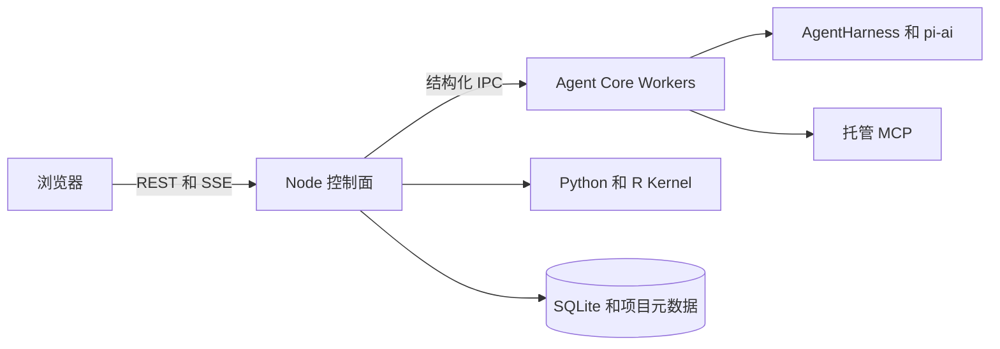
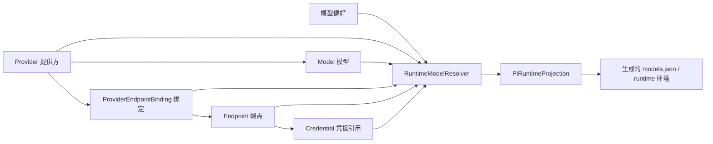
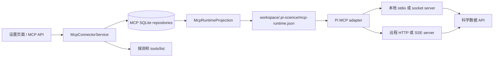

# Pi-Science 架构

[English](architecture.md)

本文描述 Pi-Science 当前的运行时架构，是进程归属、runtime 隔离、服务边界、
工作区状态和生命周期行为的规范参考。

## Agent Core 运行时


```mermaid
flowchart LR
    UI[浏览器] -->|REST 和 SSE| CP[Node 控制面]
    CP -->|结构化 IPC| W[Agent Core Workers]
    W --> SDK[AgentHarness 和 pi-ai]
    W --> MCP[托管 MCP]
    CP --> K[Python 和 R Kernel]
    CP --> DB[(SQLite 和项目元数据)]
```

Agent Core 是唯一执行后端。每个活跃对话由独立 Node Worker 执行，`AgentRuntimeManager` 负责容量、会话排他归属与进程生命周期。研究、复查及对话子代理使用隐藏 v4 会话；标题生成使用无工具、无技能的临时 Worker。

控制面把结构化 Worker 事件转换为浏览器 SSE，负责持久恢复、产物、交互及统计。Worker 重启后继续打开同一 v4 会话，浏览器不加载模型 SDK 或凭据。Worker 命令通过结构化 Node IPC 传递，SDK 在子进程中运行。

v3 会话只作为数据输入：首次使用时完整校验并复制，由官方 SDK 原子升级副本，再登记 Core 归属。离线转换不启动 Worker，也不需要 API key；原文件保持不变。见[会话转换说明](agent-core-session-conversion.md)。

## Node 原生科学运行时边界

Node 控制面拥有公开的应用 API。Session、workspace、文件、设置、任务、项目知识、
产物、谱系、引用、环境和 research loop 等大部分路由都在 Node 中实现。

Kernel 和 Notebook 等科学计算路由由 Node 控制面直接实现。Kernel Session 是从所选
Micromamba revision 启动的子进程，通过 JSONL 通信并由 Node 统一控制生命周期。
JupyterLab 仍是可选能力，使用独立的应用级工具环境；项目 kernelspec 指向当前项目 revision。

默认本地拓扑如下：

| 服务 | 地址 | 暴露方式 |
|---|---|---|
| React 开发应用 | `http://127.0.0.1:5173` | 面向浏览器 |
| Node 控制面 | `http://127.0.0.1:8787` | 面向浏览器的应用 API |
| Agent Core Worker | 父子进程 IPC | 内部执行 |

控制面通过 `/internal/live`、`/internal/ready` 和 `/internal/diagnostics`
提供启动器健康检查与本地诊断信息。

## 工作区与持久化状态

Pi-Science 采用 local-first 设计：workspace 始终是普通目录，可移植的项目级状态保存在
其内部；跨项目的协调状态则单独保存在控制面配置目录中。

```text
project/
├── AGENTS.md                 # 项目指令
├── node_modules/             # 工作区级 JavaScript 包
├── .pi/
│   ├── skills/
│   └── agents/
├── .pi-science/
│   ├── project.json           # 稳定项目身份与显示元数据
│   ├── environment.json       # 指向共享 Micromamba revision 的绑定
│   ├── memory/
│   │   └── ledger.json       # 项目记忆规范存储（记录、提案、决策）
│   ├── sessions/             # 持久化的 Pi session JSONL 文件
│   ├── agent/                # 项目级 runtime 配置回退目录
│   ├── mcp-runtime.json      # 生成的已启用连接器与有效工具策略
│   ├── runs/                 # 执行工作区与输出
│   ├── solutions/            # 不可变 research candidate
│   ├── session-titles.jsonl
│   ├── turn-artifacts.jsonl
│   ├── artifacts.jsonl
│   ├── provenance.jsonl
│   └── research-records-v2.jsonl
└── 科研文件
```

如果设置了 `PI_SCIENCE_HOME`，它就是全局配置目录；否则默认使用
`~/.pi-science`。首选位置不可写时，会回退到当前 checkout 下的
`.runtime/pi-science`。生产环境默认启用 SQLite，并由专用 worker thread 管理
`state.sqlite`。数据库使用 WAL journal，并保存：

- 稳定项目身份和规范化 workspace 位置，包括托管、收藏、最近打开与位置缺失状态；
- 不可变 Micromamba environment revision 及其生命周期状态；
- 持久任务记录、输出、owner generation 与恢复租约；
- schema migration 历史和旧状态导入指纹。

服务报告 ready 之前会完成 SQLite schema migration。数据库或迁移失败时，
`/internal/ready` 持续返回 HTTP 503；`/internal/diagnostics` 会报告状态、schema
版本、journal mode 和等待中的请求。正常关闭时 worker 会 checkpoint 数据库。
设置 `PI_SCIENCE_SQLITE_STATE=0` 可在诊断或回退时禁用该状态层；已实现的文件存储
兼容路径会继续生效。

审核后的项目记忆按需创建。Agent 发现只有在用户接受后，才会成为正式项目知识。

Memory Ledger 是项目记忆的规范存储：它把现有项目知识、审核提案、证据引用、审批状态
和决策审计事件统一放在一起。已有的 `.pi-science/project-state.json` 会在第一次读取时
迁移，并继续作为旧客户端和本地工具的兼容投影保留。

外部 workspace 通过打开 workspace 的 API 显式注册，其规范化路径和收藏状态写入
SQLite，因此重启后仍可重新发现。启动时会幂等导入旧的
`registered-workspaces.json`、`pinned.json`、环境 registry 文件和 workspace 任务
记录；这些文件是兼容输入，不再是生产环境的规范存储。

### 包隔离

Node 控制面在 SQLite 中维护全局的、带版本的 Micromamba 环境注册表。项目只保存
`environment.json` 绑定，可以复用已经就绪的 revision，不再重复下载依赖。修改受管
环境会创建新 revision，不会原地改变其他项目使用的环境。环境选择位于“设置 → 环境”。

每个对话 Session 和语言使用独立 Kernel 进程，直接从绑定的 Micromamba revision 启动。
Ready revision 不可变；安装包会创建并绑定新的 revision，因此一个 Session 不会修改
其他项目正在使用的 revision。已有 workspace `.venv` 暂时作为迁移回退；格式异常的
`.venv` 不会被自动覆盖。JavaScript 包仍保留在 workspace 内，全局 npm/pnpm 安装
重定向到 `.pi-science/`。

Session Notebook 从当前对话内部打开，统一展示 Agent 与用户单元的执行历史；磁盘
`.ipynb` 文件从“文件”打开，只有保存后才持久化。JupyterLab 使用一个应用级工具环境，
并把项目绑定的 revision 注册为 kernelspec。

## 模型资源域和运行时投影

模型配置拆分为五类资源：


```mermaid
flowchart LR
    P[Provider 提供方] --> M[Model 模型]
    P --> B[ProviderEndpointBinding 绑定]
    B --> E[Endpoint 端点]
    E --> C[Credential 凭据引用]
    S[模型偏好] --> R[RuntimeModelResolver]
    P --> R
    M --> R
    B --> R
    E --> R
    C --> R
    R --> X[PiRuntimeProjection]
    X --> J[生成的 models.json / runtime 环境]
```

- `Provider` 描述模型由谁提供。系统提供方只读；用户提供方保存到
  `model-resources.json`。
- `Model` 保存标准 `<provider_id>/<model_id>` 和能力来源。运行时验证优先级最高，
  其次是手工设置、发现结果、提供方元数据和保守回退。
- `Endpoint` 只负责 URL、协议、健康状态、出站策略和 `credential_ref`。它不保存模型
  能力，也不保存原始密钥。
- `ProviderEndpointBinding` 把提供方连接到端点，并管理优先级、模型过滤、别名和非敏感
  header。
- `CredentialStore` 在单独的 0600 文件中保存托管密钥。普通 API 只返回元数据。环境凭据
  只有在 Credential 明确写出变量名时才会读取。
- `RuntimeModelResolver` 会排除禁用、blocked、不健康、被过滤和没有认证的路由，并按
  优先级稳定排序。
- `PiRuntimeProjection` 是唯一写入 Pi `models.json` 的适配器。托管密钥只用不可预测的
  临时 runtime 变量注入，不会写入 runtime descriptor 或浏览器 API。

旧的 `custom_providers`、提供方 API key 字段和 `model-endpoints.json` 只作为迁移输入或
兼容投影。新写入统一使用模型资源服务。

## MCP 连接器域和运行时投影

MCP 配置由 Node 控制面托管，不需要手工编辑 运行时配置文件。连接器定义、全局启用与
筛选、全局工具决策、项目级工具覆盖和工具发现缓存都是 SQLite 中的规范资源。


```mermaid
flowchart LR
    UI[设置页面 / MCP API] --> S[McpConnectorService]
    S --> DB[(MCP SQLite repositories)]
    S --> P[探测和 tools/list]
    DB --> RP[McpRuntimeProjection]
    RP --> F[workspace/.pi-science/mcp-runtime.json]
    F --> A[Pi MCP adapter]
    A --> L[本地 stdio 或 socket server]
    A --> H[远程 HTTP 或 SSE server]
    L --> D[科学数据 API]
    H --> D
```

- 启动时幂等写入 18 个内置定义及其已知工具元数据。定义升级会保留用户的启用和审批
  设置。Paper Search 默认开启，其他 17 个领域连接器需要显式启用；内置定义不能编辑
  或删除。
- 内置连接器共暴露 85 个只读工具。Paper Search 使用独立 MCP 进程；其他领域共用一个
  实现入口，但以不同领域参数分别启动，因此每个连接器只公布自己的工具。进程采用
  lazy 生命周期管理。
- 自定义和从旧配置导入的连接器使用同一资源模型，支持 `stdio`、Streamable HTTP、SSE
  和 socket transport。导入预览会拒绝包含敏感字段的旧配置。连接器认证可使用本地托管
  密钥或环境变量引用，并将其传递为进程环境变量、HTTP Header 或 Bearer Token；仍拒绝
  保存字面量密钥绑定。
- MCP 凭据保存在独立、权限为 0600 的 `CredentialStore` 中，并记录
  `owner_kind=mcp` 和所属连接器。通用模型凭据 API 不列出也不能修改这些凭据。运行时
  快照只包含凭据引用，由 SDK MCP 工具加载器在进程内解析；内置定义升级会保留已有绑定。
- 启用状态、include/exclude 筛选和审批模式全局生效。工具的精确名称 `允许`、`询问`、
  `拒绝` 决策既可以全局设置，也可以按项目覆盖；优先级依次是 `拒绝`、项目决策、全局
  决策、连接器审批模式。除非连接器显式允许全部工具，未知工具仍需要审批。
- 影响 runtime 的定义或策略变更会为所有已知 workspace 生成权限为 0600、原子替换的
  `.pi-science/mcp-runtime.json`，并重载活跃 runtime。快照只保存启用的定义和策略，不
  保存解析后的密钥。每个 Agent Core Worker 通过 SDK MCP 工具加载器从自己的 Session
  workspace 加载快照。
- 探测流程执行 MCP handshake 和 `tools/list`，合并并发探测，并按连接器 revision 与
  fingerprint 缓存结果。内置工具元数据使用启动时写入的长期缓存，在线探测可以刷新它。
- 远程 transport 和内置上游客户端都经过受保护的 MCP fetch 路径：连接前校验 URL，
  公网端点启用 DNS rebinding 防护，拒绝跨 origin 请求和 HTTP 重定向，对请求设置边界，
  并将结果写入出站审计。

详细 API、schema、迁移和 UI 约定见
[MCP 管理实现](mcp-management-implementation.md)。

## 信任与安全边界

- Agent Core Worker 仅通过父子进程 IPC 接收控制面命令，浏览器不能直接调用 Worker。
- Token 只保留在后端；不会向浏览器 origin 开放 Host 的直接 CORS 访问。
- 创建 runtime 前会规范化并校验 workspace 路径。
- 每个已注册 workspace 在 `.pi-science/project.json` 中拥有稳定的项目身份；
  session 列表通过该清单解析 `project_id`。
- 注册后的 workspace 位于应用信任边界内。只应注册你信任其中项目指令与技能的 workspace。
- Runtime identity 同时包含 workspace 和 session identity，防止通过另一个 workspace
  的 runtime 恢复 session。
- 多个 writer 可能更新同一记录时，项目本地元数据使用经过校验的路径、原子写入和
  advisory lock；全局状态变更通过 SQLite worker 中的 repository 操作串行化。
- 模型提供商以及用户显式触发的文献/连接器操作可能向本机外发送请求。端点 URL 不允许
  嵌入凭据；健康检查限制重定向次数、响应大小和超时时间，跨 origin 跳转不会携带敏感
  header。为支持本地模型服务，默认允许私网端点；设置
  `PI_SCIENCE_ALLOW_PRIVATE_PROVIDERS=0` 可以拒绝私网地址。
- 默认将出站连接器的目标记录到本地 `egress-audit.jsonl`。在 `config.json` 中设置
  `egress_audit: false` 可以关闭审计。记录只包含连接器身份、目标域名、时间戳和审批
  状态，不保存请求正文或凭据。

## 生命周期与恢复


- Agent Worker 使用有界 IPC 请求、持久操作结果及恢复探测。繁忙会话不允许删除；控制面退出会关闭 Worker 和工具进程。
- Kernel 子进程在 Session 首次执行 cell 时按需启动，并在 Session 关闭、workspace
  关闭、崩溃恢复或超时清理时停止。
- Runtime 命令使用有界请求超时。超时操作会与 runtime 状态进行 reconciliation，
  避免已接受的 prompt 被静默当成失败 turn。
- 事件流重连时会携带最后一个已观察到的序号，因此短暂传输中断不需要新建 agent runtime。
- 持久任务在 SQLite 中使用 owner generation 和带期限的 lease。启动恢复会协调被中断的
  工作，同时防止旧进程覆盖新 owner 已写入的终态结果。

## 研究循环

Research loop 由 Node 控制面协调。它使用有界 Agent Core subagent Worker 生成与分析
candidate，使用任务系统执行和确定性评估，使用不可变 candidate snapshot，并通过
append-only 记录支持恢复与谱系追踪。

Research loop 状态机和持久化约定详见
[research loop ADR](adr-research-loop-subagents.md)。
