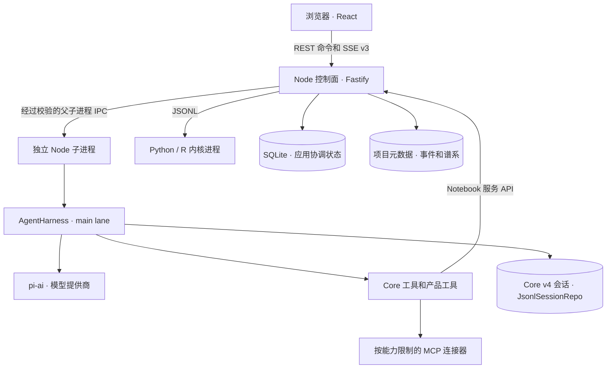
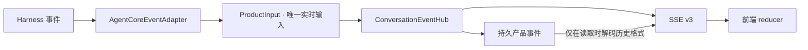

# Pi-Science 架构

[English](architecture.md) · [README](../README.zh-CN.md)

本文是当前生产架构的规范参考，说明执行与持久状态由谁负责、事件如何到达浏览器，以及系统如何恢复。实现记录和能力边界见文末链接。

## 系统边界


```mermaid
flowchart TB
    UI["浏览器 · React"] -->|REST 命令和 SSE v3| CP["Node 控制面 · Fastify"]
    CP -->|经过校验的父子进程 IPC| W["独立 Node 子进程"]
    W --> H["AgentHarness · main lane"]
    H --> AI["pi-ai · 模型提供商"]
    H --> T["Core 工具和产品工具"]
    T --> MCP["按能力限制的 MCP 连接器"]
    T -->|Notebook 服务 API| CP
    H --> S[("Core v4 会话 · JsonlSessionRepo")]
    CP -->|JSONL| K["Python / R 内核进程"]
    CP --> DB[("SQLite · 应用协调状态")]
    CP --> P[("项目元数据 · 事件和谱系")]
```

Agent Core 是唯一的智能体执行后端。对话、子代理、研究、复查和 AI 标题都通过 `AgentRuntimeManager` 使用 AgentHarness。这里的 Worker 指 Node **子进程**，而非浏览器 Worker 或共享智能体宿主；SQLite 服务使用的是独立 **worker thread**。

| 组件 | 负责 | 不负责 |
| --- | --- | --- |
| 浏览器 | 展示、输入、交互状态和已应用的 SSE 游标 | 模型凭据和智能体执行循环 |
| `AgentRuntimeManager` | 子进程容量、会话排他归属、启动、空闲清理和关闭 | 持久智能体状态 |
| `AgentCoreSessionService` | 提示提交对账、配置同步和运行监督 | 第二套执行循环或会话格式 |
| `SessionRuntime` / AgentHarness | Lane 执行、工具、模型配置、压缩和持久操作结果 | 浏览器展示 |
| `AgentSessionRepository` | 将 Core 会话只读投影为产品历史 | 另一套权威对话存储 |
| `ConversationEventHub` | 产品事件身份、持久化、交付及产品侧效果 | 自行推断 Core 已完成 |
| 科学计算服务 | 内核、Notebook、执行、产物和研究编排状态 | 模型推理 |

默认开发地址是前端 `http://127.0.0.1:5173` 和控制面 `http://127.0.0.1:8787`。Worker 不暴露 HTTP 端点。仓库启动器运行开发服务；构建包不会把启动器变为生产部署服务器。

## 智能体执行与配置

`SessionRuntime` 创建 `NodeExecutionEnv`，打开 `JsonlSessionRepo`，创建 AgentHarness，取得 `main` lane 并监听事件。提示执行使用 `lane.accept()` 和 `lane.drive()`；引导、后续提示与取消分别使用 `lane.steer()`、`lane.followUp()` 和 `lane.abort()`。

Harness 会话数据、`laneState` 和 `operationResult` 是权威状态。配置变更串行执行，并与持久 lane 配置同步；上下文压缩使用 Harness API。技能和提示模板由 Core loader 从配置目录、`.pi/skills/` 和 `.pi/prompts/` 加载，产品策略决定哪些资源可以调用。

工具集合包括 Core 的 `read`、`bash`、`edit`、`write`，以及 Notebook、todo、子代理和浏览器问卷等产品工具。Notebook 工具调用 Node 的 Notebook/内核服务。这不意味着存在通用扩展运行时；实际支持的工具和限制见[能力清单](agent-core-capability-inventory.md)。

隐藏任务共享管理器容量和会话存储：

| 任务 | 能力与生命周期 |
| --- | --- |
| 对话 | 已配置工具与技能；持久、可见的会话 |
| 对话子代理 | 收窄后的父级工具与模型策略；隐藏子会话 |
| 研究监督者 | `read` 和 `subagent`；隐藏会话 |
| 项目复查 | 无工具；隐藏会话 |
| AI 标题 | 无工具、无技能，关闭思考；使用配置的默认模型，临时隐藏会话 |

隐藏会话在激活前登记归属，任务链接使恢复时可以重新打开同一个子会话。标题任务释放时删除临时会话文件和任务链接。隐藏会话不进入正常对话列表。

## 提示提交、生命周期与恢复

首次启动与恢复使用相同顺序：

1. 打开延迟激活的 Worker。
2. 绑定控制面的事件消费者。
3. 读取并应用持久快照。
4. 激活 Worker，再执行或恢复 operation。

提示使用稳定的 operation ID 和浏览器 `client_message_id`。IPC 请求超时意味着提交结果尚不确定；服务先与持久状态对账，再决定报错或重新提交。配置变更串行执行，取消和交互响应不必等待普通配置变更完成。

监督器区分进程存活与操作进展。成功读取 IPC 状态不会重置进展期限。IPC 失败、运行故障、事件丢失，或繁忙操作长期无真实进展，都可触发 Worker 替换和持久操作恢复。等待浏览器问卷或审批的时间不计入无进展期限。

| 配置 | 默认值 | 含义 |
| --- | --- | --- |
| `PI_SCIENCE_AGENT_MAX_WORKERS` | 16 | 应用管理器共享的进程级容量，包括启动中与隐藏任务 |
| `PI_SCIENCE_IDLE_RUNTIME_MS` | 1,800,000 ms | 空闲 Worker 清理期限；非正值关闭空闲清理 |
| `PI_SCIENCE_EVENT_WATCHDOG_MS` | 60,000 ms | 探测间隔；非正值关闭 watchdog |
| `PI_SCIENCE_OPERATION_NO_PROGRESS_MS` | 900,000 ms | 繁忙操作无进展期限；合法但长期静默的工具应增大该值 |

连续自动恢复三次后，再次卡住会停止自动恢复，并保留检查点供显式重新打开。`runtime.paused` 表示运行监督停止，**不代表**持久操作结束。`operation.settled` 来自 Core 生命周期事实或权威的持久操作结果。繁忙会话不能删除；控制面关闭时等待已归属工作清理，并释放 Worker 和工具。

## 产品事件与浏览器状态


```mermaid
flowchart LR
    H["Harness 事件"] --> A["AgentCoreEventAdapter"]
    A --> I["ProductInput · 唯一实时输入"]
    I --> C["ConversationEventHub"]
    C --> E["持久产品事件"]
    C --> S["SSE v3"]
    E -->|仅在读取时解码历史格式| S
    S --> R["前端 reducer"]
```

浏览器消费有版本的产品协议，不依赖 Agent Core 包。服务端将执行事实投影为产品事件，不直接发送 SDK 对象，也不在实时链路中绕经旧协议。

| 事件族 | 语义 |
| --- | --- |
| `operation.started`、`operation.settled` | 持久操作生命周期；结束状态为 `completed`、`declined`、`aborted` 或 `failed` |
| `message.started`、`message.delta`、`message.reasoning.delta`、`message.completed` | 消息生命周期和内容进展 |
| `tool.started`、`tool.updated`、`tool.completed` | 工具调用生命周期 |
| `compaction.started`、`compaction.progress`、`compaction.completed`、`compaction.failed` | 上下文压缩生命周期 |
| `interaction.requested`、`interaction.resolved` | 带明确交互类型的浏览器交互 |
| `runtime.paused` | 监督停止，持久工作仍可能恢复 |

完整事件名称由 [`packages/contracts/src/conversation-events.ts`](../packages/contracts/src/conversation-events.ts) 共享。事件信封携带 `schemaVersion: 3`、工作区/会话身份、流 epoch、事件 ID、序号、时间，以及适用时的操作和条目身份。文本 revision 与有序分块防止重复和过期更新。重连使用 SSE 游标；epoch 和缺口检查保护事件重放与历史恢复。前端保留执行中、等待、恢复中和终态的区别。

旧的持久展示事件仅在 event store 读取路径解码，不修改原文件字节、时间戳、游标和序号。这与 **Core 会话 v3 → v4 转换** 是两个独立边界：会话格式版本与 SSE 协议版本不能混为一谈。

## 持久化与数据归属

科研文件仍是普通工作区文件。产品元数据通过 `metadataRoot(workspace)` 解析：已存在的应用托管 `<config-root>/workspaces/<规范路径哈希>/` 优先；否则使用工作区的 `.pi-science/`。代码应调用解析器，不应假定全部项目状态都与科研文件放在一起。

元数据根目录按需包含：

```text
<metadata-root>/
├── project.json                 # 项目身份
├── environment.json             # 所选环境 revision
├── agent-sessions/              # 权威 Core v4 JSONL
├── agent-session-registry.json   # 归属、转换映射、删除 tombstone
├── agent-task-links/             # 隐藏任务的会话归属
├── agent-task-results/           # 子任务结果
├── sessions/                    # 旧 v3 会话：仅作转换输入
├── events/                      # 有界产品事件重放日志
├── memory/ledger.json            # 已审核知识、提案与决策
├── mcp-runtime.json              # 生成的连接器策略，只含凭据引用
├── runs/                        # 执行目录和输出
├── solutions/                   # 不可变研究候选方案
├── session-titles.jsonl
├── turn-artifacts.jsonl
├── artifacts.jsonl
├── provenance.jsonl
└── research-records-v2.jsonl
```

全局配置目录由 `PI_SCIENCE_HOME` 指定，默认 `~/.pi-science`；首选目录不可写时回退到 checkout 内的 `.runtime/pi-science`。SQLite `state.sqlite` 管理工作区注册、环境 revision、持久任务/租约、MCP 资源和导入/schema 迁移状态，使用 WAL 与专用 worker thread。启动迁移在 ready 之前完成，数据库故障使 `/internal/ready` 保持 HTTP 503。文件投影和历史导入不构成另一套规范存储。

Core 会话由 `JsonlSessionRepo` 管理。旧 v3 会话先校验和复制，再由官方 SDK 升级，原件保持不变；registry 保存归属与条目 ID 映射，删除 tombstone 防止会话被重新导入。转换可离线执行，不需要 Worker、模型密钥或网络。见[会话转换](agent-core-session-conversion.md)。

Memory Ledger 管理正式项目知识与复查决策。智能体发现只有在用户批准后才能成为正式知识。旧 `project-state.json` 会导入并保留为兼容投影。

## 模型、凭据与 MCP

模型资源区分 `Provider`、`Model`、`Endpoint` 和 `ProviderEndpointBinding`，凭据单独保存。规范模型引用为 `<provider_id>/<model_id>`。`RuntimeModelResolver` 根据启用状态、能力、端点策略、优先级和认证筛选可用路由。

Worker 的 [`agentModels()` 适配器](../apps/server/src/runtime/agent/worker/agent-models.ts) 将 pi-ai 官方提供商与托管路由组合，在后端内存中解析凭据，直接构造模型和提供商对象，不生成 `models.json` 运行目录。浏览器 API 只返回凭据元数据，不返回密钥。环境凭据需要显式引用变量名。

MCP 定义、启用状态、发现元数据和全局/项目工具策略由控制面管理。`McpRuntimeProjection` 原子写入权限为 0600 的 `mcp-runtime.json`，其中只有有效策略和凭据引用。`AgentMcpTools` 在 Worker 中通过 Core MCP API 加载允许的连接器。

能力检查发生在发现和凭据解析之前。空 `allowedTools` 或仅含非 MCP 工具时跳过整个 MCP；精确 MCP 能力限制启动哪些连接器，再将发现结果与工具能力及托管 include/exclude 策略取交集。`Deny` 优先于项目决策、全局决策和连接器审批默认值。浏览器审批由 Worker 的 interaction bridge 处理。

内置 18 个科学连接器定义、85 个工具，初始仅启用 Paper Search。内置定义只读，自定义连接器支持 stdio、Streamable HTTP、SSE 和 socket。探测执行 handshake 与工具发现，按 revision 缓存。连接器凭据保存在独立 `CredentialStore`，不写入策略快照。资源/API 设计见 [MCP 管理说明](mcp-management-implementation.md)。

## 科学执行与研究

每个对话和语言使用独立 Python/R 内核进程，从项目绑定的不可变 Micromamba revision 启动。内核按需启动，通过 JSONL 与 Node 通信；安装包创建新 revision。旧工作区 `.venv` 保留为迁移回退，JavaScript 包保存在工作区中。JupyterLab 是可选功能，使用应用级工具环境和项目 kernelspec。

Session Notebook 展示智能体和用户的执行历史。文件型 `.ipynb` 使用 `notebook_read`、`notebook_edit` 和 `notebook_run`。编辑检查文件 SHA-256 或指定 cell revision；源代码变更清除旧输出。执行原子写回受限输出，并记录执行/产物谱系；产物发布失败保留为可见的执行证据。

Node 拥有研究循环的状态、revision、预算、确定性评估和停止决策。隐藏 Core Worker 生成候选方案并分析结果；`JobCoordinator` 执行候选与评估命令。不可变快照和追加记录支持恢复。见[研究循环 ADR](adr-research-loop-subagents.md)。

## 信任、诊断与实现参考

Worker 进程提供故障隔离，**不提供 OS sandbox 保证**。工作区路径和运行身份会校验；普通 bash/MCP 子进程使用经过白名单过滤的工具环境，不直接继承 Worker 的凭据环境。已注册项目的指令和技能仍是受信任输入。浏览器命令在控制面鉴权，Worker 只接受内部 IPC；元数据更新使用原子写入和锁，SQLite 变更经串行 repository 操作执行。

已配置的模型请求和外部连接器工具可能向本机之外传输数据。模型/连接器网络路径校验目标并限制请求；MCP 远程 fetch 还保护重定向和 DNS rebinding。为支持本地服务，模型端点默认允许私网地址，设置 `PI_SCIENCE_ALLOW_PRIVATE_PROVIDERS=0` 可限制。连接器目标记录到 `egress-audit.jsonl`，除非在 `config.json` 中关闭。

| 端点 / 文档 | 用途 |
| --- | --- |
| `/api/health` | 应用健康状态，包括 `active_agent_workers` |
| `/internal/live`、`/internal/ready` | 启动器存活和就绪检查 |
| `/internal/diagnostics` | 存储、迁移和本地运行诊断 |
| [运行时实现](agent-core-runtime-implementation.md) | 执行入口和监督机制 |
| [通信实现](agent-core-communication-implementation.md) | IPC、事件投影和恢复边界 |
| [能力清单](agent-core-capability-inventory.md) | 支持的工具、明确限制与验收范围 |
| [会话转换](agent-core-session-conversion.md) | 离线命令、自动转换和 tombstone |

CI 结果证明对应提交执行过的检查，不意味着所有外部提供商、复杂用户会话和各平台全部界面路径都已人工验收。
