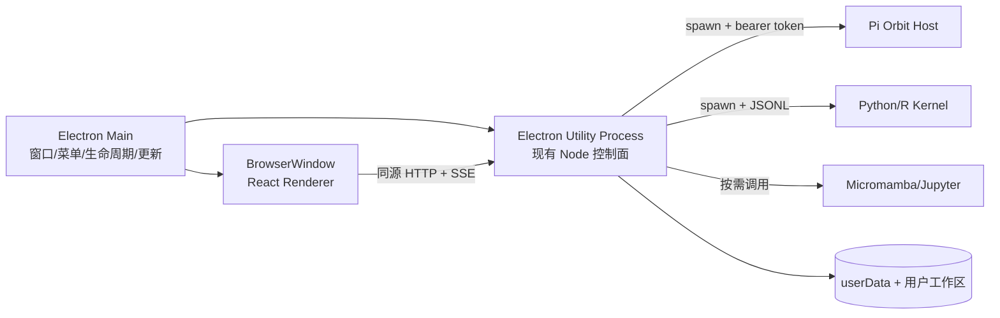

# Pi-Science Electron 桌面端建设方案

> 状态：方案评审稿
> 评估日期：2026-08-22
> 目标：在不重写现有 React、Node 控制面、Pi Orbit 和科学计算运行时的前提下，产出可安装、可签名、可升级的 macOS / Windows / Linux 桌面应用。

> 实施记录（2026-08-23）：首个可构建版本已落地。开发态验证了 Utility Process，但 Electron 43 的 macOS 打包态 helper 未可靠执行外置 runner；当前发行实现改为由 Electron Main 使用自身可执行文件的 Node 模式监督独立控制面子进程。Renderer 隔离、随机端口、cookie 鉴权和优雅退出边界保持不变。仓库供应链策略拒绝 Forge 的 Git 子依赖，因此首版使用官方 `@electron/packager`；安装器阶段可在策略允许后再评估 Forge。后续若恢复 Utility Process，应先保留现有 packaged smoke 作为回归 Gate。

## 1. 结论

Pi-Science **已经具备开发 Electron 桌面端 PoC 和 MVP 的核心技术条件，但尚不具备直接发布生产桌面安装包的条件**。

当前具备的条件：

- React 前端与 Node 控制面已经通过相对路径 HTTP API 和 SSE 解耦，现有前端可以原样运行在 Electron Renderer 中。
- Node 控制面已经能在生产模式托管 `frontend/dist`，并支持监听随机端口（`PI_SCIENCE_PORT=0`）。桌面端无需再启动 Vite。
- 控制面已有统一的 `launchServer()` / `close()` 生命周期、单实例锁、健康检查和子进程清理能力。
- SQLite 使用 Node 内置的 `node:sqlite`，服务端没有需要为 Electron 重编译的业务原生模块。
- Pi Orbit、Python/R kernel、Micromamba 环境本来就是控制面管理的外部运行时，适合继续作为桌面应用的受控子进程。
- 当前生产构建已实际验证通过；构建后的控制面可在随机端口启动，`/internal/ready` 与 `/` 均返回 200。
- 截至评估日，Electron 43.4.1 内置 Node 24.18.1，满足仓库声明的 Node `>=24.16.0` 基线；仍需通过桌面 E2E 验证 `node:sqlite`、Worker 和子进程行为。

当前不具备的条件：

- 仓库内没有 Electron 应用包、主进程、Preload、打包器配置或桌面端测试。
- 没有按 OS/CPU 生成 Pi Orbit 和 runtime extensions 的发行资源流水线。
- 运行时代码通过源码仓库相对路径定位 `harness/`、`skills/`、扩展适配器和 `runtime/pi`，打入 ASAR 后需要统一资源定位层。
- 当前本地 `runtime/` 约 1.2 GB，包含多版本 runtime、npm 缓存和开发依赖，不能整体进入安装包。
- runtime extensions 中存在 `better-sqlite3` 等平台/架构相关 `.node` 文件，不能把一台开发机的 `runtime/pi/node_modules` 跨平台复制发布。
- Windows 下 Micromamba 自动下载路径尚不支持，桌面安装包必须提供 `micromamba.exe` 或新增经校验的 Windows 下载逻辑。
- 控制面的 API 目前只依赖监听 `127.0.0.1`，`PI_SCIENCE_INTERNAL_TOKEN` 尚未形成 API 鉴权。桌面应用包含代码执行和文件写入能力，仅使用随机端口不足以作为安全边界。
- 没有应用图标、应用 ID、签名、公证、安装器、发布渠道、自动更新策略和桌面发行 CI。

因此，当前成熟度可定义为：

| 层级 | 状态 | 判断 |
|---|---|---|
| Electron 技术验证 | 可立即开始 | 核心 Web 与控制面可以复用 |
| 内部测试版 | 补齐桌面壳和资源清单后可达 | 重点解决资源路径与 runtime 组装 |
| 对外生产发布 | 尚不具备 | 鉴权、签名、公证、更新、跨平台 E2E 均为发布阻塞项 |

## 2. 推荐架构



推荐采用“**桌面壳 + 独立控制面 + 原有外部运行时**”架构：

1. Electron Main 只负责应用生命周期、单实例、窗口、系统菜单、文件选择、外链策略、日志和更新。
2. Electron `utilityProcess.fork()` 启动一个桌面专用 server runner，由 runner 调用现有 `launchServer()`；控制面监听 `127.0.0.1:0`，就绪后通过父子消息把实际 URL 返回给 Main。
3. Main 收到就绪 URL 后创建 `BrowserWindow` 并加载该 URL。前端继续使用 `/api/...` 和原生 `EventSource`，不引入一套 Electron IPC 业务协议。
4. Renderer 保持 `nodeIntegration: false`、`contextIsolation: true`、`sandbox: true`。仅在需要系统文件选择器、版本信息等少量桌面能力时，通过窄接口 Preload 暴露能力。
5. 控制面继续负责 Pi Orbit、kernel、Micromamba 和 Jupyter 生命周期；Main 退出前先请求控制面优雅关闭，超时后再终止 Utility Process。

选择 Utility Process 而不是把 Fastify 直接运行在 Main 的原因：

- 控制面或 SQLite Worker 异常不会阻塞 Electron 窗口事件循环。
- 进程退出、日志、崩溃恢复和资源占用更容易观测。
- 保留当前服务端作为独立进程的架构语义，CLI/Web 与 Desktop 可继续共享同一套控制面代码。
- Electron 官方明确建议需要 Node 子进程时优先考虑 Utility Process。

不推荐：

- 不要在 Renderer 中启用 Node.js 或直接暴露 `fs`、`child_process`。
- 不要为 Electron 另写一套前端数据层；继续复用现有 HTTP/SSE。
- 不要生产运行 `tsx watch` 或 Vite。
- 不要整体复制当前 `runtime/`；必须使用发行清单按平台组装。
- 不要依赖用户预装 Node、pnpm、Python 或 Micromamba，否则安装包不是自包含桌面产品。

## 3. 目录与构建设计

新增 workspace：

```text
apps/desktop/
├── package.json
├── forge.config.ts
├── tsconfig.json
├── src/
│   ├── main.ts              # Electron 生命周期和 BrowserWindow
│   ├── preload.ts           # 最小化、类型化的桌面 API
│   ├── server-runner.ts     # Utility Process 入口
│   ├── runtime-paths.ts     # 开发/打包资源定位
│   └── security.ts          # 导航、权限、IPC、外链策略
├── assets/                  # icns / ico / png
└── tests/
    ├── runtime-paths.test.ts
    └── desktop.e2e.ts
```

根脚本建议增加：

```json
{
  "desktop:dev": "pnpm --filter @pi-science/desktop start",
  "desktop:package": "pnpm build && pnpm --filter @pi-science/desktop package",
  "desktop:make": "pnpm build && pnpm --filter @pi-science/desktop make",
  "desktop:test": "pnpm --filter @pi-science/desktop test"
}
```

打包工具推荐 Electron Forge。它是 Electron 官方推荐的打包/分发工具，便于统一 makers、签名和发布流程。首批产物建议：

| 平台 | 架构 | 内部测试产物 | 正式产物 |
|---|---|---|---|
| macOS | arm64、x64 | ZIP | DMG + 签名 + notarization |
| Windows | x64 | unpacked/ZIP | Squirrel 或 MSI + Authenticode 签名 |
| Linux | x64 | tar.gz | deb；需要时再加 rpm/AppImage |

不要把平台二进制放在 ASAR 内。Forge 配置应把以下内容放入 `resources/` / `extraResource`：

```text
resources/
├── frontend/                # frontend/dist
├── server/                  # server runner、server dist 及运行依赖
├── contracts/               # @pi-science/contracts dist，或构建时打入 server bundle
├── harness/                 # AGENTS.md 等运行时资源
├── skills/                  # 内置 skills 完整目录
├── pi/                      # 当前 OS/CPU 的 Pi Orbit 与必要扩展
└── tools/
    └── micromamba[.exe]     # 当前 OS/CPU 的固定版本二进制
```

必须新增统一的 `RuntimePaths` 配置，替代业务代码中的“从 `import.meta.url` 向上推到仓库根目录”：

- 开发模式：指向仓库根目录和现有 `runtime/pi`。
- 打包模式：以 `process.resourcesPath` 为根。
- 控制面只接收显式的 `frontendDist`、`harnessRoot`、`skillsRoot`、`runtimeRoot`、`piCliPath` 和 `micromambaExecutable`。
- `app.asar` 只放 Electron JS；需要 spawn、执行、动态加载或写入的资源一律放在 ASAR 外。

控制面依赖是标准 ESM 和 workspace 包。发行构建应二选一，并在第一个里程碑内固定：

- 优先：将 desktop main、runner 和 server 入口分别 bundle，迁移 SQL、kernel bridge、skills 等非代码资产由资源清单复制。
- 备选：复制 server 生产依赖与 contracts 包。pnpm symlink 在打包器剪枝时较脆弱，需要专门做 packaged-app 模式测试。

## 4. 启动与退出流程

启动：

1. `app.requestSingleInstanceLock()`；第二实例把已有窗口置前，并把待打开目录传给第一实例。
2. 计算 `app.getPath("userData")`，设置：
   - `PI_SCIENCE_HOME=<userData>/data`
   - `PI_SCIENCE_WORKSPACES=<用户选择或默认目录>`
   - `PI_CLI_PATH=<resources>/pi/...`
   - `PI_SCIENCE_MICROMAMBA_EXECUTABLE=<resources>/tools/micromamba[.exe]`
   - `PI_SCIENCE_FRONTEND_DIST=<resources>/frontend`
   - `PI_SCIENCE_PORT=0`
3. 启动 Utility Process，通过 MessagePort 发送敏感启动参数并等待 `{ type: "ready", url }`。
4. 为该随机 origin 写入仅本应用可用的 HttpOnly 会话 cookie，再创建窗口加载 URL。
5. 首屏显示原生 loading/error UI；控制面启动失败时展示诊断和日志位置，而不是白屏。

退出：

1. 停止接收新任务，并向 runner 发送 `shutdown`。
2. runner 调用 `server.close()`；现有 hook 会关闭会话、Pi Host、research loop、kernel、notebook 与 SQLite。
3. 设置 10–15 秒总超时；超时后终止 Utility Process，并记录非正常退出。
4. macOS 关闭窗口默认不退出；显式 Quit 才清理控制面。Windows/Linux 最后一个窗口关闭即退出。

异常恢复：

- 控制面崩溃时窗口切换到“后端已停止”状态，允许复制日志并重启；不要无限自动重启正在执行科研任务的进程。
- 复用现有 SQLite WAL、workspace lock 和 research reconciliation；增加桌面进程崩溃后的 E2E 恢复测试。
- 应用升级不得覆盖 `userData` 或用户 workspace。

## 5. 必须先补的安全边界

这是桌面发布的 P0，不应留到签名前处理。

1. **本地 API 鉴权**：当前 localhost API 能执行代码和写文件。Main 生成高熵会话密钥，通过父子 IPC 交给控制面；控制面校验 HttpOnly、`SameSite=Strict` cookie。密钥不得进入 Renderer JS、URL、日志或命令行。
2. **Host / Origin 校验**：只接受当前随机 loopback origin；拒绝异常 `Host`、跨源写请求和 WebSocket/SSE 来源，防范恶意网页和 DNS rebinding。
3. **Renderer 隔离**：`nodeIntegration=false`、`contextIsolation=true`、`sandbox=true`、`webSecurity=true`，设置严格 CSP。
4. **导航控制**：只允许应用自身 origin；`will-navigate` 和 `setWindowOpenHandler` 默认拒绝。外链仅允许明确的 `https:` URL，并交给系统浏览器。
5. **IPC 最小化**：Preload 只暴露具体操作，例如 `selectWorkspace()`，每个 handler 校验 sender 与输入，不暴露通用 IPC、shell 或文件系统对象。
6. **Electron fuses**：打包时关闭不需要的调试和任意 Node 启动能力；启用 ASAR 完整性相关保护后再签名。
7. **密钥存储**：现有 LLM key 若仍明文保存在配置文件，应在桌面版本中迁移到系统 Keychain / Credential Manager；至少保证文件权限和日志脱敏。

## 6. Runtime 分发策略

建议首版采用“**基础运行时随包，科学环境按需下载**”：

- 随安装包携带：Electron、前后端代码、Pi Orbit、内置 skills、runtime extensions、Micromamba。
- 首次使用某科学环境时：沿用现有带版本、带 SHA-256 校验的 Micromamba revision 下载。
- 不随包携带完整 Python/R/conda 环境，避免安装包膨胀数 GB；可为离线版另做可选资源包。
- 每个平台在对应平台 runner 上运行 `fetch-pi` / runtime assembler，只保留当前版本、当前架构和生产依赖。
- 不打包 `.npm-cache`、旧 release、源码 checkout marker、测试 fixture、其它平台预编译文件和开发依赖。
- 对 Pi Orbit、Micromamba、扩展包生成 `runtime-manifest.json`，记录版本、平台、架构、SHA-256 和许可证清单；应用启动时做轻量完整性检查。

当前本机目录仅用于说明为什么必须做 assembler：

| 内容 | 当前大小 | 发行处理 |
|---|---:|---|
| `frontend/dist` | 约 14 MB | 随包 |
| `apps/server/dist` | 约 3.5 MB | 随包或 bundle |
| 单个 Pi Orbit release | 约 83 MB | 仅携带当前平台当前版本 |
| `runtime/pi/node_modules` | 约 487 MB | 生产安装、按平台剪枝 |
| `runtime/pi/.npm-cache` | 约 489 MB | 禁止打包 |
| `runtime/` 总计 | 约 1.2 GB | 禁止整体打包 |

## 7. 分阶段实施

### Phase 0：发行前置决策（1–2 天）

- 确定首发平台和 CPU 架构；建议先 macOS arm64 内测，再加 Windows x64，最后 Linux。
- 确定应用 ID、产品名、图标、版本策略和数据目录兼容策略。
- 确定签名主体、Apple Developer Team、Windows 代码签名证书和发布存储。
- 固定 Electron 43 当前受支持 patch 版本，并建立月度升级节奏。

验收：形成发行矩阵和凭证责任人；没有凭证也可做内部 unsigned 包，但不能声明生产就绪。

### Phase 1：可运行桌面壳（3–5 天）

- 新增 `apps/desktop`、Main、runner、最小 Preload 和开发脚本。
- 使用 Utility Process 启动生产控制面，加载同源前端。
- 接入单实例、窗口状态、优雅退出、启动失败页和日志目录。
- 抽取 RuntimePaths，消除打包环境中的仓库根路径假设。

验收：开发模式下可创建项目、发送一轮对话、执行一个 kernel cell、退出后无残留进程。

### Phase 2：可安装内部测试版（5–8 天）

- 接入 Forge、ASAR/extraResource、图标和平台 makers。
- 建立 runtime assembler，按平台准备 Pi Orbit、extensions 和 Micromamba。
- 完成本地 API cookie 鉴权、Origin/Host 校验、CSP、导航与 IPC 限制。
- 在“打包后的应用”而非源码模式中跑 E2E。

验收：全新机器无需 Node/pnpm 即可安装启动；Pi 对话、SSE 重连、Python 执行、文件预览、重启恢复均通过；包内无缓存和其它平台二进制。

### Phase 3：生产发行（5–10 天，证书申请时间另计）

- macOS hardened runtime、签名与 notarization；Windows 安装器签名；Linux 产物校验。
- CI matrix 在目标 OS/架构原生构建，上传 SHA-256、SBOM 和运行时 manifest。
- 实现更新检查、下载、安装、失败回滚与“任务运行中不自动重启”。
- 增加崩溃日志、版本诊断导出和隐私说明。

验收：签名校验、升级/降级边界、数据保留、冷启动、卸载重装和断网场景通过。

保守估算：单人完成 macOS arm64 内测版约 1–2 周；达到 macOS + Windows 对外发布约 3–5 周。Pi Orbit/扩展若出现平台 ABI 问题，需额外预留 1 周。该估算不包含证书审批等待和应用商店审核。

## 8. CI 与验收矩阵

现有 CI 只验证 Ubuntu / Windows 的 Web 构建和控制面测试。桌面 CI 至少增加：

| 测试 | macOS arm64 | macOS x64 | Windows x64 | Linux x64 |
|---|---:|---:|---:|---:|
| Desktop typecheck/unit | 必须 | 必须 | 必须 | 必须 |
| Forge package | 必须 | 必须 | 必须 | 必须 |
| 安装后冷启动 | 必须 | 必须 | 必须 | 必须 |
| `node:sqlite` + migration | 必须 | 必须 | 必须 | 必须 |
| Pi Orbit handshake + prompt | 必须 | 必须 | 必须 | 必须 |
| Python kernel | 必须 | 必须 | 必须 | 必须 |
| SSE 断线恢复 | 必须 | 抽样 | 必须 | 抽样 |
| 优雅退出/无孤儿进程 | 必须 | 必须 | 必须 | 必须 |
| 签名/公证校验 | 必须 | 必须 | 必须 | 不适用 |
| N-1 → N 升级且数据保留 | 必须 | 抽样 | 必须 | 抽样 |

发布 Gate：

- `pnpm test`、`pnpm typecheck`、`pnpm build` 全部通过。
- 打包应用在无开发工具链的干净 VM 上完成核心路径。
- 安装包、运行时资源和更新元数据均有 SHA-256；签名可被系统验证。
- Renderer 无 Node 权限，未知导航/窗口/权限请求被拒绝。
- 任意本地进程在不知道会话密钥时无法调用控制面 API。
- 退出、崩溃、更新后没有遗留 Pi Host、kernel、Jupyter 或 Utility Process。

## 9. 建议的首个迭代范围

首个迭代建议只承诺：

- macOS arm64 内部测试包；
- 单窗口、单实例；
- 完整复用当前项目、对话、文件、运行和设置 UI；
- 随包携带 Pi Orbit 与 Micromamba，Python 环境首次使用时下载；
- 暂不做托盘、深链、系统通知、应用商店和静默自动更新。

这个范围可以最快验证真正高风险的三件事：Electron 内置 Node 与控制面的兼容性、打包资源定位、Pi/科学 runtime 在签名应用中的子进程行为。三项通过后，再扩展 Windows 和自动更新，返工最少。

## 10. 外部依据

- Electron 官方推荐使用 Electron Forge 完成打包和分发：[Application Packaging](https://www.electronjs.org/docs/latest/tutorial/application-distribution/)
- 官方分发流程包含打包、代码签名、发布与更新：[Distribution Overview](https://www.electronjs.org/docs/latest/tutorial/distribution-overview)
- Utility Process 是官方建议的 Node 子进程方式：[Process Model](https://www.electronjs.org/docs/latest/tutorial/process-model) / [utilityProcess API](https://www.electronjs.org/docs/latest/api/utility-process)
- Renderer 隔离、导航/外链/IPC 校验和 fuses 来自官方安全清单：[Security](https://www.electronjs.org/docs/latest/tutorial/security)
- Electron 与内置 Node 版本对应关系：[Electron Releases](https://releases.electronjs.org/release)
