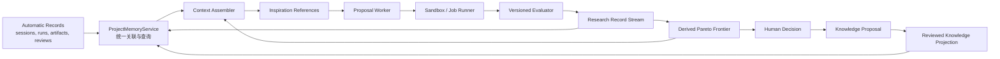

# Hyra 启发的 Pi-Science Research Loop 落地方案

> 状态：首个可交付切片及串行控制面已实现
> 适用范围：Pi-Science 工作区内可重复执行、可评价、可预算的科研与工程任务
> 核心原则：轻量 Harness、广阔探索空间、强验证边界、人工掌握最终裁决权

## 1. 背景与目标

Hyra 的核心价值不在于“多 Agent”，而在于把一次次 solution、执行日志、评估反馈和产物组织成可复用经验，再用这些经验驱动下一轮探索。Pi-Science 已经具备会话、Runs、Artifact Manifest、Provenance、Result Reviewer 和人工审批的 Project Knowledge，下一步应把这些能力连接成一个可持续改进的 Research Loop。

本方案的目标是：

1. 将一次科研尝试统一记录为可查询、可比较、可复现的 Experience；
2. 从历史最佳、信息量较高的失败和多样化方向中组装 Inspiration；
3. 在明确预算、停止条件和评估器约束下，串行或并行地产生新 Candidate；
4. 保存多指标 Pareto frontier，而不是只返回单一最高分方案；
5. 保持 Evidence、Experience、Reviewed Knowledge 和 Inspiration 的职责隔离；
6. 在后续阶段支持受治理的 Evaluator 演进，但不允许 solution 自行修改正式评价标准。
7. 将 Project Knowledge、Runs、Artifacts、Reviews 和 Research Loop 暴露为一个 Project Memory 读模型；
8. 新功能只写一个统一研究记录流，不再为每个 loop 和子功能创建独立日志；
9. Agent 不负责维护日志、索引、`PROJECT.md` 或跨文件引用，所有派生状态由 Harness 自动生成。

## 2. 非目标

首轮实现明确不做以下事项：

- 不把普通对话自动变成长期搜索任务；
- 不把 Project Knowledge Reviewer 扩展成万能 Agent；
- 不在第一阶段引入多个并行 Proposal Agent；
- 不允许模型直接修改正式 evaluator；
- 不以单一模型评分代替统计检验、外部验证或人工判断；
- 不复制全部历史会话到每次模型上下文；
- 不为了“自我进化”放宽工作区、网络、删除、凭据或审批边界。
- 不要求 Agent 同时更新 Knowledge、Experience、History 和索引文件；
- 不把相同日志、摘要或评价结果复制到多个 JSON/Markdown 文件中。

### 2.1 维护责任原则

系统采用“Agent 产出语义，Harness 维护状态”的责任划分：

| 内容 | 维护者 |
| --- | --- |
| solution 代码和方案说明 | Proposal Worker |
| evaluator 的结构化输出 | Evaluator |
| 用户知识审批决定 | 用户 |
| run、artifact、provenance、review 事件关联 | Harness |
| Experience 聚合 | ProjectMemoryService |
| `PROJECT.md` 渲染 | ProjectKnowledgeStore |
| History、索引、frontier、统计 | Harness 派生 |
| Inspiration 来源选择和引用 | Context Assembler |

Agent 不应直接写 `.pi-science` 内部状态。它只通过受约束的 API 提交 Candidate、EvaluatorResult 或 KnowledgeProposal；后端负责幂等记录、关联和投影视图。

## 3. 核心概念与边界

| 概念 | 含义 | 是否持久化 | 权威程度 |
| --- | --- | --- | --- |
| Evidence | 会话消息、工具事件、数据、代码、运行日志、引用、产物 | 是 | 原始事实，不自动等于结论 |
| Experience | 根据统一记录流聚合出的一次完整尝试 | 派生，可缓存 | 完整但可能失败或有噪声 |
| Reviewed Knowledge | 用户批准的发现、结论、决策、假设和任务 | 是 | 项目内高可信记忆 |
| Inspiration | Context Assembler 为某一候选生成的任务相关引用包 | 仅记录已实际使用的版本 | 派生信息，不是真相源 |
| Candidate | 一份待执行或已执行的 solution 快照 | 是 | 尚未通过正式评价 |
| Evaluator | 将 Candidate 的 Evidence 转换为结构化指标和 findings 的版本化契约 | 是 | 受治理的裁判 |
| Research Loop | 在预算内重复“组装上下文 → 提案 → 执行 → 评价 → 记录”的任务 | 是 | Harness 状态机 |

Project Knowledge 只保存经过审批的稳定认识。失败方案、低分方案和运行异常通过 Project Memory 查询，不进入 `PROJECT.md`。Experience 不再由 Agent 单独写一份摘要文件，而是由 Run、Artifact、Provenance、Review、Candidate 和 Evaluation 记录自动聚合。Inspiration 只保存引用和选择理由，不复制原始日志或知识正文。

## 4. 当前能力映射

| 已有能力 | 当前落点 | 在 Research Loop 中的用途 |
| --- | --- | --- |
| 实验运行 | `.pi-science/runs.jsonl`、`/api/runs` | Candidate execution 的基础记录 |
| 产物发布 | `.pi-science/artifacts.jsonl`、`/api/artifacts` | Candidate 输出和版本化产物 |
| 文件谱系 | `.pi-science/provenance.jsonl` | solution、输入、产物之间的追溯关系 |
| 环境快照 | `.pi-science/env/` | 重现 Candidate 的运行环境 |
| 结果审查 | `.pi-science/result-reviews.jsonl` | 评价中的可信度 findings |
| 项目知识 | `.pi-science/knowledge/`、`PROJECT.md` | Context Assembler 的高可信项目背景 |
| 会话技能记录 | `session-skills.jsonl`、`skill-events.jsonl` | 记录 Candidate 使用的能力版本 |

现有实现的主要缺口：

- Runs 只有 command、surface、host、status 等基础字段，没有 objective、parent、solution snapshot、evaluator version 和 metrics；
- Artifact、Provenance、Review 和 Run 之间主要依赖可选 ID，缺少一个统一 Experience 聚合记录；
- 没有针对任务动态选择经验的 Context Assembler；
- 没有持久化 Research Loop 状态机、预算和停止条件；
- 没有多指标排名、Pareto frontier 和候选晋级规则；
- Evaluator 缺少稳定的输入输出契约、版本、回归集和升级审批。

## 5. 目标架构



`ProjectMemoryService` 是统一读模型，不是另一套需要 Agent 维护的知识库。它通过稳定 ID 将现有 Runs、Artifacts、Provenance、Result Reviews、Project Knowledge 与新 Research Records 连接起来。Harness 负责状态、资源、上下文、执行、验证、审计和所有派生视图。Proposal Worker 可以自由选择算法、代码结构和探索方向，但不能绕过 evaluator、预算和安全策略。

### 5.1 单一写入、多个投影

新 Research Loop 功能只追加 `research-records.jsonl`。以下内容均由后端投影得到：

- Experience 详情；
- Loop 当前状态；
- Pareto frontier；
- 统一 History；
- Project Knowledge 候选提案；
- Context Assembler 可检索的记忆；
- Overview 统计和索引。

已有 `runs.jsonl`、`artifacts.jsonl`、`provenance.jsonl` 和 `result-reviews.jsonl` 在迁移期继续作为事实源，由 ProjectMemoryService 读取；不复制正文，只建立稳定引用。长期可以迁移到同一 envelope，但不把物理合并设为 MVP 前置条件。

## 6. 推荐存储布局

所有目录按需创建。新设计不为每个 loop 建立独立的 experiences、inspirations、events 和 frontier 文件：

```text
.pi-science/
├── research-records.jsonl          # 新 Research 功能的唯一追加流
├── knowledge/
│   └── items.json                  # 已审批知识投影，沿用现有实现
├── inbox/
│   └── proposals.json              # 人工审批队列，沿用现有实现
├── solutions/
│   └── <candidate_id>/
│       ├── solution.json
│       ├── solve.sh
│       └── ...candidate-owned files
├── evaluators/
│   └── <evaluator_id>/
│       ├── <version>.json
│       ├── evaluate.py
│       └── fixtures/
└── indexes/
    └── project-memory.json         # 可删除、可重建缓存

PROJECT.md                          # Reviewed Knowledge 的人类可读投影
```

原则：

- `research-records.jsonl` 只由后端追加，Agent 无直接写权限；
- Experience、Loop 状态和 frontier 是查询投影，不设置第二真相源；
- Inspiration 只记录引用、选择理由和实际发送给模型的摘要 digest；
- solution 目录不可在执行后原地修改，修改必须产生新 Candidate；
- 日志和大文件不复制进 Research Record，只保存来源 ID、定位、版本和哈希；
- evaluator 代码与配置按内容哈希版本化；
- `PROJECT.md` 永远由已审批 KnowledgeItem 渲染，Agent 不手工同步；
- 第一阶段不迁移旧数据，只通过 ProjectMemoryService 适配现有记录。

### 6.1 相比原方案减少的维护面

| 原方案 | 收敛后 |
| --- | --- |
| 每个 loop 一个状态 JSON | `loop.*` record 投影当前状态 |
| 每个 loop 一个 `experiences.jsonl` | ProjectMemoryService 动态聚合 Experience |
| 每个 loop 一个 `inspirations.jsonl` | 只记录实际使用的 `inspiration.issued` |
| 每个 loop 一个 `events.jsonl` | 统一 `research-records.jsonl` |
| 每个 loop 一个 `frontier.json` | 查询时计算，可进入统一索引缓存 |
| 独立 `experience-index.json` | 统一 `indexes/project-memory.json` |
| Agent 更新多份摘要和 History | Harness 自动关联和投影 |
| Research 成功结果另写知识 | 自动进入现有 Knowledge Inbox 审批 |

因此，新增 Research 功能的持久状态从“每个 loop 至少五个状态/日志文件”收敛为“一个全工作区追加流”。solution 和 evaluator 仍保留为普通文件，因为它们需要独立执行、版本化和人工检查；它们不是重复日志。

## 7. 数据契约

### 7.0 ResearchRecordEnvelope

所有新控制面记录共用一个 envelope，写入 `.pi-science/research-records.jsonl`：

```json
{
  "schema_version": 1,
  "record_id": "record-01J...",
  "record_type": "candidate.evaluated",
  "workspace_id": "workspace-...",
  "loop_id": "loop-01J...",
  "candidate_id": "candidate-0007",
  "session_id": "session-...",
  "run_id": "run_...",
  "created_at": "...",
  "producer": "evaluator-service",
  "causation_id": "record-previous",
  "correlation_id": "loop-01J...",
  "payload": {}
}
```

首版支持的 `record_type`：

```text
loop.created
loop.updated
loop.state_changed
candidate.proposed
candidate.execution_started
candidate.execution_finished
candidate.evaluated
inspiration.issued
evaluator.registered
evaluator.activated
knowledge.promotion_requested
knowledge.promotion_decided
```

Envelope 只保存该事件独有的信息。Run 日志、Artifact 内容、Result Review 和 KnowledgeItem 使用稳定 ID 引用，禁止复制完整正文。ExperienceRecord、ResearchLoop 当前状态和 frontier 均由这些记录及现有事实源聚合得到。

### 7.1 ResearchLoop

```json
{
  "schema_version": 1,
  "loop_id": "loop-01J...",
  "workspace": ".",
  "title": "提高外部验证集 AUC",
  "objective": "在不使用测试集调参的条件下提高外部验证 AUC",
  "status": "draft",
  "mode": "serial",
  "evaluator_ref": {
    "evaluator_id": "eval-auc",
    "version": 1,
    "digest": "sha256:..."
  },
  "budget": {
    "max_candidates": 20,
    "max_wall_seconds": 7200,
    "max_model_tokens": 500000,
    "max_cost_usd": 30,
    "max_parallel": 1
  },
  "stop_conditions": {
    "target_metrics": {"external_auc": 0.88},
    "patience": 5,
    "min_improvement": 0.002
  },
  "constraints": [
    "不得使用测试集调参",
    "必须固定随机种子",
    "每个指标必须报告置信区间"
  ],
  "created_by": "user",
  "created_at": "...",
  "updated_at": "..."
}
```

状态机：

```text
draft → ready → running → stopping → completed
                    ├────→ paused → running
                    └────→ failed
draft/ready/paused → cancelled
```

只有 `ready` 状态允许启动。进入 `ready` 前必须通过 evaluator、预算、输入文件和权限预检。

### 7.2 ExperienceRecord

ExperienceRecord 是 ProjectMemoryService 返回的聚合读模型，不由 Proposal Agent 直接写入，也不单独保存一份 `experiences.jsonl`。

```json
{
  "schema_version": 1,
  "experience_id": "exp-01J...",
  "loop_id": "loop-01J...",
  "candidate_id": "candidate-0007",
  "parent_candidate_ids": ["candidate-0003"],
  "inspiration_id": "inspiration-0007",
  "status": "evaluated",
  "objective": "...",
  "approach_summary": "使用嵌套交叉验证和梯度提升模型",
  "solution": {
    "path": ".pi-science/solutions/candidate-0007",
    "digest": "sha256:...",
    "entrypoint": "solve.sh"
  },
  "execution": {
    "run_id": "run_...",
    "started_at": "...",
    "finished_at": "...",
    "exit_code": 0,
    "duration_ms": 182000,
    "environment_ref": "env:abc123"
  },
  "artifacts": [
    {"artifact_id": "...", "version": 2, "sha256": "..."}
  ],
  "evaluation": {
    "evaluator_id": "eval-auc",
    "version": 1,
    "metrics": {
      "external_auc": {"value": 0.842, "direction": "maximize"},
      "runtime_seconds": {"value": 182, "direction": "minimize"}
    },
    "hard_checks": {
      "no_test_leakage": "passed",
      "artifact_verified": "passed",
      "seed_recorded": "passed"
    },
    "findings": [],
    "status": "passed"
  },
  "diagnosis": {
    "summary": "泛化稳定，但召回率较低",
    "failure_kind": null,
    "reusable_lessons": ["类别权重比过采样更稳定"]
  },
  "created_at": "..."
}
```

### 7.3 Inspiration

Inspiration 只有在实际发给 Proposal Worker 时才写入 `inspiration.issued` 记录。记录保存来源引用、选择理由、token 估算和最终上下文 digest；原始 Knowledge、日志和 Artifact 内容不复制入记录流。

```json
{
  "schema_version": 1,
  "inspiration_id": "inspiration-0008",
  "loop_id": "loop-01J...",
  "strategy": "best_failure_diverse",
  "objective": "...",
  "knowledge_refs": ["knowledge-ab12"],
  "experience_refs": {
    "best": ["exp-0007"],
    "informative_failures": ["exp-0004"],
    "diverse": ["exp-0002"]
  },
  "included_evidence": [
    {"kind": "artifact", "id": "artifact-...", "version": 2},
    {"kind": "run_log_excerpt", "run_id": "run_...", "lines": [120, 168]}
  ],
  "excluded_reasons": [
    {"experience_id": "exp-0001", "reason": "duplicate approach"}
  ],
  "token_estimate": 9200,
  "created_at": "..."
}
```

Inspiration 必须引用来源，不能生成无法追溯的“经验总结”。超过上下文预算时，优先保留硬约束、evaluator 摘要、最佳方案、关键失败和差异信息。

### 7.4 EvaluatorSpec

```json
{
  "schema_version": 1,
  "evaluator_id": "eval-auc",
  "version": 1,
  "digest": "sha256:...",
  "status": "approved",
  "inputs": [
    {"name": "predictions", "artifact_kind": "table", "required": true}
  ],
  "metrics": [
    {"name": "external_auc", "direction": "maximize", "weight": 1.0},
    {"name": "runtime_seconds", "direction": "minimize", "weight": 0.0}
  ],
  "hard_checks": [
    "no_test_leakage",
    "artifact_verified",
    "seed_recorded"
  ],
  "entrypoint": "evaluate.py",
  "fixtures_digest": "sha256:...",
  "approved_by": "user",
  "approved_at": "..."
}
```

硬检查失败的 Candidate 不得进入正式 frontier，即使软指标更高。

### 7.5 Project Knowledge 关联扩展

现有 KnowledgeItem 保持原有标题、摘要、类型和审批状态，只增加可选来源引用：

```json
{
  "experience_ids": ["exp-0007"],
  "loop_ids": ["loop-01J..."],
  "candidate_ids": ["candidate-0007"],
  "evaluator_refs": [
    {"evaluator_id": "eval-auc", "version": 1, "digest": "sha256:..."}
  ],
  "artifact_refs": [
    {"artifact_id": "artifact-...", "version": 2, "sha256": "..."}
  ]
}
```

这些字段只保存引用。知识摘要仍只存在 KnowledgeItem，产物元数据仍只存在 Artifact Manifest，评价结果仍从 Research Record 和 Evaluator 输出读取。

从 Research Loop 晋级知识时，后端自动创建 KnowledgeProposal：

1. 读取选中的 Candidate、EvaluatorResult 和 Artifact verification；
2. 生成带来源引用的候选标题和摘要；
3. 交给现有 Project Knowledge Inbox；
4. 用户编辑、接受或拒绝；
5. 接受后自动渲染 `PROJECT.md`；
6. 写入 `knowledge.promotion_decided`，不要求 Agent 更新其他文件。

## 8. Context Assembler v0

Context Assembler 首版不必是独立模型 Agent，应优先实现为确定性检索和组装服务，必要时再用模型压缩摘要。

### 8.1 输入

- ResearchLoop objective、constraints、budget 剩余量；
- 当前 evaluator 的指标和硬检查；
- Reviewed Knowledge 中 active 且相关的条目；
- 当前 loop 的所有 Experience；
- Artifact verification 和 Result Reviewer findings；
- 已尝试方法的结构化标签。

### 8.2 默认选择策略

每份 Inspiration 默认包含：

1. `best`：当前 frontier 上与主目标最相关的 1–2 个 Candidate；
2. `failure`：一个失败原因明确、能排除错误方向的 Candidate；
3. `diverse`：一个方法标签或祖先路径与 best 差异较大的 Candidate；
4. `knowledge`：最多 8 条已审批项目知识；
5. `constraints`：完整保留，不参与摘要压缩；
6. `evaluator`：指标、方向、硬检查、版本和剩余预算。

### 8.3 多样性实现顺序

首版使用可解释规则，不先引入向量数据库：

- 方法标签 Jaccard 距离；
- solution 文件摘要或内容哈希差异；
- parent lineage 距离；
- evaluator findings 类型差异；
- 最近 N 次候选的方向冷却。

当 Experience 超过 200 条或规则召回明显不足时，再增加 embedding 检索。embedding 只能辅助候选召回，最终选取原因必须写入 Inspiration。

## 9. 排名与 Pareto Frontier

Research Loop 不保存单一 `best_score` 作为唯一真相。Evaluator 为每个 metric 声明方向，Frontier 服务执行以下逻辑：

1. 排除 hard check 失败的 Candidate；
2. 对缺失指标标记 `incomplete`，不与完整 Candidate 直接比较；
3. 根据 maximize/minimize 判断支配关系；
4. 保存非支配 Candidate 集合；
5. 另外计算一个仅用于 UI 默认排序的 display score；
6. display score 不得作为删除其他 Candidate 的依据。

建议默认展示四类推荐：

- 主指标最佳；
- 成本最低；
- 稳健性最好；
- 综合折中。

统计指标应允许保存点估计、标准误、置信区间和重复次数。只有单次运行结果时，UI 必须明确显示“未评估稳定性”。

## 10. 分阶段实施计划

### Phase 1：Project Memory v0，不引入新 Agent

目标：把已有数据和 Project Knowledge 连接成统一 Project Memory 视图，不增加需要 Agent 维护的日志。

| ID | 工作项 | 主要落点 | 验收标准 | 规模 |
| --- | --- | --- | --- | --- |
| PM-01 | 定义 ResearchRecordEnvelope、ResearchLoop、ExperienceRecord、Inspiration、EvaluatorSpec | `backend/models/research_memory.py` | schema round-trip；引用和 record type 受校验 | M |
| PM-02 | 新增统一 ResearchRecordStore | `backend/services/research_record_store.py` | 单一 JSONL 并发追加不丢记录；Agent 无直接文件写入口 | M |
| PM-03 | 新增 ProjectMemoryService | `backend/services/project_memory.py` | 一次查询聚合 Knowledge、Run、Artifact、Provenance、Review 和 Research Record | L |
| PM-04 | 建立现有事实源适配器 | project memory adapters | 旧记录生成只读 provisional Experience，不复制正文 | M |
| PM-05 | 自动关联稳定 ID | event observer + project memory | session/run/artifact/review/candidate 可沿 correlation ID 双向跳转 | L |
| PM-06 | 扩展 KnowledgeItem 来源引用 | project knowledge models/store | 知识可关联 loop/candidate/evaluator/artifact，旧数据仍可读取 | M |
| PM-07 | 统一 Project Memory 查询 API | `/api/project-memory` | overview、timeline、experience、knowledge 使用同一读模型并分页 | M |
| PM-08 | 建立单一可重建索引 | `.pi-science/indexes/project-memory.json` | 删除缓存后可从事实源和 record stream 全量重建 | M |
| PM-09 | 统一 Project Knowledge/Research History | Project Knowledge UI | 同一时间线展示知识决策、运行、产物、评价和 loop 事件 | M |
| PM-10 | 自动知识晋级入口 | project memory + reviewer | Candidate 只能生成 Inbox 提案，接受后 Harness 自动更新所有投影 | M |

Phase 1 退出条件：任意一次现有运行都能从 Project Memory 回答“目标是什么、运行了什么、产生了什么、如何评价、为何失败或成功、形成了哪些已审批知识”，并且整个过程不要求 Agent 同步维护任何内部日志或 Markdown。

### Phase 2：串行 Research Loop MVP

目标：在一个 Proposal Worker 下完成真正的闭环，先证明经验复用有价值。

| ID | 工作项 | 主要落点 | 验收标准 | 规模 |
| --- | --- | --- | --- | --- |
| RL-01 | ResearchLoop CRUD 和状态机 | ProjectMemoryService + ResearchRecordStore | 非法状态转换返回 409；状态可从 record stream 恢复 | M |
| RL-02 | Evaluator preflight | evaluator service | entrypoint、fixtures、输入、权限和 digest 校验通过后才能 ready | L |
| RL-03 | Context Assembler v0 | `context_assembler.py` + ProjectMemoryService | 每份 Inspiration 只含来源引用、选择理由和受预算控制的上下文 | L |
| RL-04 | Solution snapshot contract | solution service | 每个 Candidate 有不可变 digest 和 `solve.sh` 入口 | M |
| RL-05 | 串行 Proposal Worker | loop worker | 一次只领取一个 Inspiration；崩溃后不会重复计费或重复入库 | L |
| RL-06 | Candidate 执行适配现有 Runs/Jobs | run service | 超时、取消、日志、环境和 artifacts 全部关联 Candidate | L |
| RL-07 | Evaluator 执行和结构化结果 | evaluator service + ResearchRecordStore | 结果只写统一 record stream；schema 非法时标记 evaluation_failed | L |
| RL-08 | Pareto frontier 投影 | ProjectMemoryService | 多指标支配关系、缺失指标和硬检查测试通过；无独立真相文件 | M |
| RL-09 | 预算核算与停止条件 | budget service | candidates/time/tokens/cost 任一耗尽均停止领取新任务 | M |
| RL-10 | Research Loop 页面 | frontend | 创建、预检、启动、暂停、继续、取消、查看 frontier | L |
| RL-11 | 人工晋级到 Project Knowledge | Project Memory UI + Reviewer | 用户选择 Candidate 后生成带完整引用的现有 Inbox 提案 | M |
| RL-12 | 端到端固定任务 UAT | tests/fixtures | 同一 seed 下至少完成 3 轮并复现选出的 Candidate | L |

Phase 2 退出条件：用户可以定义一个带 evaluator 和预算的任务，系统串行探索多个 Candidate，返回可解释的 frontier，并能恢复中断任务。

### Phase 3：隔离执行与并行流水线

目标：在串行闭环稳定后再提高资源利用率。

| ID | 工作项 | 验收标准 | 规模 |
| --- | --- | --- | --- |
| PX-01 | 每个 Candidate 使用独立临时工作目录 | Candidate 不能修改其他 solution 或 evaluator | L |
| PX-02 | 输入数据只读挂载或 copy-on-write | 原始数据哈希执行前后保持一致 | L |
| PX-03 | Producer/consumer 持久队列 | 队列状态写统一 record stream；进程重启后 pending/running 任务可恢复 | L |
| PX-04 | workspace 级模型、沙盒、队列信号量 | 并发不会突破用户预算和 provider 限额 | M |
| PX-05 | 多样化 Inspiration 批量生成 | 同一批候选的方法标签相似度低于阈值 | M |
| PX-06 | Candidate lease 和幂等提交 | worker 超时后可安全重领，不产生重复 Experience | M |
| PX-07 | 并行性能与成本仪表盘 | 展示吞吐、等待、执行、评价和失败开销 | M |

Phase 3 退出条件：并发从 1 提升到 N 时，结果正确性不变，资源上限不突破，吞吐随可用资源合理提升。

### Phase 4：受治理的 Evaluator 演进

目标：允许系统提出 evaluator 改进，但升级必须通过独立验证和人工批准。

| ID | 工作项 | 验收标准 | 规模 |
| --- | --- | --- | --- |
| EV-01 | Evaluator proposal 数据模型 | 变更包含动机、diff、风险和目标 failure mode | M |
| EV-02 | 固定 regression fixtures | Proposal Worker 无权读取 held-out expected outputs | L |
| EV-03 | 历史 Candidate 重放 | 新旧 evaluator 对同一候选集生成可比较报告 | L |
| EV-04 | 排序漂移和异常逆转检测 | 大范围排序变化必须产生 blocker finding | M |
| EV-05 | reward hacking 检查 | evaluator 不能读取 candidate ID、历史排名或修改输入产物 | L |
| EV-06 | 人工审批与版本发布 | 未审批版本不能成为 loop active evaluator | M |
| EV-07 | evaluator 回滚 | 新版本发现问题后可恢复旧版本且保留审计 | M |

Phase 4 退出条件：Evaluator 的升级速度慢于 Candidate 生成速度，每次升级都有 fixtures、历史重放、差异报告、人工审批和可回滚版本。

## 11. API 草案

```text
GET    /api/project-memory/overview?cwd=...
GET    /api/project-memory/timeline?cwd=...&cursor=...
GET    /api/project-memory/experiences?cwd=...&loop_id=...
GET    /api/project-memory/experiences/{experience_id}?cwd=...
GET    /api/project-memory/inspirations/{inspiration_id}?cwd=...

POST   /api/project-memory/research-loops
GET    /api/project-memory/research-loops?cwd=...
GET    /api/project-memory/research-loops/{loop_id}?cwd=...
PATCH  /api/project-memory/research-loops/{loop_id}?cwd=...
POST   /api/project-memory/research-loops/{loop_id}/preflight?cwd=...
POST   /api/project-memory/research-loops/{loop_id}/start?cwd=...
POST   /api/project-memory/research-loops/{loop_id}/pause?cwd=...
POST   /api/project-memory/research-loops/{loop_id}/resume?cwd=...
POST   /api/project-memory/research-loops/{loop_id}/cancel?cwd=...
GET    /api/project-memory/research-loops/{loop_id}/frontier?cwd=...
POST   /api/project-memory/research-loops/{loop_id}/promote?cwd=...

POST   /api/project-memory/evaluators
GET    /api/project-memory/evaluators/{evaluator_id}/versions/{version}?cwd=...
POST   /api/project-memory/evaluators/{evaluator_id}/versions/{version}/preflight?cwd=...
POST   /api/project-memory/evaluators/{evaluator_id}/proposals?cwd=...
POST   /api/project-memory/evaluators/{evaluator_id}/proposals/{proposal_id}/approve?cwd=...
```

现有 `/api/project-knowledge` API 保持兼容，并逐步改为调用同一个 ProjectMemoryService。所有写 API 必须带 workspace 校验；start/resume/cancel/promote 要求幂等 key；事件流可以复用现有 SSE 模式，但真相状态必须持久化，不能只存在内存任务中。

## 12. 前端信息架构

不新增彼此割裂的 Experience Bank 和 Research 顶级页面。现有 Project Knowledge 逐步升级为用户可理解的 **Project Memory**，复用同一导航入口和后端读模型。概念仍然分层，但用户无需在多个页面寻找同一次研究的知识、运行、产物和评价。

建议标签页：

1. Overview：`PROJECT.md`、项目目标、知识/运行/产物/研究统计；
2. Inbox：现有知识和文件提案审批；
3. Knowledge：已审批知识及其 Evidence/Experience 来源；
4. Research：Research Loop 列表和 frontier；
5. Files：现有逻辑文件视图；
6. History：统一时间线，不再分别展示多种底层日志。

### 12.1 Research 列表

- 状态、主目标、evaluator 版本；
- 已使用/剩余预算；
- Candidate 数、frontier 数；
- 最近改善时间；
- Start、Pause、Resume、Cancel。

### 12.2 Research Loop 详情

建议包含五个标签页：

1. Overview：目标、约束、预算、停止条件、当前状态；
2. Candidates：所有 Experience，支持按状态、方法和 failure_kind 筛选；
3. Frontier：多指标对比、置信区间、推荐类别；
4. Inspirations：每轮为何选择这些经验，哪些内容被排除；
5. Evaluator：版本、指标、硬检查、fixtures 和审批历史。

任何“最佳”标签旁边都必须显示“依据哪个 evaluator 版本和哪些指标”。

### 12.3 统一对象跳转

Project Memory 中所有对象使用稳定引用互相跳转：

```text
KnowledgeItem → Candidate → Experience → Run → Artifact
                  ↓             ↓          ↓
               Evaluator    Inspiration  Result Review
```

UI 不复制对象详情，只显示摘要和链接。修改 Artifact 或 Knowledge 后，其他视图通过 ID 读取最新投影，不需要 Agent 或前端同步多份文本。

## 13. 安全与科学完整性

### 13.1 权限

- Proposal Worker 只能写自己的 solution 和运行输出目录；
- evaluator、原始数据、其他 Candidate、Reviewed Knowledge 对 Proposal Worker 只读；
- 删除、外部网络、安装依赖和远程计算继续遵守现有审批策略；
- secret 只保存引用，不进入 Inspiration、solution、日志和 Experience。

### 13.2 防数据泄漏

- dataset split 及用途写入 evaluator inputs；
- held-out 数据不进入 Proposal 上下文；
- evaluator 检查 solution 是否访问禁止路径；
- 训练和评价产物分别发布并记录哈希；
- 对“测试集指标提高”但验证流程变化的 Candidate 产生 blocker。

### 13.3 防 reward hacking

- Candidate 不能修改或选择 active evaluator；
- evaluator 不读取 Candidate 排名、父代得分或显示名称；
- hard checks 与优化指标分离；
- 模型 Judge 只能产生 findings 或辅助指标，不能成为唯一硬门禁；
- evaluator 升级必须对历史候选和 held-out fixtures 回归。

### 13.4 可复现性

正式进入 frontier 的 Candidate 至少需要：

- 不可变 solution digest；
- 完整命令与退出码；
- 环境快照；
- 输入 Artifact 哈希；
- 输出 Artifact Manifest；
- evaluator ID、版本和 digest；
- 随机种子，或明确说明不可确定来源；
- 至少一次干净环境重放，或标记 `reproduction_pending`。

## 14. 预算、调度与停止

每轮领取 Candidate 前进行预算预留，而不是执行完成后才记账：

```text
remaining = configured_budget - committed_usage - completed_usage
```

预留失败时不再发放任务。取消任务后，只释放尚未实际消耗的部分。

默认停止原因：

- 达到目标指标；
- Candidate 数量耗尽；
- wall time、token 或成本预算耗尽；
- 连续 `patience` 次没有达到 `min_improvement`；
- evaluator 连续失败；
- hard check 系统性失败；
- 用户暂停或取消；
- Context Assembler 判断没有新的安全探索方向。

停止原因必须结构化保存，不能只有一条文本日志。

## 15. 兼容与迁移策略

1. 旧 `runs.jsonl` 保持可读，不原地重写；
2. 旧 Run 通过 adapter 映射成 `provisional` Experience；
3. 缺少 objective、evaluator 或环境时明确标记字段缺失；
4. 新 Research Loop 只写 `research-records.jsonl`，ExperienceRecord 由查询时聚合；
5. Artifact、Provenance 和 Project Knowledge 继续使用现有 ID 和存储；
6. ProjectMemoryService 只保存关联引用，避免复制历史正文；
7. 现有 Project Knowledge History API 改用统一时间线后仍保持响应兼容期；
8. schema 记录 `schema_version`，读取器至少兼容前一个版本；
9. 所有索引、Loop 状态、统计和 frontier 都必须可从事实源重建；
10. 等统一读模型稳定后，再评估是否物理迁移旧日志，MVP 不做批量重写。

## 16. 可观测性指标

首版至少记录：

- loop completion/cancel/failure rate；
- Candidate proposal、queue、execution、evaluation 各阶段耗时；
- 每个 Candidate 的 token、成本和 wall time；
- Context Assembler 选取来源和 token 占用；
- hard check 失败分布；
- failure_kind 分布；
- frontier 改善次数及距离上次改善的 Candidate 数；
- 重复或高度相似 Candidate 比例；
- 干净环境重放成功率；
- 用户最终选择是否位于系统默认推荐首位。

产品成功不应只看“最高分提高”，还要同时观察：单位成本改善、失败经验复用率、重复探索率和复现成功率。

## 17. 测试策略

### 17.1 单元测试

- 状态机全部合法/非法转换；
- 单一 Research Record JSONL 并发追加和损坏行恢复；
- ProjectMemoryService 对多事实源的幂等聚合；
- Experience 投影不复制日志、Artifact 或 Knowledge 正文；
- 多指标 Pareto dominance；
- hard check 对 frontier 的过滤；
- token/cost/time 预算预留与释放；
- Inspiration 的 best/failure/diverse 选择；
- evaluator 输出 schema 校验；
- solution digest 和不可变性。

### 17.2 集成测试

- Candidate → Run → Artifact → Verification → Evaluation → Experience 全链路；
- 同一事实只写一次，其他视图通过稳定 ID 读取；
- worker 崩溃、超时、取消和重启恢复；
- evaluator 失败不污染已有 frontier；
- Project Knowledge 只在人工晋级后变化，接受后无需 Agent 更新 `PROJECT.md` 或 History；
- workspace 越界、symlink escape 和禁止路径访问被拦截。

### 17.3 MVP UAT 固定任务

建议准备三个离线、可确定评价的任务：

1. 数据处理：在固定 fixture 上提高数据清洗正确率，同时限制运行时间；
2. 算法优化：优化一个纯 Python 函数，要求输出一致且性能提高；
3. 科学分析：对合成数据拟合模型，评价参数恢复误差、覆盖率和复现性。

每个任务至少运行 3 个 Candidate，并验证：

- Experience 可完整回放；
- Inspiration 来源可解释；
- 至少一个失败经验被后续 Candidate 引用；
- frontier 计算正确；
- 预算和停止条件生效；
- 最终 Candidate 可在干净环境复现。

## 18. Feature Flag 与发布策略

建议使用以下开关逐步发布：

```text
project_memory_unified_view
research_loop_serial
research_loop_parallel
research_evaluator_proposals
```

发布顺序：

1. 在 Project Knowledge 内开放 Project Memory 只读统一视图；
2. 开放串行 Loop 给受控工作区；
3. 收集至少 20 个真实 Loop 的失败模式；
4. 修复幂等、预算和恢复问题后开放并行；
5. Evaluator proposal 始终保持实验性和人工审批。

回滚时关闭新任务创建，但继续允许读取历史 Experience 和导出产物。

## 19. 推荐首个可交付切片

首个 PR 不应直接实现完整循环，建议按以下顺序：

1. `PM-01`：定义统一 record envelope 和四个核心读模型；
2. `PM-03/PM-04`：先实现只读 ProjectMemoryService，聚合现有 Knowledge、Run、Artifact、Provenance 和 Result Review；
3. `PM-05`：补齐稳定 ID 和 correlation 规则；
4. `PM-07`：提供统一 overview、timeline 和 experience 查询 API；
5. `PM-09`：把现有 Project Knowledge History 改成统一时间线；
6. `PM-02`：确认读模型后，再建立新功能唯一的 ResearchRecordStore；
7. `PM-06/PM-10`：打通 Candidate → Knowledge Inbox → `PROJECT.md` 自动投影；
8. 用真实历史运行验证字段是否足够，再冻结 schema v1；
9. 之后进入串行 Research Loop MVP。

这个切片不会启动新 Agent，也不会要求 Agent 维护新文件。它先证明 Project Memory 能否用现有事实源还原一次研究，并把正式知识、失败经验、运行和产物放在同一条可追溯链路中。

## 20. 完成定义

Research Loop MVP 只有同时满足以下条件才算完成：

- 用户明确创建并启动 Loop；
- active evaluator 已通过 preflight 且版本固定；
- 每个 Candidate 都有不可变 solution、运行、产物和评价记录；
- Experience 可追溯到原始 Evidence；
- Context Assembler 能解释为什么选择每项经验；
- 预算耗尽、暂停和重启均不会产生重复任务；
- frontier 支持至少一个 maximize 和一个 minimize 指标；
- hard check 失败方案不会被标为推荐；
- 用户可以选择 Candidate 并生成 Project Knowledge 提案；
- 提案接受后，KnowledgeItem、`PROJECT.md`、统一时间线和来源关系由 Harness 自动更新；
- Agent 没有直接写 `.pi-science` 日志、索引和知识投影的责任；
- 新 Research 功能除 solution/evaluator 文件外只维护一个追加记录流；
- 被选择的 Candidate 能在干净环境重放；
- 关闭 feature flag 后现有 Chat、Runs、Artifacts 和 Project Knowledge 不受影响。

## 21. 实施状态（2026-07-22）

本轮已经落地推荐的首个可交付切片，并建立串行循环控制面：

- Project Knowledge 已升级为统一 Project Memory 入口，Overview、Research、Files、统一 History 共用聚合读模型；
- 新功能只追加 `.pi-science/research-records.jsonl`，Loop、Experience、Frontier 和时间线均为可重建投影；
- 旧 Run、Job、Artifact、Provenance、Result Review 和 Knowledge 保持原事实源，不复制正文；
- 新工作区只预置 `AGENTS.md`，不再创建 `KNOWLEDGE.md`、`knowledge/`、`notes/` 或 Project Knowledge 骨架；
- `PROJECT.md` 只在首条知识获批后由 Harness 生成，Agent 不负责维护内部记录或知识投影；
- 已实现 Loop CRUD/状态机、evaluator 注册与预检、Inspiration 选择、不可变 Candidate 快照、串行 Job 执行、结构化 Evaluation、预算停止、Pareto frontier 及人工知识晋级；
- Candidate → Run → Evaluation → Experience → Knowledge 的引用链由 ProjectMemoryService 自动聚合；
- 可重建索引只在明确调用 rebuild 时生成，不作为第二真相源。

尚未宣称完成的部分：Proposal Agent 自动调用模型生成方案、可执行 evaluator/fixture 沙盒、进程重启后的 active-job lease 恢复、干净环境重放、Phase 3 并行流水线，以及 Phase 4 evaluator 共进化。这些应在当前串行控制面稳定后继续推进。

## 22. 参考资料

- [Tencent Hunyuan Research Agent（Hyra）](https://hunyuan.tencent.com/research/hyra)
- [Rich Sutton, The Bitter Lesson](https://www.incompleteideas.net/IncIdeas/BitterLesson.html)
- [Pi-Science runtime contracts](./science-platform-runtime.md)
- [Pi-Science skill schema](./skill-schema.md)
