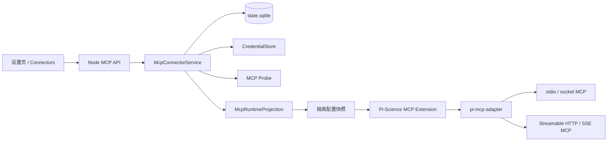

# Pi-Science MCP 管理改造实现文档

> 状态：Draft for implementation
>
> 适用基线：当前 `main`，Node 控制面 + React 设置页 + Pi Orbit + `pi-mcp-adapter@2.18.0`
>
> 目标：将现有“读取 MCP JSON 并显示开关”的功能改造成由 Pi-Science 控制面统一管理配置、项目启用策略、认证引用、运行时投影、健康状态和工具授权的 MCP Connector 子系统。

## 1. 摘要

本改造不重写 MCP 协议运行时。`pi-mcp-adapter` 继续负责 MCP 连接、懒加载、工具发现、资源暴露、输出保护和实际工具调用；OAuth 在第一阶段仍由 adapter 承担，最终由 Pi-Science 控制面提供设置页授权与 token 生命周期管理。Pi-Science Node 控制面成为 MCP 配置与策略的唯一权威，并向每个 Pi Orbit runtime 投影一份隔离、无明文密钥的有效配置。

改造后的职责边界如下：



核心决策：

1. Connector、启用状态和默认工具权限均为用户级全局配置；所有工作区使用同一集合。
2. 配置、启用、认证、运行状态和工具权限分别建模。
3. 项目运行时只接受控制面生成的 programmatic MCP 配置，不再让 adapter 隐式合并环境中的多个 MCP 文件。
4. 现有 `.mcp.json`、`.pi/mcp.json` 和用户级配置只作为兼容导入源，不再作为最终运行时权威。
5. 第一阶段继续使用 `pi-mcp-adapter` 的单一 `mcp` proxy tool，避免大量 MCP tool schema 占用上下文；默认不开启 `directTools`。
6. 与 Claude Science 一致，不把 Project/Workspace 作为 MCP 设置作用域；待 Specialist Agent 获得稳定数据库身份后扩展 agent assignment。

## 2. 背景与现状

### 2.1 当前配置发现

`apps/server/src/catalog/mcp-config.ts` 按以下优先级寻找第一个可解析文件：

1. `config.json` 中的 `mcp_config_path`
2. `<workspace>/.mcp.json`
3. `<workspace>/.pi/mcp.json`
4. `~/.config/mcp/mcp.json`
5. `<PI_SCIENCE_HOME>/mcp.json`

找到一个文件后即停止，不进行多层合并。解析失败会被当作“继续寻找下一个文件”，最终可能静默返回空配置。

### 2.2 当前设置页

`frontend/src/components/settings/MCPTab.tsx` 当前支持：

- 显示 MCP server 列表；
- 显示静态 transport、auth、data egress 和工具数量；
- 全局启用/停用；
- 展示静态健康检查结果。

不支持：

- 添加、编辑、删除 MCP；
- Remote 与 local command 分流；
- 项目级绑定；
- OAuth/credential 管理；
- 真实 MCP handshake 和 `tools/list`；
- 工具级 Allow/Ask/Deny；
- 连接、重连、断开；
- 配置导入预览和冲突处理。

### 2.3 当前运行时

运行时通过 `pi-mcp-adapter@2.18.0` 加载 MCP。该 adapter 自己合并以下配置：

1. `~/.config/mcp/mcp.json`
2. `~/.agents/mcp.json`
3. `~/.agents/mcp/mcp.json`
4. `<Pi agent dir>/mcp.json`
5. `.mcp.json`
6. `.pi/mcp.json`

adapter 还自行维护：

- lazy/eager/keep-alive 生命周期；
- OAuth 和 OS credential store；
- metadata cache；
- MCP 状态事件；
- proxy/direct tool；
- per-server `disabled`、`includeTools`、`excludeTools`、`approveTools`；
- MCP Apps、resources、prompts、sampling 和 elicitation。

### 2.4 必须修复的现状缺陷

#### 缺陷 A：设置页与运行时的配置解析不一致

Node 控制面只读取第一个配置文件，adapter 会合并六层配置。设置页看到的 Connector 集合不一定等于 Agent 实际可调用的集合。

#### 缺陷 B：设置页开关可能不影响运行时

`PUT /api/settings/mcp/:server_id` 只更新 `<PI_SCIENCE_HOME>/config.json` 的 `mcp_servers` 数组；adapter 不读取这个字段，而是读取 MCP definition 中的 `disabled` 或 `.pi/mcp.json` override。因此 UI 可能显示 disabled，但 Agent 仍可调用该 MCP。

#### 缺陷 C：健康检查不是 MCP 健康检查

当前 `probeMcpHealth` 只检查：

- stdio command 是否在 PATH；
- URL 是否可解析且通过出站 URL 校验；
- `required_env` 是否存在。

它不会连接 MCP、执行 initialize 或列出工具，无法区分 `needs-auth`、协议不兼容、握手失败和工具发现失败。

#### 缺陷 D：静默吞掉配置错误

缺失文件与 malformed JSON 都被同一 `catch` 忽略。用户无法判断“没有配置”和“配置损坏”。

#### 缺陷 E：没有单一配置写入者

设置页、用户手工 JSON、adapter 的 `/mcp enable|disable` 命令都可能表达不同状态，缺少冲突和审计模型。

## 3. 目标与非目标

### 3.1 目标

1. 设置页可以添加 Remote URL、Local command 和 Unix socket MCP。
2. Connector 配置在全局注册，按当前 workspace/project 启用。
3. Node 控制面成为规范状态与公开 API 的唯一写入者。
4. runtime 使用控制面生成的隔离配置，UI 状态与实际运行配置一致。
5. 支持真实 connect/probe、工具发现、错误分类和工具缓存。
6. 支持项目级工具过滤和 Allow/Ask/Deny/Allow all 策略。
7. 密钥不写入 Connector 表、runtime 配置快照、日志或浏览器响应。
8. 支持现有 MCP 文件的预览、显式导入、冲突检测和渐进迁移。
9. 配置变化能够安全刷新当前 workspace 的 runtime；繁忙 runtime 延迟重启，不中断当前 turn。
10. 保留 `pi-mcp-adapter` 的上下文节省、输出保护、MCP Apps 和协议兼容能力。

### 3.2 非目标

- 不接入 Claude Connectors Directory；这是 claude.ai 专有数据源。后续如需市场能力，应定义 Pi-Science 自有 registry/provider 接口。
- 不在本期实现 Organization/Admin 下发。
- 不在本期实现 per-Agent attachment。当前项目级 binding 对项目内所有会话和 subagent 生效。
- 不自行实现 MCP transport、sampling、elicitation、Apps renderer 或 output guard。
- 不允许浏览器直接连接 MCP server。
- 不支持在 UI 中保存任意明文 Authorization header；认证必须使用 Credential 引用、环境变量引用、OAuth 或受控 helper。
- 不自动导入其他工具的配置，不自动执行导入配置里的 command。

## 4. 用户体验

### 4.1 页面结构

保留 Settings 一级导航中的 MCP 标签，但将页面从表格改成 master-detail Connector 管理页。

桌面布局：

```text
┌──────────────────────────────────────────────────────────────┐
│ Search connectors…          [All ▾]          [Add connector ▾]│
├──────────────────────────────────────────────────────────────┤
│ Project enabled                                                 │
│  ● paper-search                 Ready                 [on]     │
│  ● local-memory                Connected             [on]     │
│                                                                │
│ Available                                                       │
│  ○ context7                    Not connected          [off]    │
│                                                                │
│ Imported / compatibility                                       │
│  ! legacy-github              Import required                 │
└──────────────────────────────────────────────────────────────┘
```

过滤器：

- All
- Enabled in this project
- Connected/Ready
- Needs authentication
- Local
- Remote
- Imported

### 4.2 Add connector

Add 菜单：

1. Remote URL
2. Local command
3. Unix socket
4. Import existing config

Remote 基础字段：

- Name/ID
- Display name
- URL

Remote 高级字段：

- Auth：Auto / None / OAuth / Bearer credential / Custom headers
- OAuth Client ID、scope、redirect URI（需要时）
- Transport：Auto/Streamable HTTP/SSE legacy
- Lifecycle：Lazy（默认）/Eager/Keep alive/Lazy keep alive
- Timeout、idle timeout
- Include tools、exclude tools
- Expose resources
- Description、terms URL、privacy URL

Local command 基础字段：

- Name/ID
- Display name
- Command line

Local 高级字段：

- Environment bindings
- Working directory
- Lifecycle、timeout、idle timeout
- Include/exclude tools
- Description

命令行在前端解析为 command + args，并显示解析预览。服务端重新校验，绝不能把整条字符串交给 shell。

### 4.3 Connector detail

详情页分为：

1. Overview：source、transport、endpoint/command 摘要、全局启用状态。
2. Connection：Configured/Checking/Ready/Needs auth/Error/Disabled。
3. Tools：工具名、描述、只读提示、Allow/Ask/Deny。
4. Default agent access：全局启用开关、include/exclude、Allow all。
5. Security：credential 来源、data egress、terms/privacy、最近 probe 时间。
6. Actions：Probe、Reconnect、Edit、Disconnect credential、Remove。

“Disable”“Disconnect”“Remove”必须是三个动作：

- Disable：全局关闭 Connector，不再投影到任何工作区。
- Disconnect：删除/撤销认证，不删除配置。
- Remove：删除全局 Connector；内置 Connector 不可删除。

### 4.4 状态模型

UI 不再用单个 health 字符串表达所有状态：

```ts
type McpConfigState = "valid" | "invalid";
type McpAuthState = "not-required" | "configured" | "needs-auth" | "expired" | "error";
type McpRuntimeState = "unknown" | "checking" | "ready" | "connecting" | "connected" | "error" | "disabled";
```

显示优先级：invalid > disabled > needs-auth > error > connecting/checking > connected/ready > unknown。

## 5. 目标领域模型

### 5.1 Connector

Connector 是全局、单用户资源：

```ts
type McpConnectorSource = "builtin" | "custom" | "imported";
type McpTransport = "stdio" | "streamable_http" | "sse" | "socket";

interface McpConnector {
  connector_id: string;
  name: string;             // URL-safe stable id
  display_name: string;
  description: string;
  source: McpConnectorSource;
  transport: McpTransport;
  endpoint_url: string | null;
  command: string | null;
  args: string[];
  socket_path: string | null;
  runtime_config: McpRuntimeConfig;
  credential_ref: string | null;
  revision: number;
  created_at: number;
  updated_at: number;
}
```

`runtime_config` 只保存非敏感字段，例如 cwd、lifecycle、timeout、headers 的环境/credential 引用、OAuth metadata、include/exclude 和资源开关。

### 5.2 Global connector settings

```ts
interface McpConnectorSettings {
  connector_id: string;
  enabled: boolean;
  include_tools: string[];
  exclude_tools: string[];
  approval_mode: "ask" | "custom" | "allow_all";
  revision: number;
  created_at: number;
  updated_at: number;
}
```

全局设置是 runtime effective config 的入口。启用后自动进入所有工作区的派生快照；Workspace 不是 MCP 权限边界。

### 5.3 Tool grant

```ts
interface McpToolGrant {
  connector_id: string;
  tool_name: string;
  decision: "allow" | "ask" | "deny";
  updated_at: number;
}
```

`allow_all` 是 connector settings 级显式状态，不使用工具名 `*` 冒充普通 grant。

### 5.4 Tool metadata cache

```ts
interface McpToolCacheEntry {
  connector_id: string;
  config_revision: number;
  tools: McpToolSummary[];
  resources: McpResourceSummary[];
  server_info: Record<string, unknown> | null;
  fetched_at: number;
  expires_at: number;
}
```

缓存 key 必须包含会影响服务器身份的配置 fingerprint，至少包括 transport、URL origin/path、command/args/socket 和认证类型，但不能包含密钥值。

## 6. SQLite schema

`0002_mcp_connectors.sql` 建立初始结构；`0003_global_mcp_settings.sql` 将项目绑定迁移为全局设置，并注册到 `apps/server/src/storage/sqlite/migrations.ts`。

建议 schema：

```sql
CREATE TABLE mcp_connectors (
  connector_id TEXT PRIMARY KEY,
  name TEXT NOT NULL UNIQUE COLLATE NOCASE,
  display_name TEXT NOT NULL,
  description TEXT NOT NULL DEFAULT '',
  source TEXT NOT NULL CHECK (source IN ('builtin', 'custom', 'imported')),
  transport TEXT NOT NULL CHECK (transport IN ('stdio', 'streamable_http', 'sse', 'socket')),
  endpoint_url TEXT,
  command TEXT,
  args_json TEXT NOT NULL DEFAULT '[]' CHECK (json_valid(args_json)),
  socket_path TEXT,
  runtime_config_json TEXT NOT NULL DEFAULT '{}' CHECK (json_valid(runtime_config_json)),
  credential_ref TEXT,
  enabled INTEGER NOT NULL DEFAULT 0 CHECK (enabled IN (0, 1)),
  include_tools_json TEXT NOT NULL DEFAULT '[]' CHECK (json_valid(include_tools_json)),
  exclude_tools_json TEXT NOT NULL DEFAULT '[]' CHECK (json_valid(exclude_tools_json)),
  approval_mode TEXT NOT NULL DEFAULT 'ask' CHECK (approval_mode IN ('ask', 'custom', 'allow_all')),
  settings_revision INTEGER NOT NULL DEFAULT 1,
  revision INTEGER NOT NULL DEFAULT 1,
  created_at INTEGER NOT NULL,
  updated_at INTEGER NOT NULL,
  CHECK (
    (transport = 'stdio' AND command IS NOT NULL AND endpoint_url IS NULL AND socket_path IS NULL) OR
    (transport IN ('streamable_http', 'sse') AND endpoint_url IS NOT NULL AND command IS NULL AND socket_path IS NULL) OR
    (transport = 'socket' AND socket_path IS NOT NULL AND endpoint_url IS NULL AND command IS NULL)
  )
) STRICT;

CREATE TABLE mcp_global_tool_grants (
  connector_id TEXT NOT NULL,
  tool_name TEXT NOT NULL,
  decision TEXT NOT NULL CHECK (decision IN ('allow', 'ask', 'deny')),
  updated_at INTEGER NOT NULL,
  PRIMARY KEY (connector_id, tool_name),
  FOREIGN KEY (connector_id) REFERENCES mcp_connectors(connector_id) ON DELETE CASCADE
) STRICT;

CREATE TABLE mcp_tool_cache (
  connector_id TEXT PRIMARY KEY,
  config_revision INTEGER NOT NULL,
  fingerprint TEXT NOT NULL,
  tools_json TEXT NOT NULL CHECK (json_valid(tools_json)),
  resources_json TEXT NOT NULL DEFAULT '[]' CHECK (json_valid(resources_json)),
  server_info_json TEXT CHECK (server_info_json IS NULL OR json_valid(server_info_json)),
  fetched_at INTEGER NOT NULL,
  expires_at INTEGER NOT NULL,
  FOREIGN KEY (connector_id) REFERENCES mcp_connectors(connector_id) ON DELETE CASCADE
) STRICT;
```

`credential_ref` 暂不建立 SQLite FK，因为当前 `CredentialStore` 使用独立的原子 JSON 存储。Service 层必须在写入、删除和 runtime projection 时验证引用。

## 7. 服务端模块

新增目录：

```text
apps/server/src/mcp/
├── connector-types.ts
├── connector-repository.ts
├── connector-service.ts
├── connector-validation.ts
├── legacy-config-import.ts
├── mcp-probe-service.ts
├── mcp-runtime-projection.ts
├── mcp-status-registry.ts          # 第二阶段
└── mcp-oauth-service.ts            # 第二阶段
```

### 7.1 McpConnectorRepository

只负责 SQLite CRUD 和事务性约束：

- `createConnector`
- `updateConnector(expectedRevision)`
- `deleteConnector`
- `listConnectors`
- `getConnector`
- `upsertProjectBinding`
- `listEffectiveConnectors(projectId)`
- `setToolGrant`
- `replaceToolCache`

所有 update 使用 revision 乐观锁。冲突返回 `409 revision_conflict`，避免两个设置页相互覆盖。

### 7.2 McpConnectorService

负责：

- workspace → stable project_id 解析；
- DTO 校验和错误分类；
- credential_ref 验证；
- Connector 与 binding 协调；
- import preview/commit；
- runtime projection invalidation；
- 配置变化后的 runtime reload；
- 删除前引用检查；
- 审计事件。

必须注入到 `ServerModules`，不能在 route 内自行 new repository/service。

### 7.3 Connector validation

名称约束：

- 1–64 字符；
- `^[a-z0-9][a-z0-9-]*[a-z0-9]$`，单字符允许；
- 大小写不敏感唯一；
- 禁止控制字符和路径分隔符。

Remote URL：

- 必须是绝对 `http(s)` URL；
- 禁止 URL 内嵌用户名/密码；
- 创建时调用现有 `validateConnectorOutboundUrl`；
- 私网访问单独使用 `allow_private_mcp`，不要复用模型 provider 的 `allow_private_providers`；
- HTTP 默认不允许私网，用户必须在 Connector 安全区显式开启；
- redirect 每一跳重新验证，敏感 header 不跨 origin。

stdio：

- `command` 与 `args` 分开；
- 禁止通过 `shell: true` 启动；
- command 不以 `-` 开头；
- cwd 必须是 workspace 内路径，或者为空并使用 workspace root；
- 环境变量 key 必须匹配 `^[A-Za-z_][A-Za-z0-9_]*$`；
- secret 使用 credential/environment 引用，不允许写入 runtime_config_json。

socket：

- 路径必须是绝对路径或 `~` 路径；
- 保存前规范化；
- 默认要求 socket 位于当前用户拥有的目录；
- UI 明确提示 socket 连接可能共享工具状态和文件权限。

## 8. API 契约

共享 DTO 和 Zod schema 新增到 `packages/contracts/src/mcp.ts`，由 `packages/contracts/src/index.ts` 导出。前端不得再在 `settings-types.ts` 手写另一份 `McpServer`。

### 8.1 Connector API

| 方法 | 路径 | 说明 |
|---|---|---|
| `GET` | `/api/mcp/connectors` | 全局 Connector + settings/status |
| `POST` | `/api/mcp/connectors` | 创建 Connector，可选同时全局启用 |
| `GET` | `/api/mcp/connectors/:id` | 详情、全局设置和工具缓存 |
| `PATCH` | `/api/mcp/connectors/:id` | 更新配置，要求 `revision` |
| `DELETE` | `/api/mcp/connectors/:id` | 删除自定义 Connector；内置返回 403 |
| `PUT` | `/api/mcp/connectors/:id/settings` | 全局启停和默认工具策略 |
| `POST` | `/api/mcp/connectors/:id/probe` | 有界真实握手 + tools/list |
| `GET` | `/api/mcp/connectors/:id/tools` | 工具缓存和全局权限 |
| `PUT` | `/api/mcp/connectors/:id/tools/:tool` | Allow/Ask/Deny |
| `POST` | `/api/mcp/connectors/:id/disconnect` | 删除/撤销认证 |

写 API 使用 JSON body，不使用 `?enabled=true` 表达 mutation。

绑定请求示例：

```json
{
  "enabled": true,
  "include_tools": ["search_*"],
  "exclude_tools": ["delete_*"],
  "approval_mode": "custom",
  "revision": 3
}
```

列表响应示例：

```json
{
  "connectors": [
    {
      "connector_id": "mcp_01...",
      "name": "paper-search",
      "display_name": "Paper Search",
      "source": "custom",
      "transport": "stdio",
      "binding": { "enabled": true, "approval_mode": "ask", "revision": 2 },
      "config_state": "valid",
      "auth_state": "not-required",
      "runtime_state": "ready",
      "tool_count": 8,
      "error": null
    }
  ]
}
```

### 8.2 Import API

| 方法 | 路径 | 说明 |
|---|---|---|
| `POST` | `/api/mcp/import/preview?cwd=` | 扫描受支持配置，返回来源、冲突、敏感字段提示 |
| `POST` | `/api/mcp/import/commit?cwd=` | 只导入用户明确选中的项目 |

preview 不能启动 command、连接远端或执行 `!command` secret helper。

### 8.3 OAuth API（第二阶段）

| 方法 | 路径 | 说明 |
|---|---|---|
| `POST` | `/api/mcp/connectors/:id/oauth/start` | discovery + PKCE，返回 authorize_url |
| `GET` | `/api/mcp/oauth/callback` | 校验 state/issuer，交换 token |
| `GET` | `/api/mcp/connectors/:id/oauth/status` | 仅返回 metadata |
| `DELETE` | `/api/mcp/connectors/:id/oauth` | 删除 token，尽力调用 revoke |

浏览器响应中不得返回 access token、refresh token、client secret 或 headers helper 输出。

### 8.4 兼容 API

- `/api/mcp/catalog`：第一阶段改为调用新 Service，返回旧 DTO 投影并标注 deprecated。
- `/api/settings/mcp`：改为新 Service 的 compatibility projection。
- `PUT /api/settings/mcp/:server_id`：内部转换成全局 connector settings mutation，不再要求 `cwd`。
- 两个版本后删除旧 route 和前端调用。

## 9. 真实 Probe 与状态管理

### 9.1 Probe 级别

Probe 分两级：

1. `preflight`：当前 `probeMcpHealth` 的安全校验，不启动服务器。
2. `connect`：使用 MCP SDK 执行 initialize、`tools/list`、可选 `resources/list`，然后关闭临时连接。

设置页的 Probe 按钮执行 connect probe。列表自动刷新只读取 cache，不自动启动本地 command 或触发 OAuth。

### 9.2 有界要求

- connect timeout：15 秒；
- tools/resources 总分页最多 50 页；
- metadata 总大小最多 2 MiB；
- stderr 最多保留 16 KiB，并做 secret redaction；
- probe 子进程在成功、失败、超时和客户端断开时都必须 terminate；
- 不执行任何 tool；
- 不跟随跨 origin credential redirect；
- 每个 connector 同时只允许一个 probe；
- 全局并发默认 4。

### 9.3 状态分类

错误必须分类为稳定 code：

```text
invalid_config
command_not_found
spawn_failed
timeout
network_blocked
tls_error
protocol_error
auth_required
auth_expired
tool_list_failed
server_closed
unknown
```

禁止前端依赖自由文本匹配。

### 9.4 Runtime live status（第二阶段）

`pi-mcp-adapter` 已发布 `pi-mcp-adapter/status/v1` snapshot。Pi-Science wrapper extension 订阅该事件，只转发以下非敏感字段：

- runtime/session identity；
- connector name；
- connected/cached/failed/needs-auth/not-connected/disabled；
- tool/resource count；
- failure age。

Node `McpStatusRegistry` 以内存 TTL 保存，不写 SQLite。runtime 停止或 90 秒未更新后回落为 unknown。不得转发 URL、headers、client、tool input schema 或 credential。

## 10. Runtime projection

### 10.1 为什么不能继续直接加载 ambient MCP 文件

如果继续让默认 `pi-mcp-adapter` 扫描 `.mcp.json` 等文件：

- 设置页无法证明运行时实际使用了哪个 definition；
- 全局启用状态无法成为强约束；
- import 后会产生重复或同名覆盖；
- UI disable 仍可能被另一个配置层覆盖；
- 运行时可能执行用户未在 Pi-Science 中启用的 MCP command。

因此生产运行时必须使用 adapter 的 programmatic config 模式。该模式是完整隔离快照，不读取或写入 ambient MCP 文件。

### 10.2 Wrapper extension

新增：

```text
apps/server/src/runtime/pi/extensions/pi-science-mcp.ts
```

职责：

1. 从 `PI_SCIENCE_MCP_SNAPSHOT_PATH` 读取控制面生成的快照；
2. 校验 version、project_id、revision 和 schema；
3. 调用 `createMcpAdapter({ config })`；
4. 订阅 adapter status event；
5. 不暴露 adapter 的 `/mcp setup` 和文件写入路径作为规范配置入口。

概念代码：

```ts
import { createMcpAdapter } from "pi-mcp-adapter";
import { readFileSync } from "node:fs";

const snapshot = parseSnapshot(readFileSync(requiredEnv("PI_SCIENCE_MCP_SNAPSHOT_PATH"), "utf8"));
export default createMcpAdapter({ config: snapshot.config });
```

实际实现必须避免模块加载时跨 runtime 共享 snapshot：若 Pi Orbit extension 模块会被 Host 缓存，应在 extension factory 初始化时按当前 runtime env 读取，并添加多 runtime characterization test。

### 10.3 Projection 输出

`McpRuntimeProjection` 输入：

- workspace project_id（只写入快照标识，不参与设置选择）；
- globally enabled connectors；
- connector revisions；
- tool grants；
- credential runtime values；
- application MCP defaults。

输出：

```ts
interface McpRuntimeSnapshot {
  version: 1;
  project_id: string;
  fingerprint: string;
  generated_at: number;
  config: McpConfig;
}
```

推荐 adapter settings：

```json
{
  "toolPrefix": "server",
  "directTools": false,
  "scriptMode": true,
  "hostConfigDiscovery": "off",
  "outputGuard": true,
  "showStatusIcon": false,
  "mcpFooterStatus": "off",
  "authRequiredMessage": "Connector ${server} requires authentication. Open Settings → MCP."
}
```

每个 Connector 的 binding 投影规则：

- `enabled=false`：不写入 snapshot；
- include/exclude：写入 adapter `includeTools`/`excludeTools`；
- `approval_mode=ask`：`approveTools: true`；
- `approval_mode=allow_all`：`approveTools: false`；
- `approval_mode=custom`：Deny 工具合并进入 `excludeTools`，Ask 工具写入 adapter `approveTools` 列表，其余 Allow 工具保持暴露且无需审批；
- lifecycle 默认 lazy；
- `directTools` 默认 false，只有产品明确允许的 Connector 才能开启。

### 10.4 Secret projection

快照禁止包含 secret。认证值通过不可预测的 runtime 环境变量或当前 runtime 专属的 `0600` secret file 注入。

建议沿用模型资源投影思路：

```text
PI_RUNTIME_MCP_CREDENTIAL_<random> = <secret>
```

adapter definition 只包含：

```json
{
  "headers": {
    "Authorization": "Bearer ${PI_RUNTIME_MCP_CREDENTIAL_X7Q2}"
  }
}
```

变量名随机生成，不使用 connector name，避免可预测枚举。runtime descriptor、API 和日志只能出现变量名，不能出现值。

OAuth refresh 需要长会话更新时，改用 runtime 专属 credential helper/file；helper 只能读取本 runtime 被分配的 credential，不能接受任意 credential id。

### 10.5 配置变更与 runtime reload

Connector 或 binding mutation 成功后：

1. 提交 SQLite/credential 更新；
2. 失效 projection cache；
3. 调用 `nodeSessionService.reloadConfiguration()`；
4. 空闲 runtime 立即重建；
5. busy runtime 设置 `restartPending`，当前 turn 结束后重建；
6. 重建失败时保留数据库新状态，但 API 返回 `runtime_reload_failed` 和受影响 session；UI 显示“Saved, runtime reload pending/failed”；
7. 不因 reload 失败回滚已完成的 OAuth 或 Connector 数据库写入。

本期不实现 adapter 内部 hot reload，以避免动态工具注册、prompt cache 和并发调用的竞态。

## 11. Credential 与 OAuth

### 11.1 CredentialStore 扩展

扩展 credential metadata：

```ts
owner_kind?: "provider" | "mcp";
owner_id?: string;
```

旧 `owner_provider_id` 保留兼容读取，迁移后新写入使用通用 owner 字段。Connector API 只能引用 `owner_kind=mcp` 且 owner_id 匹配自身，或用户显式选择的共享 credential。

Credential 种类至少支持：

- bearer token；
- API key/header value；
- OAuth token bundle；
- environment variable reference；
- external/keyring reference。

### 11.2 OAuth 安全要求

- Authorization Code + PKCE；
- state 单次使用、10 分钟过期，并绑定 connector_id、user/session、redirect URI；
- pin MCP resource URL 和 authorization server URL；授权中途发生变化则拒绝回调；
- 校验 issuer；
- 动态客户端注册可选；无 registration endpoint 时要求用户填写 client ID；
- access/refresh/client secret 只进入 CredentialStore；
- URL origin 或 OAuth server 修改时自动 sever 旧 grant；
- refresh 使用单飞锁；
- `invalid_grant` 转为 needs-auth；短暂网络失败不得删除 refresh token；
- callback 页面只显示成功/失败，不输出 code、token、state；
- 日志统一 redaction。

### 11.3 第一阶段兼容策略

若 OAuth Service 未在首个 PR 实现：

- 可以导入 `auth: oauth` definition；
- Settings 显示“需要在会话中完成认证”；
- runtime 继续由 adapter 使用 OS keyring 执行 OAuth；
- UI 不伪装成已连接；
- 第二阶段接管 OAuth 前，不迁移或删除 adapter keyring credential。

## 12. Legacy config 导入

### 12.1 扫描范围

复用并扩展 adapter 的标准路径概念，但只做读取和 preview：

- 当前 workspace `.mcp.json`
- 当前 workspace `.pi/mcp.json`
- `~/.config/mcp/mcp.json`
- `~/.agents/mcp.json`
- `~/.agents/mcp/mcp.json`
- 当前 `mcp_config_path`

不自动扫描 Cursor、Claude、Codex 等 host-specific 配置；用户从 Import 页面显式选择后才扫描。

### 12.2 Preview

每项返回：

- source path 和 precedence；
- server name；
- transport；
- 是否包含疑似明文 secret；
- 是否包含 `!command`；
- 是否与现有 Connector 同名；
- 是否引用 workspace 外 cwd/socket；
- 是否支持无损导入；
- normalized diff。

明文 headers/token/env secret 不能直接复制到 connector runtime_config。commit 时创建 Credential 或要求改为 environment reference。

### 12.3 渐进迁移

阶段 A：新页面同时展示 canonical Connector 和 legacy import banner，runtime 仍使用旧 adapter 文件发现。

阶段 B：canonical runtime projection 默认开启；已导入项目只使用 snapshot。未导入项目继续旧路径，并显示 compatibility mode。

阶段 C：新项目只使用 canonical mode；旧路径需要显式 `PI_SCIENCE_LEGACY_MCP_CONFIG=1`。

阶段 D：删除旧 `resolveMcpConfig` 生产调用和 `mcp_servers` 设置字段，保留独立 CLI import 工具。

每个阶段必须记录 live caller 和移除条件，符合仓库兼容代码规则。

## 13. 前端实现

建议目录：

```text
frontend/src/lib/mcp/
├── mcp-api.ts
├── mcp-queries.ts
├── mcp-mutations.ts
└── mcp-view-model.ts

frontend/src/components/settings/mcp/
├── McpConnectorsPage.tsx
├── McpConnectorRow.tsx
├── McpConnectorDetail.tsx
├── McpConnectorForm.tsx
├── McpToolsPanel.tsx
├── McpImportDialog.tsx
└── McpStatusBadge.tsx
```

实现要求：

- 使用 TanStack Query，不再用组件本地 state 手工模拟 catalog cache；
- mutation 使用 optimistic update，但 revision conflict 必须回滚并重新获取；
- query key 必须包含 canonical cwd/project identity；
- URL/command/credential 字段不写 localStorage；
- Add/Edit 有 unsaved guard；
- 删除、断开、Allow all 使用确认对话框；
- 列表错误、空状态、partial status、reload pending 分开展示；
- 移动端使用列表 → 详情导航，不压缩成五列表格；
- 视觉仅使用 `docs/ui/deepseek-harness-reference.md` 中的 token；新增视觉值先登记；
- i18n 同时补齐英文和简体中文。

## 14. 安全与审计

### 14.1 信任提示

添加 local command 时必须展示：该程序以当前用户身份运行，并可访问项目文件和继承的非敏感 runtime 环境。

添加 remote Connector 时必须展示：调用可能向目标服务发送 prompt、文件内容、序列、结构或其他项目数据。

### 14.2 Egress audit

扩展现有 `egress-audit.jsonl`：

```ts
note:
  | "mcp_probe"
  | "mcp_connect"
  | "mcp_oauth_discovery"
  | "mcp_oauth_token"
  | "mcp_tool_call"
```

只记录 connector id、origin、时间、project id、操作类型和 approved；不记录 path/query、请求体、tool args/result 或 secret。

adapter 的真实 tool call egress 若无法从控制面拦截，第一阶段必须在文档和 UI 标明“runtime call audit unavailable”，不能把 probe audit 表述为完整数据面审计。第二阶段通过 wrapper extension 上报 metadata-only call event。

### 14.3 日志和错误

- 所有错误经过 `redactMcpError`；
- redaction 覆盖 URL userinfo、Authorization、Bearer、API key、env secret、OAuth code/state；
- stdout/stderr 不直接返回前端；
- config import preview 不回显 secret，只显示 `configured: true`；
- headers helper 的输出从不落盘、不展示；
- tool schema 视为不可信输入，限制深度、节点数和字节数。

## 15. 并发与失败语义

- Connector update：revision optimistic lock。
- Binding update：独立 revision optimistic lock。
- Probe：按 connector serialized，全局 semaphore=4。
- OAuth refresh：按 credential single-flight。
- Runtime projection：以 `(project_id, effective_revision_hash)` 去重。
- Import commit：SQLite batch；Credential 创建失败时回滚 Connector 创建，已创建 secret 必须补偿删除。
- Remove：Connector 与 binding/tool cache 由 FK cascade；Credential 默认不自动删除共享项，只删除 owner 独占且无引用项。
- runtime reload 失败不回滚规范配置，返回 partial success。
- SQLite disabled 模式下 MCP 写 API 返回 `503 canonical_state_unavailable`；不要新建第二套文件写实现。

## 16. 测试计划

### 16.1 Contracts

- Connector create/update/binding/tool grant schema；
- secret 字段不出现在 public DTO；
- invalid union 和 transport exclusivity；
- stable error code。

### 16.2 Repository

- migration 0002；
- CRUD、cascade、revision conflict；
- project deletion cascade；
- connector deletion引用冲突；
- cache revision/fingerprint。

### 16.3 Service/API

- workspace containment 和 stable project identity；
- remote SSRF、redirect、userinfo；
- stdio 不经过 shell；
- malformed command/env；
- private MCP opt-in；
- import preview 不执行 command/helper；
- raw secret 不进入 DB/API/log；
- legacy route projection；
- busy runtime 变更进入 restartPending；
- reload partial failure。

### 16.4 Probe

提供测试 MCP fixtures：

- 正常 stdio；
- 正常 Streamable HTTP；
- SSE legacy；
- auth required；
- initialize error；
- tools pagination；
- oversized schema；
- hanging server；
- 子进程退出；
- stderr 包含 secret；
- redirect 到 private address。

### 16.5 Runtime projection

- 只包含全局 enabled connectors；
- ambient `.mcp.json` 不会进入 programmatic config；
- include/exclude/approval 映射正确；
- snapshot 不含 credential value；
- 多个 Pi Orbit runtime 不共享错误项目的 snapshot；
- runtime restart 后 adapter tool catalog 与 API effective config 一致。

### 16.6 Frontend

- 列表、搜索、过滤、空态和错误态；
- Remote/Local/Socket 表单；
- Advanced 渐进披露；
- optimistic binding toggle 回滚；
- revision conflict；
- Probe/Connect/Disconnect/Remove；
- per-tool permission；
- keyboard、focus trap、screen reader label；
- mobile navigation；
- 中英文文案。

### 16.7 必跑验证

每个里程碑至少运行：

```bash
pnpm typecheck
pnpm --filter @pi-science/contracts test
pnpm --filter @pi-science/server test
pnpm --filter frontend test
pnpm build
```

设置页视觉变更还需按仓库规则由视觉验证阶段独占运行 visual/accessibility 套件。

## 17. 实施里程碑

### M0：Characterization 与开关语义修复

交付：

- 固化 Node resolver 与 adapter resolver 当前差异的测试；
- 证明 `mcp_servers` 不影响 adapter 的回归测试；
- 临时修正旧 toggle：写 `.pi/mcp.json` disabled override，或明确禁用该 UI，避免继续产生错误安全感；
- 增加 malformed config diagnostics。

完成标准：设置页开关与当前 runtime 行为至少一致。

### M1：Canonical Connector + CRUD UI

交付：

- migration 0002；
- repository/service/contracts/routes；
- Connector list/add/edit/remove；
- global connector settings；
- legacy import preview/commit；
- preflight health；
- 旧 API compatibility projection。

完成标准：用户可在 UI 创建 Remote/Local/Socket Connector，并全局启停；规范状态落 SQLite。

### M2：隔离 Runtime Projection

交付：

- `pi-science-mcp.ts` wrapper；
- programmatic config；
- secret projection；
- runtime reload；
- ambient config 隔离；
- effective config diagnostics。

完成标准：Agent 可调用的 Connector 集合严格等于当前项目的 enabled binding。

### M3：真实 Probe + Tools + Permissions

交付：

- MCP connect probe；
- tool/resource cache；
- 工具详情；
- Allow/Ask/Deny/Allow all；
- adapter policy projection；
- 有界子进程和 HTTP 测试 fixtures。

完成标准：设置页可真实发现工具，权限变更在 runtime restart 后生效。

### M4：OAuth 与 Live Status

交付：

- OAuth start/callback/refresh/disconnect；
- CredentialStore owner 泛化；
- URL/AS pinning；
- adapter status bridge；
- runtime status registry；
- metadata-only egress/call audit。

完成标准：用户可以在设置页完成 OAuth，连接状态与 adapter runtime 状态一致。

### M5：移除旧生产路径

交付：

- 新项目默认 canonical mode；
- 删除生产环境 `resolveMcpConfig` 调用；
- 删除 `SettingsData.mcp_servers` 和 `mcp_config_path` 写入；
- 删除旧 `MCPTab`/`McpRow`；
- 保留独立 import CLI 和有期限的 legacy feature flag；
- 更新中英文 architecture 文档。

完成标准：只有 MCP Service 和 Runtime Projection 可以改变 Agent 的 MCP 可用集合。

## 18. 建议文件改动清单

```text
packages/contracts/src/mcp.ts                              new
packages/contracts/src/index.ts                            export

apps/server/src/storage/sqlite/migrations/0002_mcp_connectors.sql  new
apps/server/src/storage/sqlite/migrations.ts                update
apps/server/src/storage/sqlite/repositories/mcp-repository.ts      new
apps/server/src/mcp/*                                       new
apps/server/src/http/routes/mcp-routes.ts                    new
apps/server/src/http/runtime-boundaries.ts                   update
apps/server/src/app/server-modules.ts                        inject service
apps/server/src/app/app.ts                                   register routes
apps/server/src/model-resources/credential-store.ts          owner generalization
apps/server/src/runtime/pi/pi-runtime-launch.ts              add wrapper/projection
apps/server/src/runtime/pi/extensions/pi-science-mcp.ts      new
apps/server/src/security/mcp-health.ts                       split preflight/connect
apps/server/src/security/egress-audit.ts                     event types

frontend/src/lib/mcp/*                                      new
frontend/src/components/settings/mcp/*                      new
frontend/src/components/settings/MCPTab.tsx                 replace/remove
frontend/src/components/settings/McpRow.tsx                 remove after migration
frontend/src/i18n/locales/en.json                            update
frontend/src/i18n/locales/zh-Hans.json                       update

docs/architecture.md                                        update at M2/M5
docs/architecture.zh-CN.md                                  update at M2/M5
```

## 19. 验收标准

1. 设置页列出的有效 Connector 集合与新建 runtime 实际加载集合完全一致。
2. 全局关闭 Connector 后，新 turn 无法再调用；繁忙 turn 不被强制中断。
3. 新建 Remote、Local command、Socket Connector 均可通过 UI 完成。
4. Remote URL 经过 SSRF/redirect 校验；local command 不经 shell。
5. Connector 全局关闭时，所有工作区 Agent 均不可访问。
6. Probe 能区分 ready、auth required、protocol error、timeout 和 command not found。
7. Tools 页面展示真实 `tools/list` 结果，并能配置 Allow/Ask/Deny。
8. Credential 不出现在 SQLite Connector 表、API、runtime snapshot、日志和 egress audit。
9. 修改 MCP URL 或 OAuth server 会使旧 grant 失效。
10. legacy 配置导入前有 preview，导入不会自动执行 command/helper 或复制明文 secret。
11. ambient `.mcp.json` 无法绕过全局启用状态注入 runtime。
12. 多 workspace、多 session 使用同一全局配置，运行快照不会过期或分叉。
13. 内置 Connector 删除返回明确 403；自定义 Connector 删除后从全部工作区快照移除。
14. 旧 API 在迁移期有明确兼容投影和删除条件。
15. typecheck、unit、integration、build、视觉和 accessibility 验证通过。

## 20. 待评审决策

实施前只需确认以下产品决策；其余技术边界可直接按本文推进：

1. Connector 默认作用域：本文建议“全局注册、项目默认不启用”。是否接受？
2. 私网 Remote MCP：本文建议默认禁止，逐 Connector 显式允许。是否需要兼容本地 `localhost` MCP URL？
3. Local command：是否允许用户选择 workspace 外 cwd？本文建议首期禁止。
4. 工具权限默认：本文建议 `Ask`，而不是 Allow all。
5. OAuth 首发范围：M1/M2 是否允许暂时保留 adapter-owned OAuth，M4 再迁移到设置页？
6. Legacy 配置：是否接受两版本 compatibility window，而非首次启动自动迁移？

除第 5 项外，这些选择不会改变模块拆分，只影响校验、默认值和迁移节奏。
