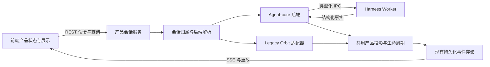

# Agent-core 通信与前端协议收敛方案

日期：2026-10-02。状态：实施中；第一批内部契约、产品输入和结构化 runner 已接入，完整完成边界及验证见 [实施记录](agent-core-communication-implementation.md)。

基线：PR #115，`59be3309e29334750ddfe307a1ae4aa89b17c304`。该提交的 Linux、Windows、macOS launcher 与 CodeQL 检查均通过。本文承接 [运行时优化方案](prd-agent-core-runtime-optimization.md)，讨论通信和适配层的收敛；完整能力边界仍以 [能力清单](agent-core-capability-inventory.md) 为准。

## 1. 目标与范围

让前端只消费稳定的产品命令、状态和事件，让 agent-core 通过一处语义投影接入产品服务。将 Orbit 专属通信与恢复处理集中到 legacy 适配器，逐步减少 core 路径对 Orbit 命令、类型和事件形态的依赖。

预期收益是减少重复转换、重复配置解析和分散的后端选择分支，使故障定位和协议变更更容易验证。不能仅以删除代码行数判断优化成功。

本轮保留 REST、SSE、Node 服务与独立 Worker，不将 Harness 或凭据加载到浏览器，不引入 WebSocket 或新的通用插件框架。默认运行时仍为 Orbit，agent-core 继续显式 opt-in。Sandbox、图片 prompt、完整扩展迁移、默认切换和 Orbit 退役使用独立验收条件。

## 2. 现状与主要成本

agent-core 已使用结构化 IPC，不能把“去掉 stdout JSON 解析”当作新的 core 改造成果。stdout/外部事件流解析属于仍需兼容的 Orbit 路径。

当前 core 对话链路大致为：

```text
Harness event
  → AgentCoreEventAdapter：转换为兼容的运行时事件
  → Worker IPC / AgentCoreRuntimeClient
  → ConversationEventHub：产品事件投影与持久化
  → SSE
  → 前端事件折叠与会话展示
```

| 位置 | 当前事实 | 优化方向 |
| --- | --- | --- |
| `agent/agent-event-adapter.ts` | Harness 事件转换为 `agent_start`、`message_update`、`tool_execution_*` 等中间事件，并处理恢复顺序 | core 直接生成有明确身份和终态的产品输入事件，保留必要的排序与恢复保护 |
| `events/conversation-event-hub.ts` | 混合处理运行时事件识别、消息/工具状态、持久化、SSE 和 observer 队列 | 分离后端语义适配与共用的投影、持久化及发布职责 |
| `agent/worker/protocol.ts` | 外层 IPC 已是 union；内层 command/notification 仍是字符串加宽泛参数 | 收窄内部命令、通知、结果与 snapshot 的类型，保持 IPC 请求关联 |
| `agent/agent-runtime-types.ts` | `RuntimeEvent` 宽泛；通用接口携带可选 `LegacyOrbitTransport` | 产品接口不暴露 Orbit 传输细节，legacy 适配器自行拥有外部流恢复 |
| `node/node-session-service.ts` | 多个方法分别判断 core 归属，再进入 Orbit 分支 | 集中会话后端解析和配置解析，共用产品处理 |
| `agent/runner-transport.ts` | 仍依赖 `PiResult` 和通用 `sendCommand` | research/review 依赖窄的结构化任务接口 |
| `agent/core-runner-runtime.ts` | 已完成的隐藏任务结果重新合成为兼容消息事件 | core runner 直接返回结构化结果和 usage，legacy runner 内部解析 Orbit 流 |
| 前端 client / agent-runtime / projection | 已有 SSE 补洞、交付状态、会话切换和展示投影 | 移除后端兼容推断，保留网络可靠性和界面展示职责 |

模型目录、压缩事实、共享 turn 生命周期、durable prompt 和隐藏子会话已在上一轮接入。本轮复用这些实现，避免再次建设相同机制。

## 3. 目标架构与职责



“一处语义投影”指 core 输入到产品事实的转换只有一个所有者，不要求压成一个大文件。IPC 校验、事件持久化和界面渲染仍是独立职责。

| 层 | 负责 | 不承担 |
| --- | --- | --- |
| Harness / Worker | 执行、lane/session 状态、工具调用、压缩、已应用配置 | 浏览器连接状态、研究预算、产品复查决策 |
| core 后端 | IPC 生命周期、订阅后激活、snapshot、operation 对账、Worker 恢复 | 解析 Orbit stdout 或外部事件流 |
| legacy 适配器 | Orbit 启动、通信、旧事件转换和专属恢复 | 定义前端的第二套协议 |
| 产品服务及投影 | 会话归属、消息/工具投影、统计、产物、复查、持久化与发布 | 推测模型是否已应用或替代 lane 状态 |
| 前端 | 已接收产品事件的折叠、分页、乐观交付、网络重连和展示 | 选择运行时后端、解析 Harness 原始事件 |

## 4. 契约收敛

### 4.1 浏览器产品契约

第一阶段保持现有 REST 路由、SSE 事件名、字段及错误码。先收敛服务端内部接口，再按证据移除前端兼容分支。运行时类型留在服务端，浏览器契约由 `packages/contracts` 提供。

产品操作覆盖 prompt、abort、配置、压缩、导航/fork、交互响应和资源刷新。每项明确请求参数、结果、是否修改持久化状态，以及交付不确定时如何查询既有 operation。并非所有操作都需要启动 Worker；历史、列表和已有持久化事实优先由 repository 提供。

配置查询和历史查询不得顺带迁移 v3、启动模型执行或修改会话归属。模型目录查询避免为探测能力临时启动 Orbit；仅在确实需要运行中事实时查询已有 Worker。

### 4.2 类型化 IPC

保留 `requestId`、超时、退出处理、pending 请求表和订阅后激活。把已使用的内部字符串命令逐项整理为 discriminated union，按命令关联参数与结果类型；边界仍执行运行时校验，不能仅靠 TypeScript 断言。

Worker 的工具请求、交互请求、取消和 fatal 也需要明确类型。未知或不合法消息产生可诊断错误，不能静默降级为成功。stderr 只作为诊断输出，不作为 core 的产品事件输入。

避免一次改写所有命令。优先迁移 prompt/abort/state/configure，再覆盖 compact、导航、交互与资源命令；临时兼容分派只存在于一个有删除条件的入口。

### 4.3 身份、顺序与权威来源

| 身份或事实 | 用途与约束 |
| --- | --- |
| 工作区真实身份 + session ID | 后端选择、缓存与归属；沿用原生 realpath，兼容 Windows 短路径和目录别名 |
| `client_message_id` | 一次用户提交的稳定身份，跨重连不重新生成 |
| operation/run ID | 持久化执行与结果对账；沿用既有 `promptOperationId` 映射 |
| 产品 turn ID | 一次用户执行及产物/复查身份，不能使用每次模型往返的内部 turn ID |
| 工具 invocation ID | 工具展示、结果关联和重放去重；同一 turn 可有多次同名工具调用 |
| IPC `requestId` | 单次进程请求关联，不能当作 durable operation ID |
| Worker epoch + runtime sequence | 区分 Worker 重开与同一 Worker 内事件缺口；明确序列重置规则 |
| 产品 SSE cursor | 浏览器重放位置，由已持久化产品事件产生；不能直接使用 Worker sequence |
| lane/session snapshot | 执行状态和已应用配置的权威；Settings 表达用户期望配置 |

维护三类状态的边界：执行状态由 core 权威提供；产品持久化投影表达可恢复的对话与后续动作；前端状态表达已应用事件和网络交付。它们可以协调，但不能用一个 `busy` 或 `connected` 布尔值互相替代。

## 5. core 事件直接进入产品投影

定义内部类型化事件输入，表达 operation 开始/终态、消息片段/完成、工具开始/增量/结果、压缩、交互及故障。字段应携带足够的稳定身份，使投影不再通过消息文本或工具名猜测归属。

core 适配器直接从 Harness 事实构造该输入，Orbit 适配器将旧事实转成同一输入。共用投影继续生成现有浏览器事件，维护消息、工具快照、todo details、产物与统计。

迁移必须保留：

- 对单个 operation 的开始/恢复顺序保护，避免首个可见工具或消息先于所属执行开始。
- completed、failed、aborted 的明确终态；传输断开不是执行成功或失败的证明。
- prompt 执行前持久化产物基线；终态后按稳定 turn 去重处理产物与复查。
- message/tool/operation 的分别去重；不能只按事件类型丢弃后续合法记录。
- 错误与终态各自承担的界面职责。同一故障不要经多个转换层生成重复错误卡片。
- 文本增量的现有合并与容量限制，终态发布前 flush；工具完整结果和关键终态不能因背压被丢弃。
- 关闭时等待 observer、事件发布、子代理结果持久化和锁释放完成，保留 `59be330` 的关闭保证。

过渡期可在测试中将同一脱敏事件轨迹分别输入旧、新投影并比较最终产品状态。生产环境不能同时发布两套事件或执行两次产物/复查副作用。

## 6. 保留可靠性，减少重复补偿

### 6.1 Prompt 交付与恢复

请求确认只证明 admission，不证明完成。超时或退出可能发生在 admission 之后；界面保留交付不确定状态，并通过稳定身份查询持久化结果。同一 ID、相同内容沿用原操作，同一 ID、不同内容明确冲突，不能自动生成新 ID 重发。

core 的 Worker 恢复统一由 core 后端管理：订阅 → snapshot → 绑定产品生命周期 → activate。恢复使用 single-flight、有界重试和排他归属；停止旧 Worker 后才能重开同一会话。watchdog 用于验证事件活跃度与权威状态，不因结构化 IPC 就直接删除。

Orbit 外部事件流的重连和特殊探测移入 legacy 适配器。前端只接收统一的恢复中、失败和可操作状态，不分别维护 core/Orbit 恢复策略。

### 6.2 SSE 与历史补洞

遵守 [会话补洞方案](prd-conversation-gap-recovery-safety.md) 的已有不变量：只有成功应用的事件才能推进恢复 cursor；`stream.gap` 后保留已经注册的 live fence；没有安全 cursor 时使用既有安全补洞路径。

不能在 REST history 读取后取“最新服务器 cursor”并直接从其后恢复，这会漏掉快照与 cursor 之间的事件。IPC 请求 ID、Worker sequence、历史分页 `snapshot_version` 和 SSE cursor 也不能混用。

本轮先复用现有 history + fence，不新增 Conversation Snapshot API。若测量表明确有必要，另行设计能证明 snapshot 与 replay watermark 一致的接口，并覆盖快照期间持续产生事件的并发场景；证明完成前不能删除现有 fence。

### 6.3 配置与冷态事实

复用 canonical model resources、已应用配置及现有上下文计算。不增加第三份模型/密钥缓存。配置仍按会话串行；拒绝或部分失败时保留 lane 的实际配置，并返回明确结果。

资源策略等产品侧持久化配置继续保留。只有被另一权威事实完全覆盖、且冷态恢复不再需要的 sidecar 字段才可删除。state/statistics 的冷态查询使用持久化 session，不伪装成运行中 snapshot，也不把累计 usage 当作当前上下文占用。

## 7. 集中后端选择与 runner 接口

会话后端解析在一个入口完成，依据持久化归属、删除标记、用途和显式 rollout 策略选择后端。不能仅按全局开关决定已有会话的后端，不能把已迁移 v4 会话退回保留的 v3 源文件。

先整理一个有限的会话后端接口，仅覆盖产品实际调用的方法；不建立任意命令透传的新通用框架。`NodeSessionService` 保留产品入口，将 Orbit 启动参数、专属超时及流恢复移入 legacy 实现。

research/review 的公共任务接口按需要提供运行、结果、usage、取消和状态。core 直接返回隐藏任务的结构化结果，避免将完整文本重新合成为 `message_update` 和 `agent_settled` 再解析。Orbit runner 自行从旧流组装相同结果；若界面需要进度，应单独定义有限的进度通知。

结构化结果校验、JSON 修复次数、deadline、响应大小、预算及停止规则保持不变。遵守 [Research Loop ADR](adr-research-loop-subagents.md)：Node 与 JobCoordinator 继续拥有研究状态和执行权威。此项优化不扩大子代理权限，也不启用尚未适配的交互工具。

## 8. 分阶段实施与完成条件

| 阶段 | 交付内容 | 完成条件 |
| --- | --- | --- |
| A：盘点与基线 | 命令/事件契约清单、调用路径、可靠性所有者、待删除兼容分支清单 | 每个消费者和现有保护都有对应去向；记录改造前测量值 |
| B：内部契约 | 类型化 IPC、事件、snapshot 和错误；先迁移关键命令 | 非法消息可诊断；关键命令不依赖宽泛强制转换；浏览器协议保持兼容 |
| C：事件投影 | core 直接进入产品输入；Orbit 独立适配；共用生命周期 | core 不再经过 Orbit 风格事件中转；轨迹对照一致，重放不重复产生副作用 |
| D：后端与 runner | 集中归属解析、隔离 legacy 传输、结构化任务结果 | core 服务和 runner 不导入 Orbit 传输类型；旧 v3 与新 v4 路由正确 |
| E：前端收敛与清理 | 移除已无消费者的补偿分支与临时桥接，更新架构记录 | 前端只依赖产品契约；故障验收通过；每项删除有替代证据 |

每阶段独立提交并附契约变化、产品行为、验证证据和删除清单。阶段 B/C 先选普通文本与工具 turn，再覆盖压缩、问卷/MCP、todo/subagent 与故障恢复。第一阶段不修改浏览器公开协议，降低前后端同时升级的要求。

代码可以过渡到新的内部边界，但同一会话只能有一个执行后端和一个有效产品发布者。不能通过同时调用两套执行链路做比较。

## 9. 验收场景与测量

| 场景 | 必须证明 |
| --- | --- |
| 普通流式对话与快速文件工具 | 消息、工具、产物归属正确；终态前 flush；一次 turn 只处理一次复查 |
| admission 后丢失确认、重复提交 | 同一 operation 被恢复，没有重复用户消息或再次模型执行；不同内容冲突可见 |
| snapshot/activate 之间 abort | 通知到达正确 operation，初始 snapshot 不覆盖后来的运行事实 |
| Worker 崩溃、事件缺口、重开 | 新 epoch 与旧事件可区分；有界恢复同一 durable operation；不发布假完成 |
| SSE gap、分页与会话切换 | 没有 snapshot/cursor 盲区；未应用事件不推进 cursor；旧会话迟到事件不污染新会话 |
| 配置并发、失败和冷态查询 | 已应用事实一致；查询无迁移/执行副作用；busy 和不支持档位保持原语义 |
| 压缩、导航、todo 和 fork | 当前上下文及工具快照与有效分支一致，累计 token 不替代上下文 |
| MCP/问卷交互 | 请求、审批、响应和取消身份正确；断线后恢复；凭据不进入前端事件 |
| 子代理取消及关闭 | 子执行停止；结果/锁释放和 observer 完成后关闭才返回；重复结果不重复计费展示 |
| 旧 v3、新 v4、删除和开关切换 | 归属稳定；删除不复活；保留 Orbit 与 core 各自可用的恢复路径 |
| Windows 短路径、目录别名 | 会话缓存和 transcript 查找使用同一真实身份，不能纳入另一工作区的会话 |

优先复用现有真实 Worker、可控模型、SSE gap 和故障回归。新增测试验证上述交错行为，不只检查新接口或类名是否存在。提交涉及 contracts、server、frontend 时运行对应类型检查和测试；最终执行现有 Linux/Windows quality、macOS launcher 与 CodeQL 检查。

阶段 A 记录以下基线，后续使用同一环境和相同轨迹比较，不在方案中虚构降幅：

- core 到浏览器的语义转换次数，以及正常 prompt/state/configure 的 IPC 调用数。
- core 活跃调用路径中对 Orbit 模块/类型的依赖，以及分散后端选择入口的数量。
- 单次 turn 事件数、字节数、首个可见增量延迟与 terminal 发布延迟；增量合并后仍需保留正确的最终结果。
- 重连到状态恢复的耗时、状态查询次数和失败重试次数；记录原始错误来源与稳定 operation 身份。
- shutdown 时待处理 observer/dispatch 的数量及完成时间，确认没有未等待的持久化任务。

删除目标是 core 路径中的 Orbit 中间形态、重复解析与无消费者的兼容逻辑。持久化事件、可靠交付和界面展示代码不以行数下降作为硬性目标。

## 10. 回退与 Orbit 退役边界

优先保持浏览器契约与现有存储格式不变，使内部改造可以逐阶段回退。回退仍必须遵守会话归属：新 v4 会话继续交给兼容的 core 实现，不因关闭开关自动转回 Orbit。

若某阶段确需修改持久化记录或公开协议，先定义版本、读取兼容和迁移/回退测试；未验证的新 v4 降级读取不能作为回退承诺。相邻阶段存在依赖时，明确一起回退的范围。

本方案完成后，Orbit 应集中在可单独维护、将来可整体删除的 legacy 适配器中。完成通信收敛不等于完成 Orbit 退役。退役仍需要真实 v3 迁移、真实研究任务、使用中的扩展等价能力或明确退役结论，以及工具边界与发布条件；Sandbox 继续按已有约定暂缓。

## 11. 实施前检查清单

- [x] 同步 PR 最新 CI 修复并记录第一批调用清单和静态基线；性能基线见实施记录中的待完成项。
- [x] 第一批保留原有重试、缓存、排序与补偿保护，只移除已被结构化任务接口替代的结果合成流。
- [ ] 明确事件投影、后端选择和配置解析各自唯一的所有者。
- [x] 保留稳定请求身份、SSE fence、Worker 隔离、审批与 shutdown drain 的验收测试。
- [x] 第一阶段保持外部协议兼容；后续公开变化另列迁移计划。
- [x] 实施记录区分已实现、已自动化验证、真实用户场景待验收和范围外项目。
