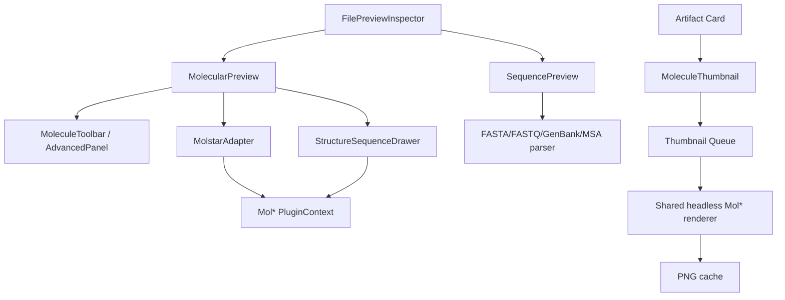

# Mol* 通用分子与序列预览实施设计

> 状态：实施中（第一阶段已落地）  
> 日期：2026-08-16  
> 基线：`main` @ `4f8f99b181d8784b90a228537f1858ef1617549e`  
> 范围：分子主预览、结构缩略图、结构关联序列、独立序列文件预览  
> 核心依赖：Mol* 5.x、OpenChemLib（仅用于 SMILES 坐标生成）

## 0. 当前实施状态（2026-08-16）

本次已完成第一条可交付纵切：

- Mol* 5.11.0 已替换 3Dmol.js，仓库不再保留两套分子渲染依赖；
- 主预览已使用本地 Mol* Viewer，覆盖 PDB、PQR、mmCIF、core CIF、SDF、MOL、MOL2、XYZ、CUBE 与 SMILES；
- Mol* 内置的表示、着色、选择、测量、截图、设置和结构关联 Sequence View 已在主预览中开放；
- 卡片缩略图改为单例隐藏 Mol* renderer 串行生成 PNG，卡片本身不持有 WebGL context；
- Mol* 通过动态 import 延迟加载，production build 中 viewer chunk 未进入首屏依赖图；
- 格式映射、缩略图行为、完整前端测试、类型检查、lint、production build 和 bundle budget 已验证。

尚未实施的是独立序列文件预览（阶段 E）及轨迹、结构叠合、远程注释等高级科研能力（阶段 F）。当前先采用 Mol* 内置专业 UI；后续再按本文设计收敛为 Pi-Science 紧凑工具栏与高级面板。

## 1. 背景

Pi-Science 当前使用 3Dmol.js 提供通用分子结构预览：

- `frontend/src/components/inspector/MoleculeView.tsx` 负责右侧 Inspector 中的交互式 3D 预览；
- `frontend/src/components/conversation/MoleculeThumb.tsx` 负责对话产物卡片中的静态分子缩略图；
- `frontend/src/lib/viewers/molecule.ts` 负责格式映射、大小分子启发式判断，以及 SMILES 到 SDF 的转换；
- `frontend/src/lib/artifacts/artifacts.ts` 把 CIF、PDB、SDF、MOL、MOL2、SMILES、XYZ、PQR、CUBE 等文件路由到 `molecule` preview kind。

现有查看器可以旋转、缩放、重置视角，并提供 stick、sphere、cartoon 三种样式，但还不能满足通用结构探索需求：

1. 蛋白质、核酸、小分子、糖链和复合物缺少针对各自语义的自动表示；
2. 缺少链、残基、配体、水、离子等 component 级显示控制；
3. 缺少结构选择、sequence 联动、局部环境、相互作用和测量；
4. 缺少表面、轨迹、体数据、晶体、结构质量等进一步科研能力；
5. 独立 FASTA、FASTQ、GenBank 和 MSA 文件目前只会落入普通文本预览。

Mol* 原生覆盖蛋白质、核酸、小分子和大规模复合物，提供可嵌入的 WebGL 查看器、结构状态树、序列面板、选择系统、表示与着色注册表，以及轨迹、体数据和科研扩展，适合作为 Pi-Science 的统一分子渲染内核。

## 2. 已确定的产品与架构决策

本设计采用以下决策：

1. **Mol* 替换 3Dmol.js，成为唯一的分子渲染引擎。**迁移完成后删除 `3dmol` 依赖，不长期维护两套 renderer。
2. **主预览与卡片缩略图必须在同一迁移中得到覆盖。**缩略图保持现有产品能力，但改由共享的无 UI Mol* 渲染器生成 PNG。
3. **主预览使用 Mol* `PluginContext` / `PluginUIContext` 能力，而不是 iframe 或远程 Mol* Viewer。**文件内容继续在本地读取和解析，不默认上传或请求远程服务。
4. **采用“Pi-Science 紧凑工具栏 + 可折叠高级面板”的产品外壳。**不把完整 Mol* 专业 UI 的所有参数直接平铺给普通用户。
5. **结构关联 sequence 使用 Mol* Sequence View。**蛋白质和核酸序列与 3D 结构双向高亮、选择和聚焦。
6. **独立序列文件使用单独的 `sequence` preview kind。**FASTA、FASTQ、GenBank、EMBL 和 MSA 不伪装成 Mol* 结构，也不与 Mol* 的结构序列组件强耦合。
7. **OpenChemLib 继续负责 SMILES 到带坐标 SDF 的转换。**Mol* 不直接承担 SMILES 解析与坐标生成。
8. **远程注释扩展默认关闭。**任何 RCSB、PDBe、EMDB 或其他在线数据请求都必须作为显式的“在线增强”功能呈现。
9. **PQR 不作为保留 3Dmol 的理由。**通过兼容解析、预转换或明确降级解决 PQR，不为单一格式保留整个旧渲染器。

## 3. 目标能力

### 3.1 通用结构表示

第一阶段面向用户暴露以下表示：

| 产品名称 | Mol* representation | 主要对象 | 默认策略 |
| --- | --- | --- | --- |
| Cartoon | `cartoon` | 蛋白质、核酸 | 聚合物默认 |
| Backbone | `backbone` | 大型蛋白质、核酸 | 性能模式 |
| Ball & stick | `ball-and-stick` | 小分子、配体、局部残基 | 小分子默认 |
| Spacefill | `spacefill` | 小分子、原子占据空间 | 用户可选 |
| Surface | `molecular-surface` | 蛋白表面、口袋、复合物 | 用户可选 |
| Line | `line` | 大体系快速浏览 | 高级设置 |
| Putty | `putty` | B-factor、柔性、置信度 | 高级设置 |
| Carbohydrate | `carbohydrate` | 糖链、糖蛋白 | 检测后自动叠加 |
| Label | `label` | 原子、残基、链、配体 | selection/测量时使用 |

第二阶段可以增加 Gaussian surface/volume、orientation、plane、point、polyhedron 和晶体 unit cell。

### 3.2 自动显示 preset

加载结构后按解析结果选择表示，而不是仅按扩展名判断：

| 结构类型 | 默认表示 |
| --- | --- |
| 纯小分子 | Ball & stick，按元素着色 |
| 蛋白质 | Polymer cartoon + ligand ball & stick；水默认隐藏 |
| DNA/RNA | Nucleic cartoon/ring + 碱基原子表示 |
| 蛋白质—核酸复合物 | Protein-and-nucleic preset |
| 糖蛋白 | Polymer cartoon + carbohydrate symbols |
| 超大结构/粗粒化体系 | Auto-LOD、backbone 或 coarse surface |
| CUBE/密度文件 | 原子结构（若存在）+ 可调等值面 |

`looksLikeMacromolecule()` 可以在迁移初期保留作加载前提示，但最终显示决策应以 Mol* 解析出的 entity、polymer 和 molecule type 为准。

### 3.3 着色

紧凑工具栏首批提供：

- 元素；
- 链；
- 分子类型；
- 二级结构；
- 单色。

高级面板提供：

- entity/polymer ID；
- residue name、sequence ID；
- hydrophobicity；
- formal charge、partial charge、residue charge；
- occupancy、uncertainty/B-factor；
- model、trajectory、structure index；
- pLDDT/QMEAN 等质量着色（数据存在或用户启用在线增强时）。

### 3.4 组件、选择和分析

首批交互能力：

- 按 atom、residue、chain、entity 粒度选择；
- 从 3D 或 sequence 面板进行 hover、select、focus；
- 显示/隐藏 polymer、ligand、water、ion、lipid、carbohydrate；
- 聚焦配体或残基，并显示指定半径内的 surroundings；
- 显示局部非共价相互作用；
- 添加 label、距离、角度和二面角测量；
- 重置相机、居中、正交/透视切换；
- 导出高分辨率 PNG。

后续能力：

- 命名 selection/component；
- 多结构叠合；
- model/assembly/symmetry 切换；
- trajectory 播放；
- clipping plane；
- state/snapshot 保存与恢复；
- validation、assembly symmetry、membrane orientation、tunnels、partial charges 等扩展。

## 4. 结构关联 Sequence View

Mol* Sequence View 仅用于已经加载为 `Structure` 的 polymer entity。它不是独立 FASTA 浏览器。

### 4.1 支持范围

- PDB/mmCIF 中的蛋白质序列；
- PDB/mmCIF 中的 DNA、RNA 和其他 polymer；
- 多链、多 entity、多 model 结构；
- sequence 与 3D 之间的双向 hover、selection 和 focus；
- 单链、全部 polymer、全部 entity 等显示模式。

纯 SDF/MOL/MOL2 小分子没有 polymer sequence，Sequence Drawer 不显示。

### 4.2 布局

Sequence View 作为 3D Canvas 下方的可折叠抽屉：

```text
┌────────────────────────────────────────────────────────┐
│ 表示  着色  组件  选择  测量  Sequence  设置           │
├────────────────────────────────────────────────────────┤
│                                                        │
│                     Mol* Canvas                        │
│                                                        │
├────────────────────────────────────────────────────────┤
│ Chain A  1  M K T ...                                  │
│ Chain B  1  A U G ...                                  │
└────────────────────────────────────────────────────────┘
```

默认行为：

- 蛋白质/核酸结构：Sequence 按钮可用，首次可默认展开；
- 多链复合物：显示链选择器；
- 纯小分子：隐藏 Sequence 按钮；
- 窄 Inspector：Sequence 以底部 drawer 呈现，不永久挤压画布；
- sequence 选中区间与 Mol* selection manager 使用同一状态事实。

## 5. 独立序列文件预览

新增 `PreviewKind = "sequence"`，与现有 `molecule`、`genome` 分离。

### 5.1 文件路由

建议第一批扩展名：

| 类型 | 扩展名 |
| --- | --- |
| FASTA | `fa`, `fasta`, `faa`, `fna`, `ffn`, `frn` |
| FASTQ | `fq`, `fastq` |
| GenBank | `gb`, `gbk`, `genbank` |
| EMBL | `embl` |
| Alignment | `aln`, `clustal`, `sto`, `stockholm` |

压缩文件（如 `.fasta.gz`、`.fastq.gz`）需要先补充复合扩展名识别和 bytes/decompression 读取，不在第一批默认承诺中。

### 5.2 SequencePreview 能力

通用能力：

- 多序列列表与快速切换；
- DNA/RNA/蛋白自动识别，并允许手动纠正；
- 固定宽度显示、行号、当前位置、区间选择；
- motif 搜索和坐标跳转；
- 长度、GC%、N 含量、氨基酸组成；
- 复制选择、导出子序列。

格式能力：

- FASTA：header、description、多记录；
- FASTQ：碱基与质量分数联动、质量图；
- GenBank/EMBL：feature 列表和简化 feature track；
- DNA/RNA：reverse complement、translation；
- MSA：consensus、conservation、gap 比例和横向虚拟滚动。

结构 sequence 和独立 sequence 共享视觉 token、字母配色和选择语义，但不共享底层数据模型。未来可通过显式 sequence alignment 建立“独立序列位置 ↔ 结构残基”映射。

## 6. 前端架构



### 6.1 `MolstarAdapter`

把 Mol* API 与 React UI 隔离，避免业务组件直接操作 Mol* state tree。建议接口：

```ts
type MolecularSource = {
  filename: string;
  data: string | Uint8Array;
  format: MolecularFormat;
};

interface MolstarAdapter {
  init(target: HTMLElement): Promise<void>;
  load(source: MolecularSource): Promise<MolecularSummary>;
  setPreset(preset: MolecularPreset): Promise<void>;
  setRepresentation(component: ComponentSelector, representation: RepresentationKind): Promise<void>;
  setColorTheme(component: ComponentSelector, theme: ColorThemeKind): Promise<void>;
  setComponentVisibility(component: ComponentKind, visible: boolean): Promise<void>;
  focus(selection?: MolecularSelection): void;
  clearSelection(): void;
  captureImage(options?: CaptureOptions): Promise<Blob>;
  dispose(): void;
}
```

`MolecularSummary` 至少包含：atom、residue、chain、entity、model 数量，polymer 类型，ligand/water/ion 状态，以及是否支持 sequence、trajectory、volume。

### 6.2 生命周期

- 一个已打开的 `MoleculeView` 对应一个 adapter/plugin 实例；
- 文件变化时清空 Mol* data state，而不是销毁并重新创建整个 plugin；
- representation、color 和 component 变化只更新 state，不重新解析文件；
- ResizeObserver 先通知 Canvas3D 更新尺寸，再按新画布面积重新计算 camera focus；普通面板保持保守 framing，标签最大化和面板宽度最大化提高结构占屏比例，compact 缩略图不参与该缩放；
- 标签最大化/恢复与预览栏宽度最大化/恢复按钮还会显式广播 inspector layout change；viewer 在 React 布局提交后和 Mol* 160ms 相机动画结束后各校准一次，避免单次 ResizeObserver 时序造成只放大不恢复或只扩画布不放大结构；
- React 卸载时取消订阅、停止动画并调用 `dispose()`；adapter 自行持有 React 18 root，先 `unmount()` UI 再销毁 plugin，避免同一容器重复 `createRoot()`；
- 同一 DOM 容器的 viewer 创建与释放串行化，覆盖 Strict Mode、快速切换和 Vite 热更新的异步初始化重叠；
- 必须覆盖 React Strict Mode 下初始化、立即清理、再次初始化的情况；
- 加载任务使用 generation/token，旧文件的异步完成不能覆盖新文件状态。

### 6.3 样式隔离

Mol* UI CSS 需要限制在 viewer root 中，避免影响 Pi-Science 的按钮、表单和 typography。优先选择：

1. 使用 Mol* Canvas 和必要的 Sequence UI，由 Pi-Science 自己渲染外层控件；
2. 若复用完整 Plugin UI，则将其放入明确的 `.molstar-root` 范围并覆盖主题变量；
3. 不全局导入不必要的 Mol* viewer skin。

## 7. 卡片缩略图

缩略图保持为静态图片，不在每张卡片中挂载完整 Mol* 实例。

### 7.1 目标流程

```text
卡片进入视口
  → 查询内存/持久缩略图缓存
  → 未命中则进入全局队列
  → 共享隐藏 Mol* renderer 加载结构
  → 应用自动 thumbnail preset
  → capture PNG
  → 清空 data state 并释放临时对象
  → 缓存并交给卡片 
```

约束：

- 全局并发为 1，避免多个 Mol* WebGL context；
- renderer 懒加载，只有分子卡片进入视口时才加载 Mol* chunk；
- 卡片组件只管理 loading/error/image，不持有 plugin；
- 缓存 key 至少包含 workspace、path、文件版本信息和 thumbnail preset version；
- 单个任务失败不能阻塞后续队列；
- renderer 失去 WebGL context 后可以重新创建；
- 长列表卸载卡片时允许取消尚未开始的队列任务。

### 7.2 大文件与截断问题

现有缩略图只读取前 256 KiB。截断 PDB 可能仍可显示部分原子，但截断 mmCIF、SDF 或其他块格式可能语法不完整，不能继续把“片段可解析”当作契约。

新策略：

1. 小于阈值的文本结构完整读取；
2. 已有缓存时不读取原文件；
3. 大文件未命中缓存时显示分子类型占位图；
4. 用户打开主预览并成功加载后生成、缓存和回填缩略图；
5. 如后续需要列表中主动生成大文件缩略图，应由可取消的后台任务处理，而不是阻塞卡片渲染。

## 8. 格式兼容策略

| 当前格式 | Mol* 策略 | 备注 |
| --- | --- | --- |
| CIF/mmCIF/mCIF | 原生 | 需要区分 coreCIF 与 mmCIF 语义 |
| PDB | 原生 | 支持结构 sequence |
| MOL/SDF | 原生 | 小分子 preset |
| MOL2 | 原生 | 小分子 preset |
| XYZ | 原生 | 可能缺少可靠键级，需检查显示结果 |
| CUBE | 原生结构/volume | 明确 structure-only 与 volume UI |
| SMILES | OpenChemLib → SDF → Mol* | 保留现有容错与多记录语义 |
| PQR | 兼容验证或预转换 | 不保留 3Dmol fallback |

迁移前必须用真实 fixture 建立格式矩阵，不能只验证“解析未抛异常”，还要验证原子数、结构类型、默认 preset 和截图非空。

## 9. 依赖与包体

- `frontend/package.json`：添加固定范围的 `molstar`，删除 `3dmol`；
- `frontend/vite.config.ts`：删除 `vendor-3dmol`，增加 `vendor-molstar` 拆包规则；
- `frontend/scripts/check-bundle-budget.mjs`：把 `vendor-molstar` 加入 lazy-only 列表；
- Mol* 主模块、Sequence UI、截图路径都必须通过动态 import 到达；
- 默认 Viewer 包含大量 extension，首版应只注册实际启用的行为和扩展；
- 不把 MP4 export、远程 provider、debug helper 等能力带入首版 bundle。

Mol* 5.11.0 的官方完整 Viewer bundle 明显大于当前 3Dmol min bundle，因此验收不仅看 initial JS；还要记录 molecule chunk 的 raw、gzip/brotli 大小、首次打开耗时和峰值内存。

## 10. 安全与本地优先

- 本地文件通过已有 `readArtifact`/workspace file API 读取；
- Mol* 接收内存中的 text/bytes，不把本地文件 URL 交给第三方服务；
- 默认不启用 PDB、EMDB、volume streaming、plugin state server；
- 在线 annotation/download 操作必须显示目标服务、请求内容类别和用途；
- Mol* state snapshot 不得隐式包含本地绝对路径或敏感 workspace metadata；
- structure tooltip/label 中的文件内容按文本处理，不注入未清理 HTML。

## 11. 预计文件改动

### 11.1 分子预览

| 文件 | 改动 |
| --- | --- |
| `frontend/package.json` | `3dmol` → `molstar` |
| `pnpm-lock.yaml` | 更新依赖锁 |
| `frontend/vite.config.ts` | Mol* lazy chunk |
| `frontend/scripts/check-bundle-budget.mjs` | lazy-only 与 Mol* 预算检查 |
| `frontend/src/components/inspector/MoleculeView.tsx` | 改为 Mol* 外壳与生命周期管理 |
| `frontend/src/components/inspector/MoleculeToolbar.tsx` | 新增紧凑工具栏 |
| `frontend/src/components/inspector/MoleculeAdvancedPanel.tsx` | 新增高级设置 |
| `frontend/src/components/inspector/StructureSequenceDrawer.tsx` | 新增结构 sequence 面板 |
| `frontend/src/lib/viewers/molstar.ts` | 新增 Mol* API 适配层 |
| `frontend/src/lib/viewers/molecule.ts` | 格式、SMILES 转换和产品类型调整 |
| `frontend/src/components/conversation/MoleculeThumb.tsx` | 改为缩略图服务消费者 |
| `frontend/src/lib/viewers/molecule-thumbnail.ts` | 新增共享 renderer、队列和缓存 |

### 11.2 独立序列预览

| 文件 | 改动 |
| --- | --- |
| `frontend/src/lib/artifacts/artifacts.ts` | 新增 `sequence` kind 和扩展名 |
| `frontend/src/lib/artifacts/preview-policy.ts` | sequence 读取策略 |
| `frontend/src/components/inspector/FilePreviewInspector.tsx` | lazy-load `SequencePreview` |
| `frontend/src/components/inspector/SequencePreview.tsx` | 新增独立 sequence viewer |
| `frontend/src/lib/viewers/sequence.ts` | 格式识别、解析、统计和坐标模型 |
| `frontend/src/i18n/locales/en.json` | 新增分子与序列文案 |
| `frontend/src/i18n/locales/zh-Hans.json` | 新增分子与序列文案 |

文件可以在实现过程中按职责进一步拆分，但不应让 React 组件直接散布 Mol* state transform 细节。

## 12. 测试计划

### 12.1 纯逻辑单元测试

- 扩展名到 Mol* format 的映射；
- SMILES 多记录转换及错误行跳过；
- molecular summary 到自动 preset 的映射；
- component、representation、color 的产品枚举映射；
- sequence 文件格式识别和基础解析；
- DNA/RNA/蛋白识别、GC%、reverse complement、translation；
- FASTQ 质量值解析；
- thumbnail queue 的并发、取消、失败继续和缓存 key。

### 12.2 Mol* adapter 测试

jsdom 中 mock adapter 边界，不 mock Mol* 内部 state tree。浏览器级测试覆盖：

- React Strict Mode 下只保留一个有效 viewer；
- 快速切换文件不会显示上一个文件；
- resize 后画布尺寸正确；
- style/color/component 更新不重新解析结构；
- 卸载后订阅、动画和 WebGL 资源释放；
- WebGL 初始化失败显示可恢复错误。

### 12.3 格式 fixture

至少包含：

- 真实蛋白质 PDB；
- 真实 protein/nucleic mmCIF；
- DNA 或 RNA 结构；
- ligand SDF/MOL2；
- 多记录 SDF 和 SMILES；
- XYZ；
- CUBE；
- PQR；
- FASTA、FASTQ、GenBank、MSA。

对结构 fixture 验证：解析成功、原子数大于零、entity 分类合理、默认 preset 正确、sequence 可用性正确、截图包含非背景像素。

### 12.4 UAT

新增分子与序列预览 UAT，至少验证：

1. 从文件列表打开蛋白质结构；
2. 展开 sequence，点击残基并观察 3D focus；
3. 切换到 surface、按链着色、隐藏水；
4. 选择两个原子并测量距离；
5. 打开小分子并确认默认 ball & stick；
6. 对话卡片进入视口后出现缩略图；
7. 多张分子卡片不会创建多个并行 WebGL context；
8. 打开 FASTA 和 FASTQ，确认使用独立 SequencePreview；
9. 断网时所有本地预览仍可工作。

## 13. 分阶段实施

### 阶段 A：adapter 与格式基线

- 引入 Mol*；
- 建立 `MolstarAdapter`；
- 覆盖当前结构格式 fixture；
- 实现本地 load、dispose、resize 和错误边界；
- 暂不扩展独立 sequence 文件。

退出条件：当前主分子预览支持的主要格式在 Mol* 中可加载，PQR 有明确处理结论。

### 阶段 B：主预览与基础产品 UI

- 自动 preset；
- 基础 representation、color、component 控制；
- reset/focus/screenshot；
- 保持 Preview/Code tab 契约不变。

退出条件：蛋白质、小分子、核酸的默认显示均优于或不弱于现有 3Dmol 版本。

### 阶段 C：结构 sequence 与分析

- Sequence Drawer；
- sequence ↔ 3D 双向联动；
- selection granularity；
- surroundings、相互作用、label 和测量。

退出条件：多链蛋白质和核酸结构可以从 sequence 精确定位到 3D 残基。

### 阶段 D：缩略图迁移并移除 3Dmol

- 共享无 UI Mol* thumbnail renderer；
- 队列、缓存、大文件降级；
- 更新 MoleculeThumb 测试；
- 删除所有 `3dmol` import、依赖、chunk 和 mock。

退出条件：仓库中无运行时 `3dmol` 引用，卡片缩略图功能保持。

### 阶段 E：独立序列预览

- 新增 `sequence` kind；
- FASTA/FASTQ 首批；
- GenBank/EMBL feature；
- MSA 虚拟化与 conservation。

该阶段可以在 Mol* 主迁移之后独立交付，不阻塞 3Dmol 的移除。

### 阶段 F：高级科研能力

- trajectory/topology；
- volume/density；
- superposition；
- validation 与显式在线增强；
- state/snapshot。

## 14. 验收标准

功能验收：

- 蛋白质、小分子、DNA/RNA 和复合物均有合理的默认显示；
- 主预览支持旋转、平移、缩放、聚焦、重置和截图；
- 标签最大化或面板宽度最大化后，Canvas3D 尺寸和相机 framing 均随容器变化，结构本身明显放大；
- 用户可切换基础表示、着色和 component 可见性；
- 有 polymer 的结构可以打开 sequence 并与 3D 双向联动；
- 卡片缩略图继续显示，不为每张卡片创建独立 Mol* plugin；
- 独立 FASTA/FASTQ 使用 sequence viewer，而不是 Mol* Structure View；
- 本地预览在断网环境中正常工作；
- 最终生产依赖中不存在 `3dmol`。

质量验收：

- `pnpm --filter frontend typecheck` 通过；
- 分子、缩略图和序列相关 Vitest 通过；
- 前端 build 与 bundle budget 检查通过；
- 浏览器 UAT 覆盖结构、sequence 和缩略图；
- 快速切换文件无陈旧状态；
- 反复打开/关闭预览不会持续增加 WebGL context 或事件订阅；
- Mol* 不进入 initial JS，首次打开之外的页面不加载 Mol* chunk。

## 15. 风险与待验证项

| 风险 | 处理 |
| --- | --- |
| Mol* bundle 较大 | 动态 import、裁剪 extensions、独立 chunk、记录 gzip/brotli |
| React 生命周期和 Mol* imperative state 冲突 | adapter 隔离、generation token、显式 React root unmount、同容器初始化串行化、Strict Mode 测试 |
| PQR 不在官方格式清单中 | fixture 实测；兼容解析或本地预转换 |
| 截断 mmCIF/SDF 无法生成缩略图 | 完整读取小文件；大文件使用缓存/占位图 |
| 多卡片耗尽 WebGL context | 单个共享 renderer、全局串行队列 |
| 完整 Mol* UI 与现有主题冲突 | 自定义外壳、CSS scope、仅复用必要 UI |
| 远程扩展破坏 local-first | 默认关闭，显式在线增强和审计 |
| sequence 面板被误用为 FASTA viewer | `StructureSequenceDrawer` 与 `SequencePreview` 明确分层 |
| 超大结构阻塞 UI | Mol* task/cancellation、auto-LOD、加载进度与阈值策略 |

## 16. 官方参考

- Mol*：<https://molstar.org/>
- 安装：<https://molstar.org/docs/>
- Plugin 实例与 React 集成：<https://molstar.org/docs/plugin/instance/>
- 文件格式：<https://molstar.org/docs/plugin/file-formats/>
- Selections：<https://molstar.org/docs/plugin/selections/>
- Viewer 操作与 Sequence Panel：<https://molstar.org/viewer-docs/>
- Measurements：<https://molstar.org/viewer-docs/tips/measurements/>
- 源码：<https://github.com/molstar/molstar>
